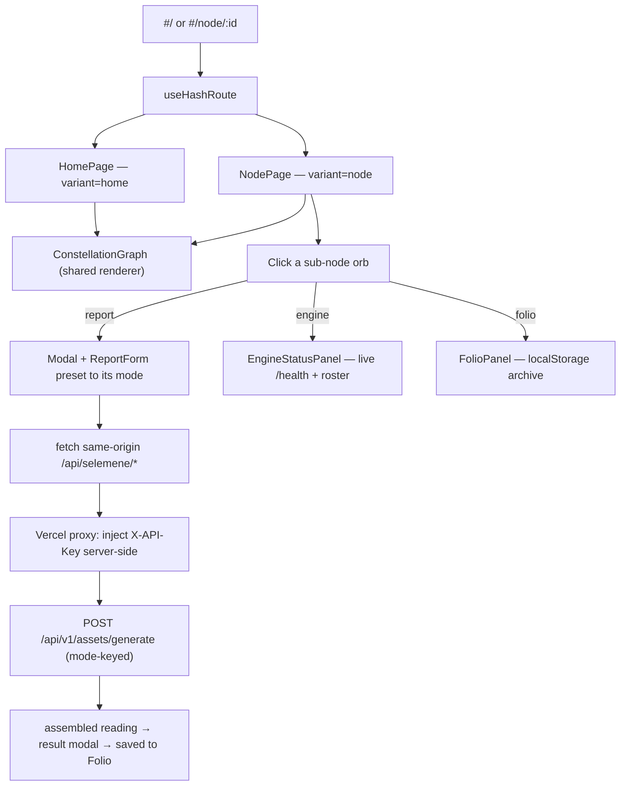

<div align="center">


[](https://urania-137.vercel.app)
[](https://github.com/Sheshiyer/urania-137/actions/workflows/ci.yml)


</div>

---

> **Urania 137** is the frontend for the Selemene consciousness engines — a **multi-page stellar console**. You land on a galactic overview of seven report surfaces; clicking a node opens its own page, where that node re-centres as a golden astrolabe and its sub-nodes orbit it. The graph is the interface at every depth.


## The idea

Everything is the graph. A central **NOESIS** core is ringed by seven parent nodes; each node is a doorway into its own page of sub-criteria, drawn as a dense golden sacred-geometry mandala in the **Tryambakam Noesis** visual identity (void-black canvas, sacred-gold wireframe, glowing radial edges, nebula, art-deco frames). The taxonomy is the "137 jobs across 7 departments / second brain" concept from the source reel by [@alassafi.ai](https://instagram.com/alassafi.ai).

- **Galactic home** (`#/`) → the seven parent nodes around the NOESIS core, with a console top-bar and stat footer.
- **Click a node → its page** (`#/node/:id`) → the node re-centres as a golden astrolabe and its sub-nodes orbit it, each a labelled orb (with a sacred-geometry glyph on Engine Status).
- **One node, one URL** → hash routing with zero router dependency; every page is deep-linkable.
- **The report modal is the leaf** → clicking a sub-node opens the Selemene input form, preset to that surface's mode, and submits to the **live public API**; the reading is saved to the Folio.
- **Engine Status is live** → real `/health`, `/health/ready`, and engine roster telemetry (no mock data).
- **Folio Archive is real** → every generated report persists to `localStorage` with search, favorites, and Markdown/DOCX/PDF export.
- **The graph is the interface** — the top nav is an additive convenience; every destination is also a node you can click.
- **`prefers-reduced-motion`** skips the entrance bloom and renders the static console.

## The seven surfaces

| Node | URL | Sub-nodes |
|------|-----|-----------|
| **Birth Witness** | `#/node/birth` | Birth Blueprint · Lineage · Human Design · Gene Keys · Vedic Clock · Panchanga · Timing Windows |
| **Union Mirror** | `#/node/compat` | Synastry · Compatibility · Family Constellations · Business Partnership · Relationship Dynamics · Composite |
| **Sky Weather** | `#/node/transit` | Daily Transits · Monthly Cycles · Retrogrades · Eclipses · Solar Returns · Lunar Returns · Mundane Astrology |
| **Noesis Reading** | `#/node/witness` | L0 Minimal → L5 Comprehensive · Bridge Question · Pattern Extraction |
| **Engine Status** | `#/node/engine` | 16 Consciousness Engines · Vedic Clock · Panchanga · I Ching · Astro · Health · Pulse · Human Design · Enneagram · Gene Keys · Anamnesis |
| **Folio Archive** | `#/node/folio` | Saved Reports · Search · History · Favorites · Markdown · DOCX · PDF · Exports |
| **Bridge Query** | `#/node/bridge` | Question-Based Reports · Horary · Follow-Up Inquiries · I Ching · Decision Support |

## Visual direction

Brand-aligned design references were locked before implementation; the built app matches them one-to-one. The moodboard anchors palette, typography, and composition:

<div align="center">


</div>

Each node's cluster is a re-centred golden astrolabe — the design target for `#/node/birth`:

<div align="center">


</div>

The multi-page architecture — overview, a parent cluster, and the report modal:

<div align="center">


</div>

The full set of per-node design references lives in [`.assets/page-references/`](./.assets/page-references/).

## Quick start

```bash
git clone https://github.com/Sheshiyer/urania-137.git
cd urania-137
npm install
npm run dev        # http://localhost:5173
```

Production build:

```bash
npm run build      # tsc + vite build
npm run preview
```

The Selemene API needs an `X-API-Key` and sends no CORS header for other origins,
so the browser never calls it directly. A **server-side proxy** (`api/proxy.ts`,
routed by `vercel.json`) injects the key and gives the SPA a same-origin endpoint.
The key is a **server-only** env var — never a `VITE_` variable (those are inlined
into the public bundle).

```bash
# Vercel: Project → Settings → Environment Variables (Production/Preview)
SELEMENE_API_KEY=nk_...                      # secret, server-side only
SELEMENE_API_URL=https://selemene.tryambakam.space

# Local dev: .env.local (gitignored) — the Vite dev server proxies the same way
SELEMENE_API_KEY=nk_...
SELEMENE_API_URL=https://selemene.tryambakam.space
```

## How it works



**One data-driven component renders every depth.** `ConstellationGraph` reads a node's children and draws it re-centred with its sub-nodes — `variant="home"` for the NOESIS overview, `variant="node"` for a parent page — so the eight surfaces cannot drift from one another. The visual grammar lives in a frozen primitive layer:

- `src/styles/tokens.ts` — the single source of colour + typography truth.
- `primitives/` — `StellarNode` (plain / ornate orb / home planet), `CoreGlow` (ornate astrolabe hub with flower-of-life), `Glyph` (sacred-geometry icon set), `CompassStar`.
- `chrome/` — `TopNav`, `StatFooter`, `PageTabs` (the console dressing).
- `panels/` — `EngineStatusPanel` (live telemetry), `FolioPanel` (persisted archive).
- `App` → `useHashRoute` → `HomePage` / `NodePage`; `NodePage` owns the report/info/result modals.

## Project structure

```
urania-137
├── .assets/
│   ├── moodboard.png                     # Brand + composition moodboard
│   └── page-references/                   # Per-node design references (design targets)
├── docs/
│   ├── urania-137-multi-page-integration-plan.md
│   └── superpowers/specs/2026-07-15-motion-reel-flow-design.md
├── scripts/screenshot.mjs                 # Playwright screenshot helper
├── src/
│   ├── App.tsx                            # Router: TopNav + HomePage / NodePage
│   ├── pages/  (HomePage, NodePage)        # The two views
│   ├── components/
│   │   ├── ConstellationGraph.tsx         # Shared renderer (variant: home | node)
│   │   ├── Modal.tsx  ·  ReportForm.tsx    # Report input + result shell
│   │   ├── chrome/   (TopNav, StatFooter, PageTabs)
│   │   ├── panels/   (EngineStatusPanel, FolioPanel)
│   │   ├── layout/   (PageHeader, PageFrame)
│   │   └── primitives/ (StellarNode, CoreGlow, Glyph, CompassStar)
│   ├── data/selemeneNodes.ts              # Seven surfaces, their modes and children
│   ├── hooks/  (useHashRoute, useNodeGraph, useReportGenerator, useEngineStatus, useFolio)
│   ├── lib/    (selemeneApi.ts, folioStore.ts, graphUtils.ts)
│   ├── styles/tokens.ts                   # Design tokens (single source of truth)
│   └── types/index.ts
├── ISA.md                                 # Ideal State Artifact (goals + verification)
└── vite.config.ts
```

## Tech

- **React 19** + **TypeScript 5**, built with **Vite 6**.
- **Tailwind CSS 3** for utilities; **SVG** for the graph (no canvas/WebGL — lightweight, responsive).
- **CSS entrance animation** (`motion-safe:animate-graph-in`), gated by `prefers-reduced-motion`.
- **Hash-based routing** (`useHashRoute`, `#/node/:id`) with zero router dependency.
- **Live status** via `useEngineStatus` (`/health`, `/health/ready`, `/api/v1/engines`) and a `localStorage` Folio archive (`folioStore.ts`).
- API client in `src/lib/selemeneApi.ts` → same-origin proxy (`api/proxy.ts`) → Selemene `POST /api/v1/assets/generate`; the reading's `assembled` markdown renders in the result modal.

## Brand identity

| Color | Hex | Role |
|-------|-----|------|
| Void Black | `#070B1D` | Primary canvas |
| Sacred Gold | `#C5A017` | Wireframe, accents, CTAs |
| Witness Violet | `#2D0050` | Observer-state gradients |
| Flow Indigo | `#0B50FB` | Data streams |
| Coherence Emerald | `#10B5A7` | Success, coherence |
| Parchment | `#F0EDE3` | Primary text |

Typography: **Cinzel** (engraved serif — wordmark + page titles), **Panchang** (display — node labels), **Satoshi** (body).

## Credits

Conceptually inspired by the "137 jobs across 7 departments / enterprise-grade second brain" stellar-graph reel by [@alassafi.ai](https://instagram.com/alassafi.ai). The reference frame is kept local only and is not redistributed here; all published imagery is original brand work.

## License

MIT — same as the parent Tryambakam Noesis project.

---

<div align="center">


**Built for the Selemene Engine · Tryambakam Noesis**

</div>
