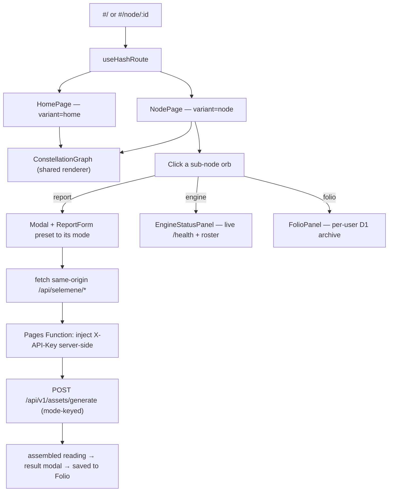

<div align="center">

# URANIA 137

### Selemene Report Console

[](https://urania-137.pages.dev)
[](https://github.com/Sheshiyer/urania-137/actions/workflows/ci.yml)


</div>

---

> **Urania 137** is the **online entry** to Tryambakam Noesis — a **multi-page stellar console** over the Selemene consciousness engines. You land on a galactic overview of seven surfaces; clicking a node opens its own page, where that node re-centres as a golden astrolabe and its sub-nodes orbit it. The graph is the interface at every depth.

### Part of an integrated product

| Surface | Role | Where |
|---|---|---|
| **Urania 137** (this) | The online entry — the graph. No install, no capture. | `urania-137.pages.dev` (Cloudflare Pages — first deploy pending) |
| **Noesis Mirror** | The person's walkable 3D field; proximity is the interface. | `314.tryambakam.space/p/:personId` |
| **Sankalpa** | The Electron instrument — consent-gated capture (biofield, face-reading). | v0.1.0, unreleased |

Both doors are **nodes, not menu items**: Folio Archive → Noesis Mirror, Engine Status → Sankalpa Desktop. See **[`docs/integrated-product-map.md`](./docs/integrated-product-map.md)** for who owns which engine, where the consent boundary sits, and the two gates a witness mode must pass before it's exposed.

## The idea

Everything is the graph. A central **NOESIS** core is ringed by seven parent nodes; each node is a doorway into its own page of sub-criteria, drawn as a dense golden sacred-geometry mandala in the **Tryambakam Noesis** visual identity (void-black canvas, sacred-gold wireframe, glowing radial edges, nebula, art-deco frames). The taxonomy is the "137 jobs across 7 departments / second brain" concept from the source reel by [@alassafi.ai](https://instagram.com/alassafi.ai).

- **Galactic home** (`#/`) → the seven parent nodes around the NOESIS core, with a console top-bar and stat footer.
- **Click a node → its page** (`#/node/:id`) → the node re-centres as a golden astrolabe and its sub-nodes orbit it, each a labelled orb (with a sacred-geometry glyph on Engine Status).
- **One node, one URL** → hash routing with zero router dependency; every page is deep-linkable.
- **The report modal is the leaf** → clicking a sub-node opens the Selemene input form, preset to that surface's mode, and submits to the **live public API**; the reading is saved to the Folio.
- **Engine Status is live** → real `/health`, `/health/ready`, and engine roster telemetry (no mock data).
- **Folio Archive is real** → every generated report persists to a **per-user Cloudflare D1 store** behind a login identity, with search, favorites, and Markdown/DOCX/PDF export.
- **The graph is the interface** — the top nav is an additive convenience; every destination is also a node you can click.
- **`prefers-reduced-motion`** skips the entrance bloom and renders the static console.

## The seven surfaces

Every child is wired to a capability the engine **actually serves** — verified against the live API and `noesis-api`'s source. Nothing here sends a mode the engine can't resolve.

| Node | URL | Wired to |
|------|-----|----------|
| **Birth Witness** | `#/node/birth` | `birth-blueprint` **workflow** · numerology · human-design · gene-keys · vimshottari · panchanga · vedic-clock **engines** |
| **Union Mirror** | `#/node/compat` | `composite-dyad` · `integrated-reading` (2+ subjects) **witness** |
| **Sky Weather** | `#/node/transit` | `daily-practice` **workflow** · transits · panchanga · vedic-clock · biorhythm **engines** |
| **Noesis Reading** | `#/node/witness` | `integrated-kundali-l0` (12-part reading) · `integrated-reading` **witness** · `full-spectrum` · `creative-expression` **workflows** |
| **Engine Status** | `#/node/engine` | live `/health` + `/health/ready` + roster · 10 individually runnable **engines** |
| **Folio Archive** | `#/node/folio` | per-user D1 archive — search · favorites · Markdown/DOCX/PDF export |
| **Bridge Query** | `#/node/bridge` | `decision-support` · `self-inquiry` **workflows** · tarot · i-ching · enneagram **engines** |

> **On witness modes.** `POST /api/v1/assets/generate` does not validate `mode` — an unknown or empty mode returns `200` with a generic one-pass `default: Reading`, indistinguishable from a real result. `noesis-api`'s `load_mode_document` resolves only `integrated-reading`/`composite-dyad` and `integrated-kundali-l0`/`kundali`/`kundali-l0`. The richer partner and lineage modes exist as authored docs in the engine repo (`packages/witness-pipeline/modes/`) but aren't loaded yet; they'll get a child here once the engine serves them. `report_level` is currently ignored by the engine.

## Visual direction

Brand-aligned design references were locked before implementation; the built app matches them one-to-one. The moodboard anchors palette, typography, and composition:

<div align="center">


</div>

Each node's cluster is a re-centred golden astrolabe — the design target for `#/node/birth`:

<div align="center">


</div>

The multi-page architecture — overview, a parent cluster, and the report modal:

<div align="center">


</div>

The full set of per-node design references lives in [`.assets/page-references/`](./.assets/page-references/).

## Quick start

Local development runs entirely through **Cloudflare's toolchain** — one command serves the SPA, the `/api/*` Pages Functions, and a local D1 database:

```bash
git clone https://github.com/Sheshiyer/urania-137.git
cd urania-137
npm install
cp .dev.vars.example .dev.vars   # fill SELEMENE_API_KEY; keep every other line as-is
npm run migrate:local            # apply migration 0001_init to the local D1
npm run dev                      # build (tsc + vite) then wrangler pages dev → http://localhost:8788
```

There is no separate Vite dev server: `wrangler pages dev` is the single local
entrypoint, so the SPA and the API always run together exactly as they do on
Cloudflare Pages.

### Local environment (`.dev.vars`, gitignored — never commit)

```bash
# Engine (the shared service credential the Function injects server-side):
SELEMENE_API_URL="https://selemene.tryambakam.space"
SELEMENE_API_KEY="<your-selemene-api-key>"

# CF Access verification (placeholders are fine locally; real values come from
# the 9d9d Access app — see docs/auth/contracts.md):
CF_ACCESS_AUD="dev-aud"
CF_ACCESS_TEAM_DOMAIN="dev.cloudflareaccess.com"

# Dev-only identity injection (local only; MUST be unset in production):
DEV_IDENTITY_EMAIL="dev@urania.local"

# REQUIRED locally: wrangler ≥4.112 synthesizes CF_PAGES="1" inside
# `pages dev`, which trips the fail-closed production marker in the
# dev-identity guard. Blank it locally so dev injection can fire —
# production is unaffected because real Pages sets CF_PAGES for real:
CF_PAGES=""
```

## Deploy (Cloudflare Pages)

The app deploys as a single Cloudflare Pages project: `npm run build` emits the
SPA to `dist/`, and `functions/` ships as Pages Functions serving `/api/*`.
Per-user data lives in D1 (binding `DB`, migration `migrations/0001_init.sql`).
The build settings are mirrored in `wrangler.toml`.

**One-time remote setup (owner's Cloudflare account — PENDING, tracked as T-080 / T-058 / T-059):**

1. `npx wrangler login`
2. Create the Pages project `urania-137` (dashboard → Workers & Pages → Pages; build command `npm run build`, output dir `dist`, Node 22).
3. Provision D1 (preview + production): `npx wrangler d1 create urania-137-db`, then paste the real `database_id` into `wrangler.toml` (replacing the placeholder).
4. Apply migrations remotely: `npm run migrate:remote`.
5. Set production secrets (never committed): `npx wrangler pages secret put SELEMENE_API_KEY`, plus `SELEMENE_API_URL`, `CF_ACCESS_AUD`, and `CF_ACCESS_TEAM_DOMAIN` from the 9d9d Access app. **Do not** set `DEV_IDENTITY_EMAIL` in production.
6. Deploy: `npx wrangler pages deploy dist`.

The CF-Access application itself (email-OTP policy, AUD, team domain) is
provisioned on the owner's account — the handoff contract is
[`docs/auth/contracts.md`](./docs/auth/contracts.md).

## How it works



**One data-driven component renders every depth.** `ConstellationGraph` reads a node's children and draws it re-centred with its sub-nodes — `variant="home"` for the NOESIS overview, `variant="node"` for a parent page — so the eight surfaces cannot drift from one another. The visual grammar lives in a frozen primitive layer:

- `src/styles/tokens.ts` — the single source of colour + typography truth.
- `primitives/` — `StellarNode` (plain / ornate orb / home planet), `CoreGlow` (ornate astrolabe hub with flower-of-life), `Glyph` (sacred-geometry icon set), `CompassStar`.
- `chrome/` — `TopNav`, `StatFooter`, `PageTabs` (the console dressing).
- `panels/` — `EngineStatusPanel` (live telemetry), `FolioPanel` (persisted archive).
- `App` → `useHashRoute` → `HomePage` / `NodePage`; `NodePage` owns the report/info/result modals.

## Project structure

```
urania-137
├── .assets/
│   ├── moodboard.png                     # Brand + composition moodboard
│   └── page-references/                   # Per-node design references (design targets)
├── docs/
│   ├── auth/                              # CF-Access contracts + phase-gate evidence
│   ├── integrated-product-map.md
│   └── superpowers/                       # specs + swarm plans
├── functions/
│   ├── api/[[path]].ts                    # /api/* router (Pages Functions)
│   └── lib/                               # cf-access · dev-identity · engine-proxy · db
├── migrations/0001_init.sql               # D1 schema: users + readings
├── scripts/verify/                        # runnable gates (taxonomy, daily, V5, phase exits)
├── src/
│   ├── App.tsx                            # Router: TopNav + HomePage / NodePage
│   ├── pages/  (HomePage, NodePage)        # The two views
│   ├── components/
│   │   ├── ConstellationGraph.tsx         # Shared renderer (variant: home | node)
│   │   ├── Modal.tsx  ·  ReportForm.tsx    # Report input + result shell
│   │   ├── chrome/   (TopNav, StatFooter, PageTabs)
│   │   ├── panels/   (EngineStatusPanel, FolioPanel)
│   │   ├── layout/   (PageHeader, PageFrame)
│   │   └── primitives/ (StellarNode, CoreGlow, Glyph, CompassStar)
│   ├── data/selemeneNodes.ts              # Seven surfaces, their modes and children
│   ├── hooks/  (useHashRoute, useNodeGraph, useReportGenerator, useEngineStatus, useFolio)
│   ├── lib/    (selemeneApi.ts, folioStore.ts, api/contract.ts, graphUtils.ts)
│   ├── styles/tokens.ts                   # Design tokens (single source of truth)
│   └── types/index.ts
├── wrangler.toml                          # Pages + Functions + D1 config
├── ISA.md                                 # Ideal State Artifact (goals + verification)
└── vite.config.ts                         # build-only (no dev server, no proxy)
```

## Tech

- **React 19** + **TypeScript 5**, built with **Vite 6**.
- **Cloudflare Pages + Functions + D1** — hosting, `/api/*` API layer, and per-user storage on one platform; **`wrangler pages dev`** is the single local entrypoint.
- **Tailwind CSS 3** for utilities; **SVG** for the graph (no canvas/WebGL — lightweight, responsive).
- **CSS entrance animation** (`motion-safe:animate-graph-in`), gated by `prefers-reduced-motion`.
- **Hash-based routing** (`useHashRoute`, `#/node/:id`) with zero router dependency.
- **Login identity** via Cloudflare Access email OTP (JWT verified in the Function); locally, a prod-safe dev identity is injected from `DEV_IDENTITY_EMAIL`.
- **Live status** via `useEngineStatus` (`/health`, `/health/ready`, `/api/v1/engines`) and a per-user D1 Folio archive (`/api/folio/*`).
- API client in `src/lib/selemeneApi.ts` → same-origin `/api/selemene/*` → Pages Function (`functions/lib/engine-proxy.ts`) injects the server-side key → Selemene `POST /api/v1/assets/generate`; the reading's `assembled` markdown renders in the result modal.

## Brand identity

| Color | Hex | Role |
|-------|-----|------|
| Void Black | `#070B1D` | Primary canvas |
| Sacred Gold | `#C5A017` | Wireframe, accents, CTAs |
| Witness Violet | `#2D0050` | Observer-state gradients |
| Flow Indigo | `#0B50FB` | Data streams |
| Coherence Emerald | `#10B5A7` | Success, coherence |
| Parchment | `#F0EDE3` | Primary text |

Typography: **Cinzel** (engraved serif — wordmark + page titles), **Panchang** (display — node labels), **Satoshi** (body).

## Credits

Conceptually inspired by the "137 jobs across 7 departments / enterprise-grade second brain" stellar-graph reel by [@alassafi.ai](https://instagram.com/alassafi.ai). The reference frame is kept local only and is not redistributed here; all published imagery is original brand work.

## License

MIT — same as the parent Tryambakam Noesis project.

---

<div align="center">

**Built for the Selemene Engine · Tryambakam Noesis**

</div>
