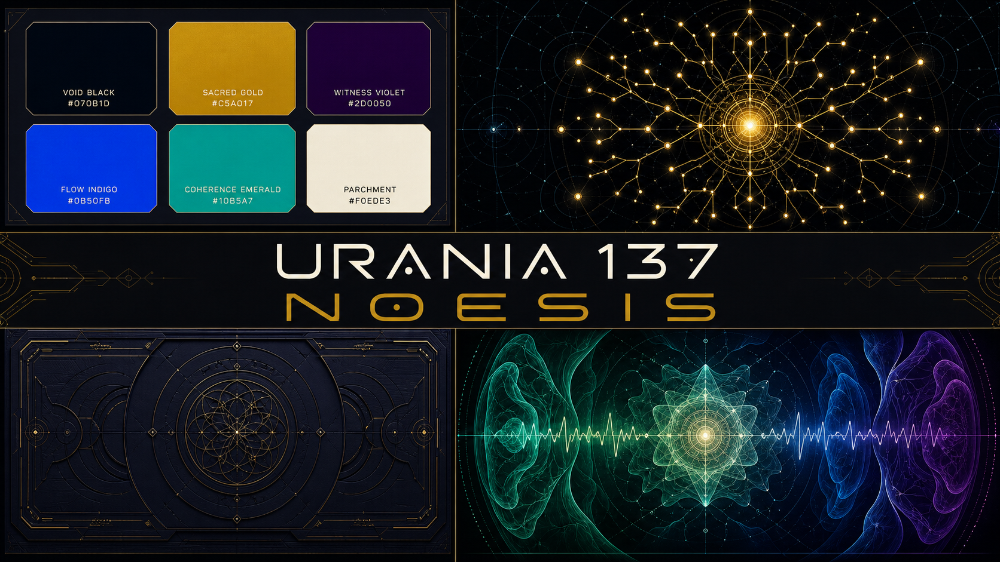
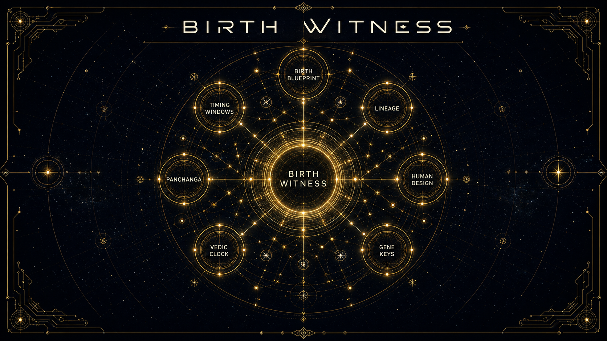
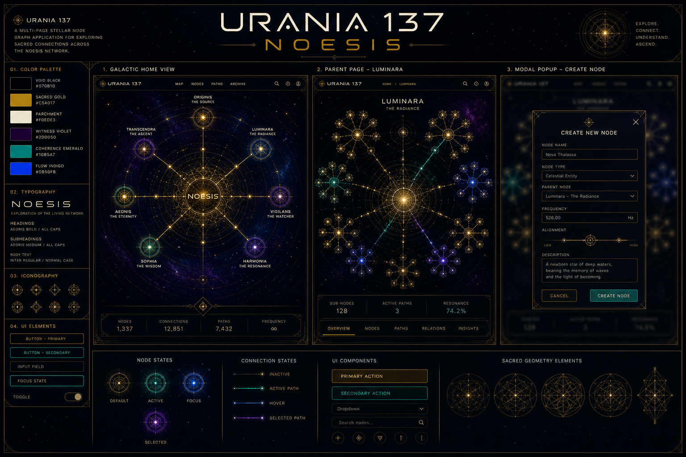
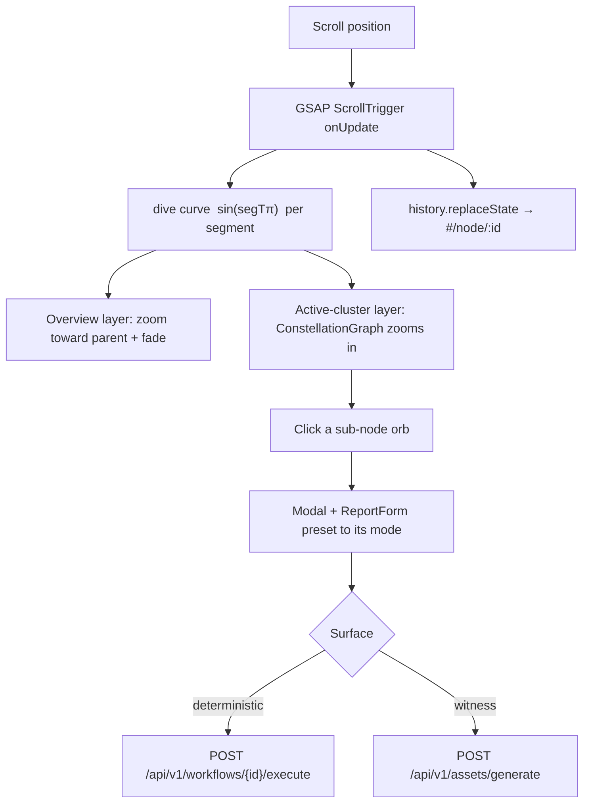

<div align="center">


[](https://github.com/Sheshiyer/urania-137/actions/workflows/ci.yml)


</div>

---

> **Urania 137** is the frontend for the Selemene consciousness engines — rendered as a **scroll-driven journey through a stellar constellation**. You land on a galactic overview of seven report surfaces; scrolling *dives* the camera into each one, revealing its sub-nodes, before resurfacing to travel to the next. The graph is the only interface, at every depth.


## The idea

Everything is the graph. A central **NOESIS** core is ringed by seven parent nodes; each node is a doorway into its own cluster of sub-criteria. The experience emulates the "compile the second brain" flow of the source Instagram reel by [@alassafi.ai](https://instagram.com/alassafi.ai) — but rendered as a live, navigable console in the **Tryambakam Noesis** visual identity (void-black canvas, sacred-gold wireframe, glowing radial edges).

- **Galactic overview** → the seven parent nodes around the NOESIS core.
- **Scroll = camera dive** → each scroll segment zooms into one node's cluster (it re-centres and its sub-nodes bloom in), then resurfaces before the next.
- **Click jumps the journey** → clicking a node smooth-scrolls straight to its cluster.
- **One node, one URL** → the hash syncs to `#/node/:id` as you pass each cluster, and deep-links land at the right beat.
- **The report modal is the leaf** → clicking a sub-node opens the Selemene input form, preset to that surface's mode, and submits to the **live public API**.
- **No menus, no side panels** — navigation is always by clicking or scrolling the graph.
- **`prefers-reduced-motion`** falls back to a static overview ↔ cluster toggle.

## The seven surfaces

| Node | URL | Sub-nodes |
|------|-----|-----------|
| **Birth Witness** | `#/node/birth` | Birth Blueprint · Lineage · Human Design · Gene Keys · Vedic Clock · Panchanga · Timing Windows |
| **Union Mirror** | `#/node/compat` | Synastry · Compatibility · Family Constellations · Business Partnership · Relationship Dynamics · Composite |
| **Sky Weather** | `#/node/transit` | Daily Transits · Monthly Cycles · Retrogrades · Eclipses · Solar Returns · Lunar Returns · Mundane Astrology |
| **Noesis Reading** | `#/node/witness` | L0 Minimal → L5 Comprehensive · Bridge Question · Pattern Extraction |
| **Engine Status** | `#/node/engine` | 16 Consciousness Engines · Vedic Clock · Panchanga · I Ching · Astro · Health · Pulse · Human Design · Enneagram · Gene Keys · Anamnesis |
| **Folio Archive** | `#/node/folio` | Saved Reports · Search · History · Favorites · Markdown · DOCX · PDF · Exports |
| **Bridge Query** | `#/node/bridge` | Question-Based Reports · Horary · Follow-Up Inquiries · I Ching · Decision Support |

## Visual direction

Brand-aligned design references were locked before implementation; the built app matches them one-to-one. The moodboard anchors palette, typography, and composition:

<div align="center">



</div>

Each node's cluster is a re-centred golden astrolabe — the design target for `#/node/birth`:

<div align="center">



</div>

The multi-page architecture — overview, a parent cluster, and the report modal:

<div align="center">



</div>

The full set of per-node design references lives in [`.assets/page-references/`](./.assets/page-references/).

## Quick start

```bash
git clone https://github.com/Sheshiyer/urania-137.git
cd urania-137
npm install
npm run dev        # http://localhost:5173
```

Production build:

```bash
npm run build      # tsc + vite build
npm run preview
```

Point it at a Selemene deployment with environment variables (defaults target the public API):

```bash
# .env.local
VITE_SELEMENE_API_URL=https://selemene.tryambakam.space
VITE_SELEMENE_API_KEY=            # optional; sent as X-API-Key when set
```

## How it works



**One data-driven component renders all seven cluster pages.** `ConstellationGraph` reads `SELEMENE_NODES[i].children` and draws that node re-centred with its sub-nodes — so the seven pages cannot drift from one another. The visual grammar lives in a frozen primitive layer:

- `src/styles/tokens.ts` — the single source of colour + typography truth.
- `primitives/` — `StellarNode` (plain + ornate orb), `StellarEdge`, `StellarSubNode`, `CoreGlow` (simple + ornate hub), `CompassStar`.
- `StellarNodeGraph` (the overview) and `ConstellationGraph` (a cluster) compose the same primitives.
- `ScrollJourney` orchestrates the two layers, the ScrollTrigger camera, URL sync, click-jump, deep-linking, and the report modal.

## Project structure

```
urania-137
├── .assets/
│   ├── moodboard.png                     # Brand + composition moodboard
│   └── page-references/                   # Per-node design references (design targets)
├── docs/
│   ├── urania-137-multi-page-integration-plan.md
│   └── superpowers/specs/2026-07-15-motion-reel-flow-design.md
├── scripts/screenshot.mjs                 # Playwright screenshot helper
├── src/
│   ├── components/
│   │   ├── StellarNodeGraph.tsx           # Overview radial graph (generic)
│   │   ├── ConstellationGraph.tsx         # Ornate per-node cluster (data-driven)
│   │   ├── Modal.tsx  ·  ReportForm.tsx    # Report input + result shell
│   │   ├── motion/ScrollJourney.tsx       # Scroll-driven camera journey
│   │   ├── layout/  (PageHeader, PageFrame)
│   │   └── primitives/ (StellarNode, StellarEdge, StellarSubNode, CoreGlow, CompassStar)
│   ├── data/selemeneNodes.ts              # Seven surfaces, their modes and children
│   ├── hooks/  (useNodeGraph, useReportGenerator)
│   ├── lib/    (motion.ts, graphUtils.ts, selemeneApi.ts)
│   ├── styles/tokens.ts                   # Design tokens (single source of truth)
│   └── types/index.ts
├── ISA.md                                 # Ideal State Artifact (goals + verification)
└── vite.config.ts
```

## Tech

- **React 19** + **TypeScript 5**, built with **Vite 6**.
- **Tailwind CSS 3** for utilities; **SVG** for the graph (no canvas/WebGL — lightweight, responsive).
- **GSAP + `@gsap/react` (ScrollTrigger)** for the scroll journey and entrance motion.
- **Hash-based routing** (`#/node/:id`) with zero router dependency.
- Live API client in `src/lib/selemeneApi.ts` (deterministic workflows + witness asset generation).

## Brand identity

| Color | Hex | Role |
|-------|-----|------|
| Void Black | `#070B1D` | Primary canvas |
| Sacred Gold | `#C5A017` | Wireframe, accents, CTAs |
| Witness Violet | `#2D0050` | Observer-state gradients |
| Flow Indigo | `#0B50FB` | Data streams |
| Coherence Emerald | `#10B5A7` | Success, coherence |
| Parchment | `#F0EDE3` | Primary text |

Typography: **Panchang** (display) and **Satoshi** (body) via FontShare.

## Credits

Conceptually inspired by the "137 jobs across 7 departments / enterprise-grade second brain" stellar-graph reel by [@alassafi.ai](https://instagram.com/alassafi.ai). The reference frame is kept local only and is not redistributed here; all published imagery is original brand work.

## License

MIT — same as the parent Tryambakam Noesis project.

---

<div align="center">


**Built for the Selemene Engine · Tryambakam Noesis**

</div>
