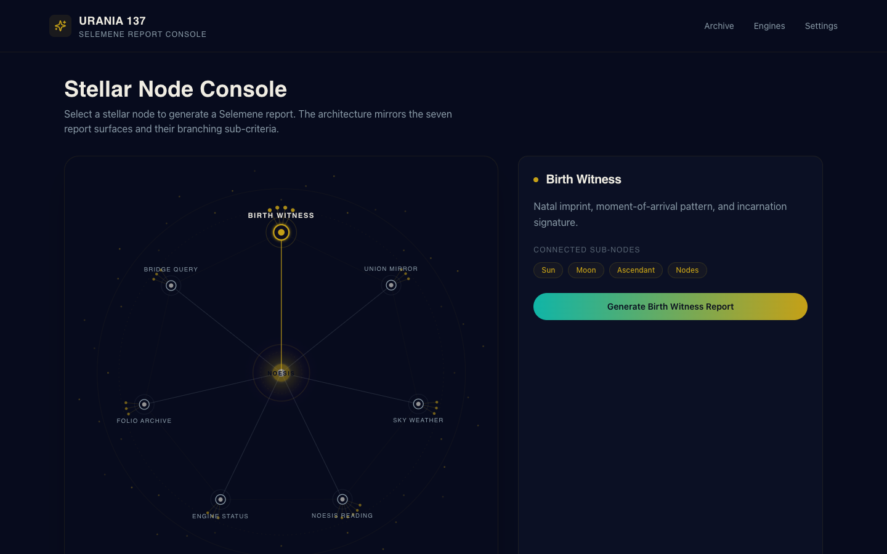
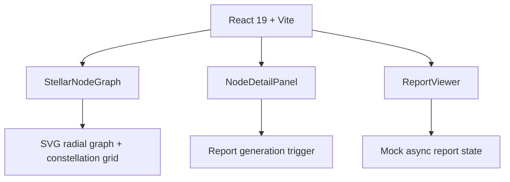

<div align="center">


</div>

<div align="center">


</div>

---

> **Urania 137** turns the Selemene engine stack into a navigable stellar node graph. Select a node, generate a report, and read the witness output — all on a dark canvas that respects the Tryambakam Noesis visual identity.


## What It Is

Urania 137 is a browser-based frontend for the Selemene consciousness engines. It recreates the **stellar node branching architecture** from the reference Instagram post (`@alassafi.ai`) as an interactive report console:

- A central **NOESIS** core.
- Seven radial report nodes: Birth Witness, Union Mirror, Sky Weather, Noesis Reading, Engine Status, Folio Archive, and Bridge Query.
- Each node branches into sub-criteria, matching the original "enterprise second brain" graph structure.
- One click generates a report panel for the selected node.

The visual language is anchored in the **Tryambakam Noesis** brand identity: Void Black canvas, Sacred Gold wireframe, Witness Violet gradients, and bioluminescent accents.

## Visual Direction

The moodboard below locks the palette, typography, and node-graph composition before any code was written:

<div align="center">


</div>

Live preview of the built interface:

<div align="center">



</div>

## Quick Start

```bash
git clone /Volumes/madara/2026/twc-vault/01-Projects/tryambakam-noesis/urania-137
# or, if this repo is on GitHub:
git clone https://github.com/Sheshiyer/urania-137.git
cd urania-137
npm install
npm run dev
```

Then open the local URL shown in the terminal (usually `http://localhost:5173/`).

To build for production:

```bash
npm run build
npm run preview
```

## Architecture



- **React 19** with TypeScript for UI components.
- **Vite** for fast dev and production builds.
- **Tailwind CSS 3** for utility styling.
- **SVG** for the node graph (no canvas, no WebGL — lightweight and responsive).
- **Data-driven nodes**: `src/data/selemeneNodes.ts` defines the seven report surfaces and their sub-nodes.

## Project Structure

```
urania-137
├── .assets
│   ├── moodboard.png              # Brand + composition moodboard
│   ├── urania-137-preview.png     # Built UI preview
│   └── instagram-download/        # Reference extraction artifacts
├── dist/                          # Production build
├── src
│   ├── components
│   │   ├── StellarNodeGraph.tsx   # SVG radial node graph
│   │   ├── NodeDetailPanel.tsx    # Node info + report trigger
│   │   ├── ReportViewer.tsx       # Generated report display
│   │   └── SelemeneHeader.tsx     # Top navigation
│   ├── data
│   │   └── selemeneNodes.ts       # Seven report surfaces
│   ├── hooks
│   │   └── useReportGenerator.ts  # Mock report generation state
│   ├── types
│   │   └── index.ts               # TypeScript interfaces
│   ├── App.tsx
│   ├── main.tsx
│   └── index.css                  # Fonts + Tailwind entry
├── index.html
├── package.json
├── tailwind.config.js
├── tsconfig.json
└── vite.config.ts
```

## Project Health

| Category | Status | Score |
|:---------|:------:|------:|
| Type Safety | ████████████████████ | 100% |
| Build | ████████████████████ | 100% |
| Tests | ░░░░░░░░░░░░░░░░░░░░ | 0% |
| CI/CD | ░░░░░░░░░░░░░░░░░░░░ | 0% |
| Documentation | ██████████████░░░░░░ | 70% |

> **Overall:** 54% — functional prototype, ready for integration and test coverage.

## Next Steps

- Wire `useReportGenerator` to the live Selemene API (`selemene.tryambakam.space`).
- Add route-based navigation for each report surface.
- Implement report persistence and the Folio Archive view.
- Add unit tests with Vitest and component tests with React Testing Library.
- Connect the README Generator NotebookLM pipeline for auto-refresh docs.

## Brand Identity

This project follows the **Tryambakam Noesis** visual identity:

| Color | Hex | Role |
|-------|-----|------|
| Void Black | `#070B1D` | Primary canvas |
| Sacred Gold | `#C5A017` | CTAs, wireframe, accents |
| Witness Violet | `#2D0050` | Observer-state gradients |
| Flow Indigo | `#0B50FB` | Data streams |
| Coherence Emerald | `#10B5A7` | Success, coherence |
| Parchment | `#F0EDE3` | Primary text |

Typography: **Panchang** (display) and **Satoshi** (body) via FontShare.

## Reference Extraction

The Instagram reference was captured with the `gram`/`glam` Instagram CLI and a headless Chrome screenshot. The original reference image is preserved in `.assets/instagram-download/stellar-node-branching.jpg`.

## License

MIT — same as the parent Tryambakam Noesis project.

---

<div align="center">


**Built for the Selemene Engine · Tryambakam Noesis**

</div>
