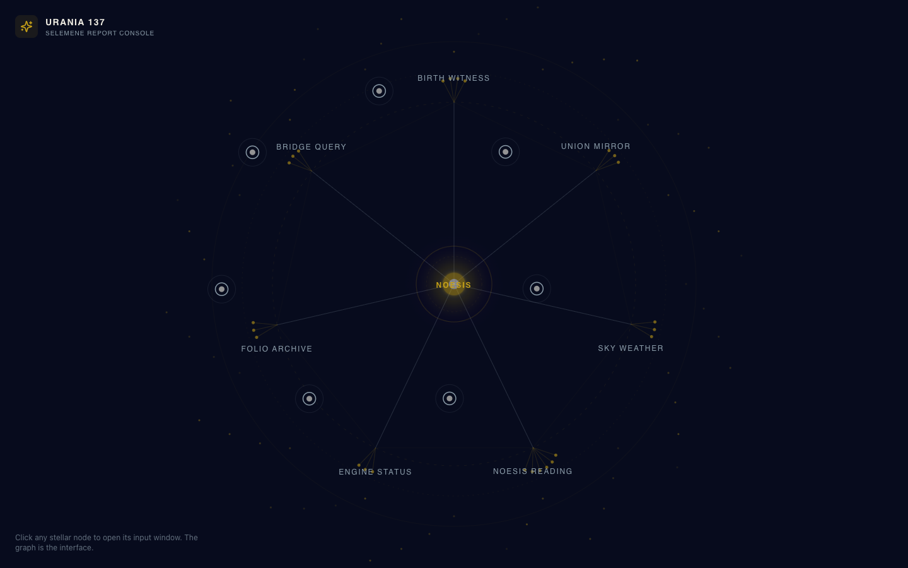
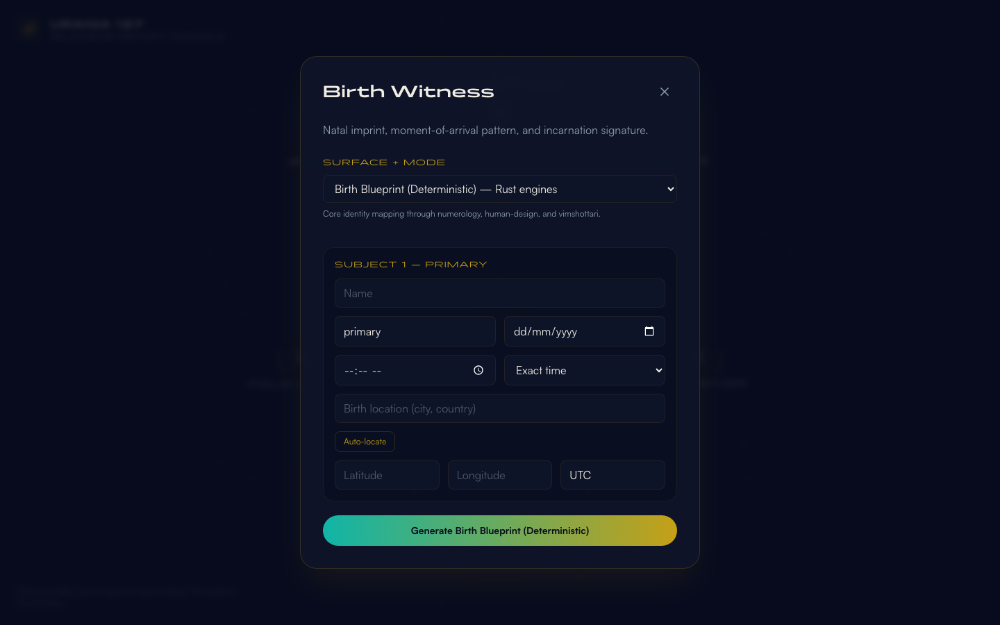

<div align="center">


</div>

<div align="center">


</div>

---

> **Urania 137** turns the Selemene engine stack into a navigable stellar node graph. Select a node, generate a report, and read the witness output — all on a dark canvas that respects the Tryambakam Noesis visual identity.


## What It Is

Urania 137 is a browser-based frontend for the Selemene consciousness engines. It recreates the **stellar node branching architecture** from the reference Instagram post (`@alassafi.ai`) as an interactive report console:

- The **entire interface is the graph**: a central NOESIS core with seven radial report nodes.
- Seven radial report nodes: Birth Witness, Union Mirror, Sky Weather, Noesis Reading, Engine Status, Folio Archive, and Bridge Query.
- Each node branches into sub-criteria, matching the original "enterprise second brain" graph structure.
- Clicking any node opens a **modal popup** with the Selemene input variables for that report surface (subjects, birth data, relationship context, language, report level, etc.).
- Submissions are sent to the **live public Selemene API** (`selemene.tryambakam.space`) for both deterministic Rust workflows and narrative witness readings.
- No side panels, no embedded report widgets — the graph is the only persistent UI surface.

The visual language is anchored in the **Tryambakam Noesis** brand identity: Void Black canvas, Sacred Gold wireframe, Witness Violet gradients, and bioluminescent accents.

## Visual Direction

The moodboard below locks the palette, typography, and node-graph composition before any code was written:

<div align="center">


</div>

Multi-page architecture moodboard and per-parent page references (brand-aligned design comps) live in `.assets/page-references/`:

- `multi-page-architecture-moodboard.png` — home view + parent page + modal popup
- `birth-witness-page.png`
- `union-mirror-page.png`
- `sky-weather-page.png`
- `noesis-reading-page.png`
- `engine-status-page.png`
- `folio-archive-page.png`
- `bridge-query-page.png`

Live preview of the built interface:

<div align="center">



</div>

A modal opens when a stellar node is selected (here: Birth Witness with the deterministic surface active):

<div align="center">



</div>

## Quick Start

```bash
git clone /Volumes/madara/2026/twc-vault/01-Projects/tryambakam-noesis/urania-137
# or, if this repo is on GitHub:
git clone https://github.com/Sheshiyer/urania-137.git
cd urania-137
npm install
npm run dev
```

Then open the local URL shown in the terminal (usually `http://localhost:5173/`).

To build for production:

```bash
npm run build
npm run preview
```

## Architecture

```mermaid
graph TD
    A[React 19 + Vite] --> B[Full-screen StellarNodeGraph]
    B --> C[Node click]
    C --> D[Modal popup]
    D --> E[ReportForm with Selemene variables]
    E --> F{Surface}
    F -->|deterministic| G[POST /api/v1/workflows/{id}/execute]
    F -->|witness| H[POST /api/v1/assets/generate]
    G --> I[Result modal / JSON]
    H --> I
```

- **React 19** with TypeScript for UI components.
- **Vite** for fast dev and production builds.
- **Tailwind CSS 3** for utility styling.
- **SVG** for the node graph (no canvas, no WebGL — lightweight and responsive).
- **Data-driven nodes**: `src/data/selemeneNodes.ts` defines the seven report surfaces and their modes.
- **Live API client**: `src/lib/selemeneApi.ts` handles deterministic workflow execution and witness asset generation against `selemene.tryambakam.space`.

## Project Structure

```
urania-137
├── .assets
│   ├── moodboard.png                            # Brand + composition moodboard
│   ├── urania-137-preview-v3.png                # Built UI preview (full graph)
│   ├── urania-137-birth-witness-modal.png       # Node modal example
│   └── instagram-download/                      # Reference extraction artifacts
├── dist/                                        # Production build
├── scripts
│   └── screenshot.mjs                           # Playwright screenshot helper
├── src
│   ├── components
│   │   ├── StellarNodeGraph.tsx                 # Full-screen SVG radial node graph
│   │   ├── Modal.tsx                            # Modal popup shell
│   │   └── ReportForm.tsx                       # Selemene variable input form
│   ├── data
│   │   └── selemeneNodes.ts                     # Seven report surfaces and modes
│   ├── hooks
│   │   └── useReportGenerator.ts                # Live API report generation state
│   ├── lib
│   │   └── selemeneApi.ts                       # Selemene API client
│   ├── types
│   │   └── index.ts                             # TypeScript interfaces
│   ├── App.tsx
│   ├── main.tsx
│   └── index.css                                # Fonts + Tailwind entry
├── index.html
├── package.json
├── tailwind.config.js
├── tsconfig.json
└── vite.config.ts
```

## Project Health

| Category | Status | Score |
|:---------|:------:|------:|
| Type Safety | ████████████████████ | 100% |
| Build | ████████████████████ | 100% |
| Tests | ░░░░░░░░░░░░░░░░░░░░ | 0% |
| CI/CD | ░░░░░░░░░░░░░░░░░░░░ | 0% |
| Documentation | ██████████████░░░░░░ | 70% |

> **Overall:** 54% — functional prototype, ready for integration and test coverage.

## Next Steps

- Verify live Selemene API endpoints once deployed and handle CORS/timeout errors gracefully.
- Add route-based navigation for each report surface.
- Implement report persistence and the Folio Archive view.
- Add unit tests with Vitest and component tests with React Testing Library.
- Connect the README Generator NotebookLM pipeline for auto-refresh docs.

## Brand Identity

This project follows the **Tryambakam Noesis** visual identity:

| Color | Hex | Role |
|-------|-----|------|
| Void Black | `#070B1D` | Primary canvas |
| Sacred Gold | `#C5A017` | CTAs, wireframe, accents |
| Witness Violet | `#2D0050` | Observer-state gradients |
| Flow Indigo | `#0B50FB` | Data streams |
| Coherence Emerald | `#10B5A7` | Success, coherence |
| Parchment | `#F0EDE3` | Primary text |

Typography: **Panchang** (display) and **Satoshi** (body) via FontShare.

## Reference Extraction

The Instagram reference was captured with the `gram`/`glam` Instagram CLI and a headless Chrome screenshot. The original reference image is preserved in `.assets/instagram-download/stellar-node-branching.jpg`.

## License

MIT — same as the parent Tryambakam Noesis project.

---

<div align="center">


**Built for the Selemene Engine · Tryambakam Noesis**

</div>
