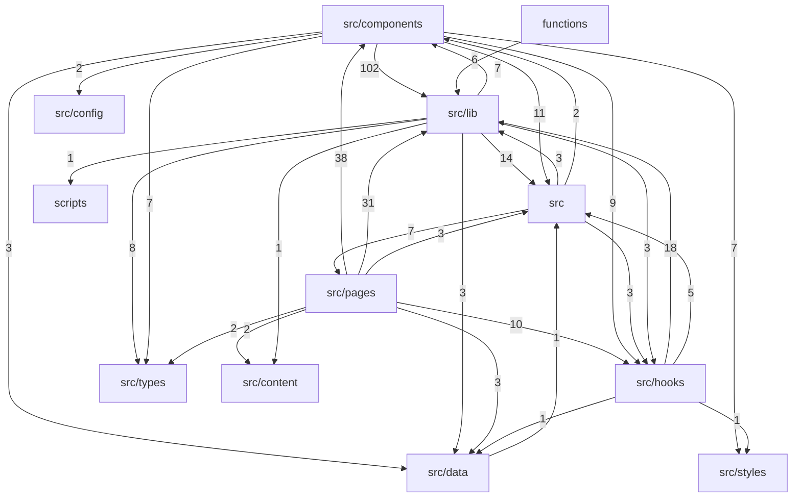

# Dependency Graph

> Auto-generated by `ArchitectureAssetsSync.hook.ts`. Last refreshed: 2026-08-01T11:49:40.529Z
> Scanned 357 source files. Edges aggregate to top-level directories (or `src/<name>`).

## Module graph

## Edge counts

| From | To | Imports |
|---|---|---|
| `src/components` | `src/lib` | 102 |
| `src/pages` | `src/components` | 38 |
| `src/pages` | `src/lib` | 31 |
| `src/hooks` | `src/lib` | 18 |
| `src/lib` | `src` | 14 |
| `src/components` | `src` | 11 |
| `src/pages` | `src/hooks` | 10 |
| `src/components` | `src/hooks` | 9 |
| `src/lib` | `src/types` | 8 |
| `src` | `src/pages` | 7 |
| `src/components` | `src/types` | 7 |
| `src/components` | `src/styles` | 7 |
| `src/lib` | `src/components` | 7 |
| `functions` | `src/lib` | 6 |
| `src/hooks` | `src` | 5 |
| `src` | `src/hooks` | 3 |
| `src` | `src/lib` | 3 |
| `src/components` | `src/data` | 3 |
| `src/lib` | `src/data` | 3 |
| `src/lib` | `src/hooks` | 3 |
| `src/pages` | `src/data` | 3 |
| `src/pages` | `src` | 3 |
| `src` | `src/components` | 2 |
| `src/components` | `src/config` | 2 |
| `src/pages` | `src/content` | 2 |
| `src/pages` | `src/types` | 2 |
| `src/data` | `src` | 1 |
| `src/hooks` | `src/data` | 1 |
| `src/hooks` | `src/styles` | 1 |
| `src/lib` | `scripts` | 1 |