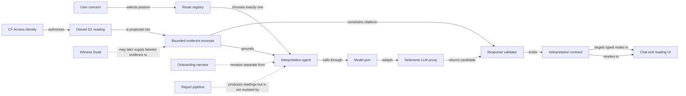

# Grounded Chat Interpretation Architecture

## Decision

Urania now has a framework-neutral interpretation kernel and an authenticated
`POST /api/chat/interpret` route for conversational follow-up on an existing
owned reading. This is not a new report engine, a replacement for onboarding,
or a claim that durable multi-agent memory already exists.

The immediate design is ports and adapters inside the existing Cloudflare Pages
Functions application. Cloudflare Agents SDK and Durable Objects remain a
future transport/state option, not the current domain model.

## What exists today

The repository review found three previously existing chat-shaped
responsibilities. They are related, but they are not interchangeable agents.

| Surface | Live entry point | Responsibility | Boundary |
|---|---|---|---|
| Urania onboarding narrator | `POST /api/chat/turn` | Re-voices the deterministic intake state machine; emits persisted SSE turn events | It collects validated intake. It does not interpret a completed reading. |
| Selemene Witness Dyad | `POST /api/selemene/api/v1/witness/interpret` → Selemene `POST /api/v1/witness/interpret` | Runs Aletheios, Pichet, and synthesis over a live witness context | It requires `live_scores` plus consciousness/user context; it is not a general archive-follow-up route. |
| Selemene LLM proxy | `${NARRATOR_LLM_URL}/v1/chat/completions` | Provides OpenAI-compatible model transport and provider fallback | It is infrastructure, not a product-level agent or evidence policy. |

Before this iteration, Urania had no general post-reading interpretation
endpoint. Completed engine/workflow/witness results rendered in the thread and
Folio, but could not enter a grounded follow-up contract.

The live Witness Dyad request requires six biofield measurements:
`energy`, `coherence`, `symmetry`, `complexity`, `regulation`, and
`color_balance`. Its response exposes `aletheios`, `pichet`, `synthesis`,
`witness_question`, `engines_used`, and `llm_powered`. Individual supporting
engine failures are tolerated in Selemene, so the response is intentionally a
witness synthesis rather than a deterministic report.

## New non-report endpoint

`POST /api/chat/interpret`

```json
{
  "readingId": "owned-folio-reading-id",
  "route": "pattern",
  "question": "Why does this feel relevant now?",
  "history": [
    { "role": "user", "content": "I keep returning to the contrast." }
  ]
}
```

`route` is required and closed:

| Route | Agent | May do | May not do |
|---|---|---|---|
| `pattern` | Aletheios | Reflect source-visible patterns and tensions | Originate calculations, predictions, or facts |
| `embodied` | Pichet | Offer provisional embodied inquiry | Diagnose, prescribe, or command action |
| `synthesis` | Synthesis | Connect already-grounded observations | Introduce unsupported evidence |
| `navigate` | Navigator | Return typed reading/evidence destinations | Invent nodes, sections, or component routes |

There is no `general` route and no implicit default. The existing onboarding
Narrator and live Witness Dyad are catalogued explicitly as non-selectable for
archive interpretation.

## Concept map

Focus question: how can a user question a reading conversationally without
confusing calculation, reporting, and interpretation?



The most important cross-link is between the interpretation response and typed
reading nodes. It lets a conversational answer point back into the visual
reading library instead of duplicating the reading as prose.

## Grounding contract

The browser never supplies reading content as trusted context. The Function:

1. verifies Cloudflare Access identity;
2. derives the stable user row;
3. loads `readingId` with the existing owner-scoped D1 query;
4. projects metadata and body into at most twelve stable evidence excerpts;
5. places those excerpts in the prompt as explicitly untrusted data;
6. validates every returned claim and destination before responding.

Each accepted claim contains:

- `text` — one bounded atomic statement;
- `status` — `source-grounded` or `interpretive-synthesis`;
- `evidenceIds` — one or more identifiers from the supplied packet.

Unknown evidence identifiers, malformed claims, invented node targets, empty
model content, non-2xx upstream responses, and timeouts all produce the same
honest shape: `degraded: true`, a named failure, `claims: []`, and a target back
to the source reading. The fallback does not imitate interpretation.

The complete response also names `route`, `agentId`, `question`, `targets`, and
`provenance`. Provenance records the reading, node, agent, evidence packet, and
whether the Selemene LLM proxy actually produced the accepted response.

## Trust and failure boundaries

- Authentication and SQL ownership run before any model call.
- Reading text and conversation history are untrusted prompt data.
- Questions are limited to 2,000 characters.
- History is ephemeral and limited to eight 2,000-character turns.
- Evidence is capped at 8,000 total characters.
- The model port sends `x-chat-key` only when `CHAT_PROXY_TOKEN` is configured.
- The kernel exposes no tools, report persistence, retrieval, or memory writes.
- Interpretation never invokes report rendering or report completion semantics.
- A failed interpretation returns HTTP 200 with a typed degraded contract so
  the reading UI can render the honest state without inventing a successful
  assistant turn.

## Why the Cloudflare Agents SDK is deferred

The current application already owns D1 chat sessions, replayable narrator
events, intake state transitions, and report handoff semantics. Adding the
current Agents SDK to an existing project requires the `agents` package,
`nodejs_compat`, a Durable Object binding, and a SQLite-class migration. Its
automatic state is private to each Agent instance and synchronized over its own
runtime model.

Introducing those pieces now would create a second session and persistence
architecture before Urania has validated post-reading conversation behavior.
The domain kernel therefore depends on `InterpretationModelPort`, not on a
Durable Object class. The port can move behind an Agent later without changing
agent identities, route policy, evidence projection, or response validation.

Current primary references:

- [Cloudflare: add Agents to an existing project](https://developers.cloudflare.com/agents/getting-started/add-to-existing-project/)
- [Cloudflare: store and sync Agent state](https://developers.cloudflare.com/agents/runtime/lifecycle/state/)
- [Cloudflare: conversation state and memory](https://developers.cloudflare.com/agents/concepts/conversation-state-and-memory/)

## Staged evolution

### Stage 1 — integrate the two reading views

Render route/posture controls beneath a completed `ResultThread` and inside an
opened Folio reading. Keep the visual reading as the fallback and primary source
surface. Use response targets to focus typed elements without losing the
conversation.

### Stage 2 — prove durable follow-up

If users repeatedly return to interpretation threads or require multi-device
continuity, add a dedicated interpretation-session contract. Do not reuse
onboarding chapters. Preserve consented history separately from claims or
source evidence.

### Stage 3 — add retrieval only with lineage

Vectorize may enter through a new `EvidencePort` only after deployed indexes,
owner/subject/language/relationship filters, stable source pointers, deletion,
and evaluation are all verified. Retrieval summaries remain secondary evidence,
never deterministic computation.

### Stage 4 — adopt Durable Agents for a demonstrated need

Move the same kernel behind Cloudflare Agents when synchronized multi-client
state, scheduled work, long-running tasks, or tool approvals justify a Durable
Object migration. One state authority must replace, not silently duplicate, the
chosen conversation store.

### Stage 5 — continuous learning with governance

“Continuous learning” becomes a live claim only after explicit consent,
privacy scrubbing, versioned datasets, offline evaluations, model/version
registry, staged deployment, rollback, and provenance from output to training
source are operational. None of those capabilities is implied by this scaffold.

## Implementation map

| Concern | File |
|---|---|
| Domain contracts | `functions/lib/agents/types.ts` |
| Closed registry | `functions/lib/agents/registry.ts` |
| Request validation and evidence projection | `functions/lib/agents/evidence.ts` |
| Untrusted-evidence prompt contract | `functions/lib/agents/prompt.ts` |
| Existing proxy adapter | `functions/lib/agents/model.ts` |
| Response validation and degradation | `functions/lib/agents/interpret.ts` |
| Authenticated route | `functions/api/[[path]].ts` |
| Kernel tests | `functions/__tests__/agent-kernel.test.ts` |
| Ownership and route tests | `functions/__tests__/chat-interpret-route.test.ts` |
