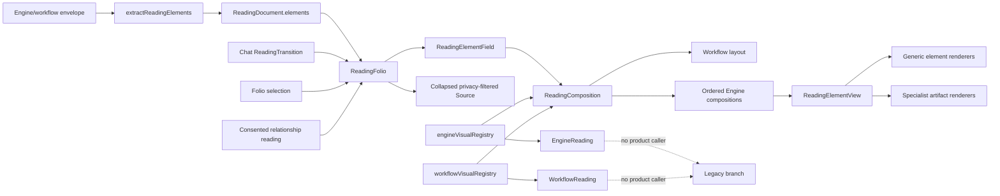

# Urania 137 Engine Output Design-to-Code Integration Audit

Date: 2026-07-27
Repository: `Sheshiyer/urania-137`
Audit baseline: `d0b3ca684882a9cf9f1169b28d680a9eb9a2ecea`
Branch: `codex/urania-role-aware-flow-repair`
Composition-pass state: current working tree, pending visual review

## Executive verdict

The Engine output layer now has **one canonical composition path**. All 18
engine contracts and all six workflow layout contracts are consumed by the
live `ReadingFolio` route. Visual fidelity is still incomplete: only four
engine outputs and one workflow composition have direct populated browser
proof, and five engine-specific source layers remain unimplemented.

**Bounded completion definition for this pass:** all 18 registered Engines and
all six registered workflows reach the canonical compositor without runtime
failure; the composed subset has deterministic desktop/mobile evidence ready
for the user’s review. This does **not** claim visual approval, populated proof
for the remaining 14 Engines or five workflows, implementation of the five
declared-only source layers, or removal of the legacy unmounted branch.

| Layer | Current coverage | What it actually proves |
| --- | ---: | --- |
| Frozen engine reference inventory | 18/18 (100%) | Every engine has an explicit target, state, provenance, and fallback. |
| Frozen workflow reference inventory | 6/6 (100%) | Every workflow has a target composition, currently marked `proposed`. |
| Named extractor coverage | 18/18 (100%) | Every supported engine has a source allowlist and semantic element path. |
| Live semantic renderer reachability | 18/18 (100%) | Known engine envelopes can reach `ReadingFolio → ReadingElementField`. |
| Manifest component contracts semantically wired/tested | 44/49 (89.8%) | A live generic, specialist, or workflow compositor covers the contract’s core relationship. |
| Manifest component contracts declared only | 5/49 (10.2%) | The name exists in the atlas/registry but the promised engine source layer is not live. |
| Engines marked `implemented` by the atlas | 7/18 (38.9%) | Current source fields have a named default projection; this is not browser proof. |
| Engines marked `partial` by the atlas | 8/18 (44.4%) | Core fields render while secondary fields remain in Source. |
| Engines marked `capture-gated` | 3/18 (16.7%) | A consented persisted capture is required for verified visual projection. |
| Named workflow composite surfaces implemented | 6/6 (100%) | Each workflow now has its declared layout, stable engine order, run ledger, and lossless fallback. Atlas status remains `proposed` pending visual review. |
| Populated engine-specific browser DOM evidence | 4/18 (22.2%) | Numerology, Panchanga, Vedic Clock, and Biorhythm. |
| Screenshot-visible successful engine output | 4/18 (22.2%) | Direct composition-pass evidence captures the same four outputs. |
| Live/API or replay fixture evidence | 17/18 (94.4%) | Data availability, not frontend visual integration; `biofield-capture` lacks even this fixture. |

The most important structural change is that registry metadata now participates
in the shipped product path. The earlier atlas-specific `EngineReading` and
`WorkflowReading` components still have no product caller, but they are no
longer the only code that knows the visual contracts:

`ReadingComposition` performs a stable partition: the registry-selected primary
element renders first, supporting elements retain source order, and every input
element has exactly one owner. Workflow groups follow their declared registry
order. Undeclared engines, unknown elements, and raw technical data remain
visible once through explicit fallback regions.

The five declared-only component layers do not create unreachable routes:
their parent Engines still render available semantic elements and fall back to
an unresolved notice plus privacy-filtered technical source when the
specialized layer is absent. An 18-way SSR integration probe covers that
missing-source path; it is a runtime-safety proof, not visual-fidelity proof.

There is deliberately no blended “percent integrated” score: it would hide
the gap between contract coverage and visual proof. The defensible quantities
are **18/18 live semantic engine paths**, **44/49 semantically wired/tested
component contracts**, **6/6 named workflow composites**, **4/18 populated
engine browser DOM artifacts**, and **4/18 successful completed-output
screenshots**. The population source of truth is
`docs/engine-output-atlas.json`, not the rows in this report.

### Exact code ownership index

Every implementation symbol used in the one-to-one tables below resolves
through these repository paths:

- Contract registry: `src/lib/readings/engineVisualRegistry.ts`.
- All 18 engine extractors and the workflow/engine envelope adapter:
  `src/lib/readings/elements.ts`.
- Canonical shell and compositor:
  `src/components/readings/ReadingFolio.tsx`,
  `src/components/readings/elements/ReadingElementField.tsx`, and
  `src/components/readings/elements/ReadingComposition.tsx`.
- Atomic element dispatcher:
  `src/components/readings/elements/ReadingElementView.tsx`.
- Live consumers: `src/components/chat/ReadingTransition.tsx`,
  `src/pages/ReadingLibraryPage.tsx`, and
  `src/pages/RelationshipReadingPage.tsx`.
- Generic semantic components: `src/components/readings/elements/`, including
  `ReadingFactGrid.tsx`, `ReadingNumberCodes.tsx`, `ReadingPositions.tsx`,
  `ReadingRelations.tsx`, `ReadingSequence.tsx`, `ReadingCycles.tsx`,
  `ReadingSpread.tsx`, `ReadingCollections.tsx`, `ReadingQuestions.tsx`,
  `ReadingMedia.tsx`, `ReadingArtifact.tsx`, `ReadingCapture.tsx`,
  `ReadingNotice.tsx`, `ReadingRaw.tsx`, and `ReadingSourcePayload.tsx`.
- Specialist artifacts: `src/components/readings/artifacts/`, including
  `ActivationCross.tsx`, `CapturePanel.tsx`, `ChakraSpectrum.tsx`,
  `DoshaClock.tsx`, `FiveLimbMandala.tsx`, `HexagramTransition.tsx`,
  `MediaArtifact.tsx`, `MetricField.tsx`, `NestedPeriodSpiral.tsx`,
  `QualityPanel.tsx`, `RaagaPlayer.tsx`, and `SafeGeometryPreview.tsx`.
- Unmounted atlas-specific branch:
  `src/components/readings/EngineReading.tsx`,
  `src/components/readings/WorkflowReading.tsx`, and
  `src/components/readings/SystemRunLedger.tsx`.

## Scoring rule

The denominator was frozen before scoring.

| Tier | Meaning |
| ---: | --- |
| 0 | Absent: no contract and no implementation. |
| 1 | Declared only: atlas/registry intent exists, but no live equivalent. |
| 2 | Wired/tested: the live canonical path reaches a semantic component and focused tests pass. |
| 3 | Runtime-verified: a populated browser artifact proves the output composition. |

Documentation and generated boards are design evidence, not implementation
evidence. A symbol or passing source-reconciliation test cannot promote a row
to Tier 3.

## Frozen visual reference manifest

### Core visual language and Engine output boards

| # | Reference | Dimensions | Authority |
| ---: | --- | ---: | --- |
| 1 | `.assets/moodboard.png` | 1672×941 | Palette, wordmark, constellation, waveform, framing, and type direction. |
| 2 | `.assets/generated/readings-ecosystem/component-atlas.png` | 1672×941 | Reading Atlas, Reading Section, System Stack, Evidence Ledger, Pattern Constellation, Timing Spine, Bridge Question, and Flat Source State. Counts are fictional. |
| 3 | `.assets/generated/readings-ecosystem/reading-folio.png` | 1672×941 | Sustained-reading hierarchy and Reading/Evidence/Source separation. Identifiers and telemetry are fictional. |
| 4 | `.assets/generated/engine-output-atlas/engine-component-families.png` | 1536×1024 | Final twelve-family Engine component design contract. |
| 5 | `.assets/generated/engine-output-atlas/engine-reading-surfaces-final.png` | 1536×1024 | Final eighteen-engine surface/state/provenance board. |

The five files above are fingerprinted by
`.assets/generated/engine-output-atlas/generation-metadata.json`.

### Approved page-composition references

| # | Reference | Composition target | Boundary |
| ---: | --- | --- | --- |
| 6 | `.assets/page-references/multi-page-architecture-moodboard.png` | Graph home, parent view, modal, and node/edge states | Historical for Engine semantics; fictional telemetry prohibited. |
| 7 | `.assets/page-references/birth-witness-page.png` | Birth Blueprint, Human Design, Gene Keys, Vedic Clock, Panchanga, timing | Composition only. |
| 8 | `.assets/page-references/union-mirror-page.png` | Synastry, composite, compatibility, relationship dynamics | Visible percentages and claims are non-authoritative. |
| 9 | `.assets/page-references/sky-weather-page.png` | Transits, cycles, retrogrades, eclipses, returns | Composition only. |
| 10 | `.assets/page-references/noesis-reading-page.png` | L0–L5 reading levels, Bridge Question, Pattern Extraction | Composition only. |
| 11 | `.assets/page-references/engine-status-page.png` | Operator/navigation constellation | Its “16 engines” total is obsolete; current contract is 18. |
| 12 | `.assets/page-references/folio-archive-page.png` | Saved reports, exports, search, history, favorites | Composition only. |
| 13 | `.assets/page-references/bridge-query-page.png` | Decision support, Horary, I Ching, follow-up inquiries | Composition only. |

### Governing contracts and provenance

| # | Reference | Authority |
| ---: | --- | --- |
| 14 | `docs/engine-output-visualization-atlas.md` | Reader-facing governing relationship grammar and state legend. |
| 15 | `docs/engine-output-atlas.json` | Executable completeness source: 18 engines, 6 workflows, 49 component contracts. |
| 16 | `docs/reading-element-library.md` | Implemented source allowlists, semantic element grammar, and boundaries. |
| 17 | `.assets/generated/engine-output-atlas/generation-metadata.json` | Generator, hashes, inputs, outputs, and non-determinism boundary. |
| 18 | `.assets/generated/engine-output-atlas/prompts/engine-component-families.txt` | Exact twelve-family generation contract. |
| 19 | `.assets/generated/engine-output-atlas/prompts/engine-reading-surfaces.txt` | Exact engine, status, and provenance generation contract. |
| 20 | `.assets/generated/engine-output-atlas/prompts/engine-reading-surfaces-final-edit.txt` | Explicit removal of invented causal links. |

### Superseded references

- `.assets/generated/engine-output-atlas/engine-reading-surfaces.png` is an
  unproven first generation and is absent from final output provenance.
- `.assets/generated/engine-output-atlas/engine-reading-surfaces-corrected.png`
  is a fingerprinted intermediate whose invented `FEEDS`, `REFINES`,
  `SUPPORTS`, `DRIVES`, and `VALIDATES` links were removed from the final.
- Generated images govern composition, hierarchy, density, palette, and
  framing. They never govern runtime data, telemetry, engine truth, or
  authorization.

## Twelve generated component families → live code

| Generated family | Live code mapping | Fidelity assessment |
| --- | --- | --- |
| Fact Constellation | `ReadingFactGrid`, plus `FiveLimbMandala`, `DoshaClock`, `SafeGeometryPreview` dispatches | Wired/tested. Values and source paths survive; the generic renderer is a grid, not a constellation. |
| Number Code Matrix | `ReadingNumberCodes` | Wired/tested and closest to the reference; browser DOM proof exists through Numerology. |
| Position Wheel | `ReadingPositions` | Wired/tested as the required sortable table; the radial wheel is not implemented. |
| Relation Field | `ReadingRelations` | Wired/tested as named endpoint rows; no multi-edge field/graph is rendered. |
| Temporal Spine | `ReadingSequence`, `NestedPeriodSpiral`, `DoshaClock` | Wired/tested with explicit order and dates. |
| Cycle Wavefield | `ReadingCycles` | Wired/tested as bars with printed values; no wavefield or forecast sequence. |
| Spread Field | `ReadingSpread`, `HexagramTransition` | Wired/tested with source order; no generalized free-layout spread engine. |
| Collection Orbit | `ReadingCollections` | Wired/tested as grouped pills/lists; no orbit geometry. |
| Question Deck | `ReadingQuestions` | Wired/tested as an ordered list; no card-deck interaction. |
| Media Artifact | `MediaArtifact`, `ReadingMedia`, `RaagaPlayer` | Wired/tested with URL allowlisting, metadata, text equivalent, and missing/failed states. |
| Capture Panel | `CapturePanel`, `MetricField`, `ChakraSpectrum`, `QualityPanel` | Wired/tested for persisted verified observations; no successful capture browser proof. |
| Technical Source | `ReadingSourcePayload`, `ReadingRaw` | Wired/tested, collapsed, privacy-filtered, and separated from Reading. |

## Eighteen engine surfaces → code, consumers, evidence, and gaps

All rows ultimately consume through `ReadingFolio → ReadingElementField`.
`ReadingTransition`, `ReadingLibraryPage`, and `RelationshipReadingPage` are
the live callers of `ReadingFolio`.

| Engine | Reference target / atlas state | Live component mapping | Tier | Remaining gap |
| --- | --- | --- | ---: | --- |
| `numerology` | Number Code Matrix / implemented | `extractNumerology → ReadingComposition → ReadingNumberCodes` | 3 | Direct DOM and screenshot proof now exist; no separate `NumerologyFactGrid`. |
| `human-design` | Facts/collections; target BodygraphMap + ActivationTable / partial | `ReadingFactGrid + ReadingCollections + ReadingRelations` | 2 | Bodygraph and activation records remain unimplemented/source-only. |
| `gene-keys` | Facts/collections; target activation/frequency / partial | `ActivationCross` for four supplied positions | 2 | `FrequencyTriadCards` is declared only; atlas prose under-reports the now-wired ActivationCross. |
| `vimshottari` | Period Timeline / implemented | `NestedPeriodSpiral` plus `ReadingSequence` fallback | 2 | No browser output proof; registry alias `DashaTimeline` does not name the implementation symbol. |
| `panchanga` | Five-Limb Facts / implemented | `FiveLimbMandala + ReadingFactGrid` | 3 | Populated DOM and screenshot proof exist through Daily Practice. Manifest test forbids “mandala” while the dispatcher uses that name; semantics remain safe but naming drift remains. |
| `vedic-clock` | Current Window + Transitions / implemented | `DoshaClock` | 3 | Populated DOM and screenshot proof now exist; registry still names generic `FieldFactGrid`/`TransitionSequence`. |
| `biorhythm` | Cycle Bands / partial | `ReadingCycles` | 3 | Populated DOM and screenshot proof now exist; forecast and critical-day sequence stay source-only. |
| `transits` | Position + Aspect Field / implemented | `ReadingPositions + ReadingRelations` | 2 | No position wheel/aspect chord field and no browser output proof. |
| `nadabrahman` | Raga Recommendation List / implemented | `ReadingFactGrid + ReadingCollections` | 2 | No Raga Time Dial or browser output proof. |
| `tarot` | Source Spread / implemented | `ReadingSpread` | 2 | No separate `CardMeaningPanel`; no browser output proof. |
| `i-ching` | Source Spread; target transition / partial | `HexagramTransition` | 2 | The specialized transition now exists, but manifest state/prose still describes it as a target; screenshot proves loading only. |
| `enneagram` | Inquiry Deck / partial | `ReadingQuestions` | 2 | Assessed `TypologyFactGrid` remains declared only. |
| `sacred-geometry` | Safe Form Facts / partial | `SafeGeometryPreview` | 2 | Current plate is a safe textual placeholder, not a source-derived geometry rendering. |
| `raaga` | Facts + Player / partial | `ReadingFactGrid + ReadingCollections + RaagaPlayer` | 2 | `SwaraSequence` is represented as a collection, not its own sequence; no browser evidence. |
| `sigil-forge` | Intention + Artifact / partial | `SafeGeometryPreview + MediaArtifact` | 2 | No dedicated construction plate and no browser output proof. |
| `biofield` | Capture Boundary / capture-gated | `CapturePanel → MetricField/ChakraSpectrum/QualityPanel` | 2 | Browser evidence is Source-only; no verified capture composition. |
| `biofield-capture` | Quality + Provenance / capture-gated | `CapturePanel → MetricField/QualityPanel` | 2 | No browser evidence and no live/API replay fixture evidence. |
| `face-reading` | Capture Boundary / capture-gated | `CapturePanel` generic observations | 2 | No browser evidence and no dedicated physiognomy/elemental-balance visual. |

### Evidence distribution

- Tier 3: 4 engines — `numerology`, `panchanga`, `vedic-clock`, and
  `biorhythm`.
- Tier 2: 14 engines.
- Screenshot-visible completed engine output: 4 engines.
- Source-only browser provenance: `biofield`.
- Loading-only screenshot: `i-ching`.
- No browser evidence: `biofield-capture`, `face-reading`, `raaga`.
- All other engines appear only in menus, ledgers, source/unit tests, API
  taxonomy, or replay fixtures.

The existing 36-row browser matrix is internally complete, but its responses
are deterministic synthetic fixtures and its screenshots generally capture
navigation or above-fold Folio state rather than completed Engine compositions.
The new direct evidence set in `docs/ui/evidence/composition-pass/` fills the
first four populated rows and includes a 390-pixel workflow composition.

## Six workflow surfaces → code and gaps

The live canonical compositor renders the workflow run ledger, orders returned
engines by the registry contract, applies the named layout, and preserves
undeclared/unknown/raw fallbacks exactly once. It does not invent relationships
between engines.

| Workflow | Proposed reference component | Live behavior | Tier | Remaining visual gap |
| --- | --- | --- | ---: | --- |
| Birth Blueprint | `CompositeIdentityMap` | Named two-column composition with declared Engine ordering | 2 | No invented identity links; visual review is pending. |
| Creative Expression | `CreativeArtifactShelf` | Named responsive shelf for artifact/media Engine groups | 2 | Shelf density and emphasis need visual review. |
| Daily Practice | `TemporalPracticeSequence` | Named single-column rhythm composition for time/motion groups | 3 | Direct desktop/mobile proof exists; no cross-engine chronology is inferred. |
| Decision Support | `PerspectiveComparison` | Named two-column comparison composition | 2 | Perspective alignment needs populated visual review. |
| Full Spectrum | `FullSpectrumConstellation` | Named responsive multi-column spectrum composition | 2 | It is a semantic grid, not constellation geometry or a filterable field. |
| Self-Inquiry | `InquiryLayerStack` | Named single-column inquiry stack | 2 | Layer rhythm needs populated visual review. |

Result: exact named workflow composition is 6/6 in code and focused tests;
one of six has populated desktop/mobile browser proof.

## Forty-nine manifest component contracts → implementation

`T1` means declared only. `T2` means a live semantic equivalent is wired and
covered by focused tests. `T3` means populated browser evidence exists.

| Contract | Current implementation mapping | Tier |
| --- | --- | ---: |
| ActivationTable | Human Design activations deliberately remain Source-only | T1 |
| BiofieldMetricBands | `MetricField` inside verified `CapturePanel` | T2 |
| BiorhythmCycleBands | `ReadingCycles` | T2 |
| BodygraphMap | Profile facts, center collection, channel relations only | T1 |
| CaptureConsentGate | `CapturePanel` gated branch | T2 |
| CaptureQualityPanel | `QualityPanel` | T2 |
| CapturedFieldReading | Verified branch of `CapturePanel` | T2 |
| CardMeaningPanel | Meaning/detail embedded in `ReadingSpread` | T2 |
| ChakraFieldMap | `ChakraSpectrum` | T2 |
| ChangingLineSequence | Ordered table inside `HexagramTransition` | T2 |
| CompositeIdentityMap | Named layout in canonical `ReadingComposition` | T2 |
| CompositePartialState | Generic workflow ledger plus `ReadingNotice` | T2 |
| ConstructionStepSequence | Ordered steps inside `SafeGeometryPreview` | T2 |
| ContributingEngineIndex | Live workflow ledger through `ReadingCollections`; exact `SystemRunLedger` branch is unmounted | T2 |
| CreativeArtifactShelf | Named layout in canonical `ReadingComposition` | T2 |
| DashaTimeline | `NestedPeriodSpiral` | T2 |
| ElementalBalanceBands | Generic capture metric/observation handling | T2 |
| FieldFactGrid | `ReadingFactGrid`, `FiveLimbMandala`, `DoshaClock` | T2 |
| ForecastSequence | Biorhythm forecast remains Source-only | T1 |
| FrequencyTriadCards | Gene Keys frequency layer remains Source-only | T1 |
| FullSpectrumConstellation | Named layout in canonical `ReadingComposition` | T2 |
| GeneKeySequence | `ActivationCross` | T2 |
| GeneratedArtifactState | Media status in `MediaArtifact` plus safe artifact fallback | T2 |
| GeometryElementIndex | Fact list in `SafeGeometryPreview` | T2 |
| HexagramChangeMap | `HexagramTransition` | T2 |
| InquiryLayerStack | Named layout in canonical `ReadingComposition` | T2 |
| InquiryQuestionDeck | `ReadingQuestions` | T2 |
| NumberReductionMap | `ReadingNumberCodes` | T3 |
| NumerologyFactGrid | Detail embedded in `ReadingNumberCodes`; no separate grid | T2 |
| OrderedCollectionList | `ReadingCollections` | T2 |
| PanchangaFactGrid | `FiveLimbMandala + ReadingFactGrid` | T2 |
| PeriodDetailPanel | Printed periods/details inside `NestedPeriodSpiral`/`ReadingSequence` | T2 |
| PerspectiveComparison | Named layout in canonical `ReadingComposition` | T2 |
| PhysiognomyObservationMap | Generic `CapturePanel` observations | T2 |
| PlanetPositionTable | `ReadingPositions` | T2 |
| PlayableArtifactState | `RaagaPlayer`/`MediaArtifact` status | T2 |
| RaagaPlayer | `RaagaPlayer` | T2 |
| RagaRecommendationList | `ReadingCollections` | T2 |
| SacredGeometryPlate | `SafeGeometryPreview` placeholder plate | T2 |
| SigilConstructionPlate | `SafeGeometryPreview` | T2 |
| SwaraSequence | Source-ordered swaras in `ReadingCollections` | T2 |
| SystemRunLedger | Live semantic ledger via `ReadingCollections`; exact component has no product caller | T2 |
| TarotSpread | `ReadingSpread` | T2 |
| TemporalPracticeSequence | Named canonical layout with populated desktop/mobile proof | T3 |
| TimeRecommendationCard | `ReadingFactGrid` | T2 |
| TransitAspectMap | `ReadingRelations` | T2 |
| TransitionSequence | `DoshaClock` | T2 |
| TypologyFactGrid | No assessed Enneagram record renderer | T1 |
| UnresolvedFieldState | `ReadingNotice` plus collapsed `ReadingRaw`/Source | T2 |

Only `RaagaPlayer` is both an exact atlas component name and a live dispatched
React symbol. The six workflow component names now appear as executable
`data-workflow-layout` contracts in one shared `ReadingComposition` rather than
as six duplicative React symbols. `SystemRunLedger` remains an exact legacy
symbol under the unmounted `WorkflowReading` branch.

## Current planning reconciliation

### Repository plans

- `docs/plans/2026-07-27-urania-graph-first-ui-realignment.md` defines the
  exact registry, shared shells, specialist artifacts, extractors, and exit
  gate that now exist. Its final 15 acceptance checkboxes remain unchecked even
  though ISA Iteration 10 records the implementation and verification as
  complete. The plan is stale as a status surface.
- `docs/engine-output-visualization-atlas.md` correctly keeps all six named
  workflow composites `proposed` pending the user’s visual review. Their named
  layouts are now live in `ReadingComposition`. Its engine prose is stale where
  newer specialist dispatch exists (`ActivationCross`, `HexagramTransition`,
  `FiveLimbMandala`, `DoshaClock`, `NestedPeriodSpiral`).
- `docs/reading-element-library.md` is an older baseline: its union table omits
  the later `media`, `artifact`, and `capture` element kinds, and some
  engine-to-element rows predate the specialist artifact pass.
- `docs/frontend-brand-flow-review-2026-07-27.md` P0/P1 work is substantially
  closed by Iterations 10–11. This pass adds direct screenshot stories for
  Numerology and Daily Practice, but its broader P2 evidence request remains
  open.
- `docs/urania-137-multi-page-integration-plan.md` remains useful for page
  composition, but its generated page telemetry and older modal/report wiring
  are not authoritative for Engine runtime state.

### GitHub

The repository currently has **16 open issues, 0 open pull requests, and 0
open issues that track the current Engine-output design program**. All 16 open
issues belong to the older **Cloudflare Auth + Reading Storage** milestone,
carry stale `status:planned` labels, and have no GitHub Project membership.
The Daily Panchanga milestone is 0 open / 80 closed; the Cloudflare milestone
is 16 open / 66 closed.

| Issue | Open title / plan task | Current evidence-based classification |
| --- | --- | --- |
| [#91](https://github.com/Sheshiyer/urania-137/issues/91) | Epic: migrate auth/storage/hosting to Access, D1, Pages | Stale parent epic; reconcile children, then close. |
| [#150](https://github.com/Sheshiyer/urania-137/issues/150) | T-059 production variables/no-bypass | Completed; overlaps #158. |
| [#157](https://github.com/Sheshiyer/urania-137/issues/157) | T-066 Access cutover | Completed; overlaps #172. |
| [#158](https://github.com/Sheshiyer/urania-137/issues/158) | T-067 production secrets | Completed; overlaps #150. |
| [#160](https://github.com/Sheshiyer/urania-137/issues/160) | T-069 V1 live authentication-required proof | Completed; evidence aggregated by #168/#170. |
| [#161](https://github.com/Sheshiyer/urania-137/issues/161) | T-070 V2 live identity/D1 mapping proof | Completed; evidence aggregated by #168/#170. |
| [#162](https://github.com/Sheshiyer/urania-137/issues/162) | T-071 V3 two-account live isolation proof | Owner-waived; only residual if strict two-account proof is reactivated. |
| [#163](https://github.com/Sheshiyer/urania-137/issues/163) | T-072 V4 fresh-session durability proof | Completed; evidence aggregated by #168/#170. |
| [#164](https://github.com/Sheshiyer/urania-137/issues/164) | T-073 dev identity inert in production | Completed; evidence aggregated by #168/#170. |
| [#165](https://github.com/Sheshiyer/urania-137/issues/165) | T-074 reconfirm V5–V8 in production | Completed; evidence aggregated by #168/#170. |
| [#166](https://github.com/Sheshiyer/urania-137/issues/166) | T-075 backend hardening from live findings | Completed in Phase-5 sign-off. |
| [#167](https://github.com/Sheshiyer/urania-137/issues/167) | T-076 live auth/logout/Folio UI polish | Completed in Phase-5 sign-off. |
| [#168](https://github.com/Sheshiyer/urania-137/issues/168) | T-077 consolidated live evidence dossier | Completed in Phase-5 sign-off. |
| [#169](https://github.com/Sheshiyer/urania-137/issues/169) | T-078 mark Phase-5 ISA evidence verified | Completed in Phase-5 sign-off. |
| [#170](https://github.com/Sheshiyer/urania-137/issues/170) | T-079 final live migration exit gate | Completed in Phase-5 sign-off. |
| [#172](https://github.com/Sheshiyer/urania-137/issues/172) | T-081 User Access-app provisioning handoff | Resolved through Access-app reuse; overlaps #157. |

Completion evidence for T-066–T-079 is recorded in
`docs/auth/2026-07-24-t079-phase5-signoff.md`; `wrangler.toml` records the
T-081 resolution. These issues all map to
`docs/superpowers/plans/2026-07-20-cloudflare-auth-readings-plan.md`, not to
the Engine atlas or graph-first UI plans.

The merged graph-first implementation is
[#173](https://github.com/Sheshiyer/urania-137/pull/173): 100 changed files,
21 commits, and green checks. Iteration 11 commit `d0b3ca6` is one commit ahead
of `origin/main`, with no open pull request or issue.

### Planning gaps with no current issue

- Removal or formal deprecation of the unmounted `EngineReading` /
  `WorkflowReading` branch; registry consumption on the canonical path is now
  complete.
- The remaining 14 rows of the 18-engine populated browser/screenshot evidence
  matrix.
- The five declared-only engine layers. All six proposed workflow composition
  contracts are implemented but await visual approval.
- Authenticated-consent share links, `birth_profiles`, optional cross-session
  semantic memory, and decorative glow-core token debt.
- Stale README/product-map “first deploy pending” claims.

The superseded 117-task multi-page plan should not be converted into 117
retroactive issues. Selemene REQ-1 and REQ-3 belong in the upstream Selemene
tracker. No GitHub state was mutated by this audit.

## Highest-leverage remaining work

1. **Finish the 18-engine visual proof matrix.** Four successful populated
   outputs are now captured. Add the remaining fourteen engines plus partial,
   empty, failed, and capture-gated states, each with screenshot, DOM,
   request/response ledger, Axe result, and fixture provenance.
2. **Add an executable conceptual-to-runtime component map.** Extend the
   manifest with `implementationComponent` and `consumerPath`, then validate
   symbol reachability rather than searching registry strings.
3. **Remove or deprecate the legacy presentation branch.** Registry metadata is
   now live in `ReadingComposition`; keeping unmounted `EngineReading` and
   `WorkflowReading` indefinitely would restore two architectures.
4. **Close the five declared-only engine layers:** Human Design
   Bodygraph/activations, Biorhythm forecast sequence, Gene Keys frequency
   layer, and Enneagram assessed profile.
5. **Complete the user-led visual review of all six workflow layouts.** The
   contracts are implemented without inferred cross-engine relationships;
   promote `proposed` only after populated review.
6. **Refresh planning status.** Mark the shipped graph-first plan complete,
   update the older element library, and create current issues for the evidence
   matrix, legacy-branch removal, missing engine layers, and workflow visual
   approval.
7. **Reconcile delivery state.** Publish/review commit `d0b3ca6`, close or
   reclassify the 16 stale Cloudflare issues, and explicitly preserve or reverse
   the #162 owner waiver.
8. **Separate semantic completeness from visual fidelity in all future
   reporting.** Publish contract, wired/tested, and browser-verified percentages
   independently.

## Verification performed during this audit

- Focused compositor and Folio suite — 5 files, 29/29 tests passed.
- Focused artifact/compositor regression after the Vedic Clock contrast repair
  — 3 files, 23/23 tests passed.
- After all temporary Folio fixtures were deleted, `npm test` passed 84/84
  files and 688/688 tests, and `npm run build` passed with 1,657 modules
  transformed. The test/build result therefore does not depend on retained
  review data.
- `node --test scripts/readings/engine-output-atlas.test.mjs`
  — 9/9 atlas, privacy, membership, and registry reconciliation tests passed.
- `npm run verify:ui-visual -- http://127.0.0.1:8788`
  — 36/36 deterministic rows passed, including Axe and reflow assertions.
- Direct in-app browser verification proved Numerology plus the Daily Practice
  composition (`panchanga → vedic-clock → biorhythm`) at 1440×1000 and
  390×844. Both viewports had zero root overflow, known readings omitted the
  old `Unstructured Source` preface, and every declared primary slot resolved.
- Direct screenshot evidence is stored under
  `docs/ui/evidence/composition-pass/`. Temporary local Folio fixtures were
  deleted after capture; no review fixture remains in local D1.
- 15/15 visual images in the scoped reference corpus were inspected at original
  resolution.
- 5/5 final generation metadata hashes matched.
- CodeGraph confirmed `EngineReading` is called only by `WorkflowReading`,
  `WorkflowReading` has no caller, and `ReadingFolio` has three live callers.

Build emitted existing warnings for the parent Astro TypeScript base config and
the Vite chunk-size threshold; neither blocked the build.
