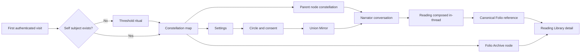

# Urania 137 Frontend Brand, Components, and Journey Review

Status: evidence-backed review; no user-facing implementation changed
Reviewed source: `c2d5238` plus the intentional dirty worktree present on 2026-07-27
Scope: frontend identity, vocabulary, component system, journey coherence, responsive behavior, and accessibility

## Executive assessment

Urania already has a distinctive identity. The void field, restrained gold
geometry, Panchang/Satoshi foundation, engraved reading titles, violet witness
state, emerald computed state, and constellation interaction are recognizably
Tryambakam Noesis. This is not a generic chat product wearing a mystical skin.

The system is not yet one coherent living-reading experience. It currently
behaves as three adjacent products:

1. a graph-first celestial navigator,
2. a conversation-first intake and result sheet,
3. an archive/settings console built from dense cards and technical metadata.

The governing brand principle is already written in the source material:
**“Architectural, not decorative — sacred geometry is load-bearing.”** That is
the correct decision test for the next iteration. Urania is strongest where
geometry explains real structure (`ReadingAtlas`, evidence kinds, timing order,
source counts). It loses trust where geometry merely looks computational
(invented node totals, infinity-frequency, derived “resonance,” evenly spaced
archive records).

The product should be described accurately as **graph-first discovery,
conversation-first intake, and visual-reading-first return**. It is not yet
chat-first at the first viewport: a returning person must interpret the map,
enter a parent node, and choose a child before the narrator appears.

## Review environment

- Source: current local worktree; no existing change was reverted or reformatted.
- Build: `npm run build` passed; Vite transformed 1,616 modules.
- Runtime: Wrangler Pages local runtime at `http://localhost:8792`.
- Identity: local development account `dev@urania.local`.
- Archive state: one owner-scoped Folio record was available locally.
- Browser engine and matrix: headless Chromium through Playwright at desktop
  `1440×1000`, mobile `390×844`, and a `720×1000` CSS-pixel viewport proxy
  for effective 200% reflow.
- Runtime diagnostics: zero console errors or warnings, page errors, failed
  requests, or HTTP failures across the reviewed routes.
- Reference set: `.assets/moodboard.png`, the multi-page architecture board,
  all seven page references, `component-atlas.png`, and `reading-folio.png`.
- Browser matrix and captures: see the Evidence index.
- Limitation: this review does not represent a second authenticated participant
  or a populated production administrator session. Live unauthenticated, empty
  archive, permission-denied, and server-error states were unavailable; their
  rendering was reviewed from source instead. No logout, relationship, consent,
  reading-generation, or Folio-save mutations were sent; opening the existing
  chat flow created local chat session/turn requests.
- Accessibility boundary: keyboard order, activation, focus visibility,
  dialog containment/return, Escape, pointer targeting, DOM semantics,
  contrast, and source-level reduced-motion behavior were reviewed. This was
  not a VoiceOver/NVDA screen-reader run, a cross-engine run, or a formal WCAG
  1.4.10 test at 320 CSS pixels. Those remain implementation-verification
  requirements rather than claims of conformance.

## Product and route map

The loop is structurally sound: onboarding establishes a subject, the map
chooses a lens, conversation assembles the request, one canonical record is
saved, and Library recovers that same record. The problem is not route
coverage. The problem is that each transition changes interaction grammar and
terminology more than it should.

## What already feels unmistakably Urania

### 1. The visual identity is coherent at the foundation

The shipped palette matches the canonical brand configuration: Void Black,
Sacred Gold, Witness Violet, Flow Indigo, Coherence Emerald, Parchment, Muted
Silver, and Deep Surface. Motion is restrained, graph reveals respect
`prefers-reduced-motion`, and the repeated fine-rule/diamond grammar matches
the source boards.

### 2. The constellation is a real interaction model

The same `ConstellationGraph` renders both the galactic overview and each
parent system. Nodes support pointer, Enter, Space, hover, and focus states.
This carries the “map the circuit like a cosmos” brand idea into actual
navigation rather than leaving it in marketing imagery.

### 3. The reading layer contains unusually honest primitives

`ReadingAtlas` explicitly distinguishes native sections from a flat record and
refuses to invent missing relationships. `EvidenceLedger` distinguishes
computed, witness, historical, retrieval, and system evidence.
`PatternConstellation` labels retrieval as synthesis memory rather than chart
fact. `ReadingRelations`, `ReadingSequence`, and `ReadingCycles` print the
values that their marks encode. This is the strongest part of the component
system.

### 4. Canonical identity and trust are visible

Chat and Library resolve the same record identifier and checksum. The Library
explains owner, subject, source, producer, and access reason. Settings explains
that relationship consent permits shared generation without exposing either
person’s entire archive. The interface assumes capability instead of treating
the reader as broken.

### 5. Error and absence language is generally honest

The system says when an engine, save, relationship service, subject, or record
is unavailable. It does not convert those states into mystical ambiguity.

## Material findings

### Blocker — dialog semantics and focus behavior are incomplete

`ChatSheet` and the shared `Modal` render visually convincing overlays but do
not expose `role="dialog"`, `aria-modal`, an associated title, initial focus,
a focus trap, Escape close, or focus restoration. Keyboard focus can move
behind the overlay. Outside-click close is implemented on a non-semantic
backdrop. This blocks an accessible component-system sign-off.

Required direction: one `InstrumentDialog` primitive owning desktop modal and
mobile sheet variants, with semantic dialog markup, focus lifecycle, Escape,
scroll locking, an inert background, labelled title/description, and explicit
close behavior.

Evidence: `src/components/chat/ChatSheet.tsx:431`,
`src/components/Modal.tsx:18`.

### Blocker — several displayed metrics are simulated rather than observed

The home footer hard-codes `1,337` nodes, `12,851` connections, and
`Frequency ∞`. Node pages calculate “Resonance” from label length and child
count. These marks look authoritative, but they do not describe stored state.
That directly conflicts with “sacred geometry as data visualization,” the
brand’s observational posture, and the reading layer’s otherwise careful
provenance.

Required direction: remove them, label them explicitly as mythic ornament, or
replace them with real counts and a named calculation. `Sub-Nodes` and `Live
Paths` can remain when sourced from actual capabilities; “Resonance” cannot.

Evidence: `src/pages/HomePage.tsx:20`, `src/pages/NodePage.tsx:159`.

### Blocker — critical brand-avoid vocabulary is shipped as product structure

The canonical voice system marks `path`/`journey` as critical avoid words and
recodes them toward architecture, protocol, and grammar. The runtime repeatedly
ships `Paths`, `Live Paths`, and `Union Mirror path`. This is not a stylistic
preference: the current vocabulary frames the product as a guided progression
rather than an instrument for inhabiting and examining structure.

Required direction: replace `Paths` with `Relations`, `Structures`, or
`Protocols` where those concepts actually exist; use `Union Mirror access` for
the consent state; omit reference-only categories until implemented.

Evidence: `src/pages/HomePage.tsx:21`, `src/pages/NodePage.tsx:161`,
`src/components/chrome/PageTabs.tsx:1`, `src/pages/SettingsPage.tsx:356`,
canonical `03-voice-and-tone.md`, and `brand-config.yaml`.

### Major — the first viewport does not explain what the product does

The returning-user home view presents a beautiful graph, brand wordmark, node
names, decorative verbs, and system statistics. It does not surface the core
promise: examining the machinery of meaning through multiple lenses while
preserving authorship. “Explore · Connect · Understand · Ascend” is generic,
and “Ascend” leans toward the hierarchical transformation language the brand
normally rejects.

Required direction: add one concise product statement and one primary action
without covering the graph. For example: “See what is active. Choose a lens;
the narrator assembles the reading with you.” Keep the map visible.

The first-time Threshold also omits the wider Tryambakam/Kha-Ba-La proposition
and moves directly from poetic threshold language into personal facts. A
single grounded sentence about self-consciousness, embodied observation, and
independence would connect Urania to the larger practice without turning
onboarding into a pitch.

Evidence: `src/pages/HomePage.tsx:28`, `src/pages/ThresholdPage.tsx:428`,
canonical `05-messaging-direction-summary.md`.

### Major — “chat-first” is true only after two levels of navigation

The Threshold is narrator-led, but returning users land on the map. A reading
conversation appears only after choosing a parent and then a runnable child.
The Library’s “Begin in chat” button jumps to the Noesis Reading constellation,
not into a conversation. The current implementation is coherent as
graph-first discovery and chat-first intake, but not as a chat-first product.

Required direction: preserve both modes but make the relationship explicit.
Add a global “Begin a reading” affordance that opens a compact lens selector
and then the same narrator session. The map remains the spatial entry; the
conversation becomes an equally direct entry.

Evidence: `src/App.tsx:13`, `src/pages/NodePage.tsx:167`,
`src/pages/ReadingLibraryPage.tsx:91`.

### Major — one archive has too many names and doorways

The user encounters `Archive`, `Library`, `Folio Archive`, `Reading Library`,
`canonical Folio record`, `Open record`, and the `Archive doorway`. The
underlying distinction is sound—graph doorway versus recovery reader—but the
copy makes them feel like separate stores.

Required direction: use **Folio** as the product noun and plain language for
views:

- `Folio` — the one owner-scoped archive,
- `Folio map` — constellation view,
- `Reading` — canonical detail,
- `Browse Folio` — list/search/recovery.

Evidence: `src/components/chrome/TopNav.tsx:19`,
`src/pages/ReadingLibraryPage.tsx:79`,
`src/components/chat/ResultThread.tsx:101`.

### Major — engine-shaped data can dominate the reading

The persistence contract is admirably lossless, but a real deterministic
reading can still expose long JSON-shaped engine output in chat or an archived
record when extraction cannot produce richer elements. Preserving source is
not the same as making it primary reading material.

Required direction: render three explicit layers:

1. **Reading** — narrative sections and the most meaningful visual elements,
2. **Evidence** — systems, provenance, confidence, and source paths,
3. **Source** — lossless raw payload behind a collapsed disclosure or export.

The archive remains byte-faithful; the default reading view becomes human.

Evidence: `src/lib/chat/resultMessages.ts:12`,
`src/lib/readings/adapters.ts:87`,
`src/components/readings/ReadingFolio.tsx:66`.

### Major — streaming and long-form reading share one unstable announcement surface

The entire conversation thread is a polite live region. Every streaming delta
mutates content inside it, while full reading results can also be inserted
there. Auto-scroll runs on each message/result update. This can overwhelm
screen-reader announcements and pull a reader away from the section they are
examining.

Required direction: announce only concise status changes, keep completed
messages outside a continuously mutating live region, pause auto-scroll after
manual reader movement, and give long-form results an explicit “Open reading”
transition.

Evidence: `src/components/chat/ChatSheet.tsx:239`,
`src/components/chat/ChatSheet.tsx:407`,
`src/components/chat/ChatSheet.tsx:464`.

### Major — long-form readings need a material and typographic mode

The generated `reading-folio.png` correctly uses the Parchment token as an
actual reading surface, creating a clear transition from dark instrument to
legible document. The application currently uses Parchment almost entirely as
text on Void/Surface. Large readings therefore remain visually inside a
control console and become tiring to scan.

Required direction: introduce a `ReadingCanvas` mode—Parchment or a higher
contrast “paper in the instrument”—for sustained prose, while evidence,
navigation, and source payloads remain in the dark technical shell.

Evidence: `.assets/generated/readings-ecosystem/reading-folio.png`,
`src/components/readings/ReadingFolio.tsx:22`.

The current Markdown renderer also collapses every heading level to `h3`,
including headings inside an existing `h3` section, and does not constrain
prose to a sustained-reading measure. Preserve source hierarchy, bind article
labels to headings that actually render, and target a 65–75 character measure.

Evidence: `src/components/readings/ReadingBody.tsx:8`,
`src/components/readings/ReadingSection.tsx:29`,
`src/components/readings/ReadingFolio.tsx:33`.

### Major — muted microtype is below reliable reading contrast

The interface uses many 7–10px uppercase labels with `silver/45–70` or
`gold/55–65`. Computed over Void Black:

| Treatment | Contrast |
|---|---:|
| `silver/75` | 4.26:1 |
| `silver/70` | 3.85:1 |
| `silver/60` | 3.12:1 |
| `silver/55` | 2.80:1 |
| `silver/45` | 2.24:1 |
| `gold/70` | 4.28:1 |
| `gold/60` | 3.41:1 |
| `parchment/90` | 13.50:1 |

These labels are normal-size text, not large text; tracking does not reduce the
contrast requirement. The smallest examples appear in the Reading Library map,
evidence states, source paths, settings states, and page chrome.

Required direction: define semantic text tokens (`primary`, `secondary`,
`metadata`, `disabled`) with tested foreground values. Set 12px as the normal
metadata floor, reserve 10–11px for nonessential labels at compliant contrast,
and never use 7–8px for information.

Evidence: `src/index.css:115`,
`src/components/readings/ReadingLibraryMap.tsx:101`,
`src/components/readings/elements/ElementFrame.tsx:22`.

### Blocker — the primary graph has invalid assistive structure and no equivalent

The home constellation contains focusable SVG groups, but the outer SVG is
declared as one image and no semantic list offers the same seven destinations
and descriptions. The archive map’s decorative SVG is hidden correctly, and
its record buttons are separate, but the home graph remains the only route to
several primary surfaces on mobile. Nesting focusable `role="button"` controls
inside `role="img"` can hide the controls from assistive technology. Graph
nodes receive keyboard focus but show no reliable visible focus treatment.

Required direction: pair every navigational graph with an ordered DOM list
that can be visually hidden, revealed in reduced-complexity mode, or used as a
mobile “list lens.” The list should include node label, epithet, and purpose.

Evidence: `src/components/ConstellationGraph.tsx:161`,
`src/components/primitives/StellarNode.tsx:35`.

### Major — small-screen tapping, reflow, and chrome containment fail

At `390×844`, tapping the visual center of the Integrated Reading node can hit
a decorative SVG `<line>` instead of its control; keyboard activation works.
The Logout control extends beyond the right viewport edge on every reviewed
mobile route. At the effective 200%-zoom check, Folio exposes only five of nine
visual nodes and loses the Exports/PDF/DOCX/Markdown cluster off-canvas; Witness
edge nodes and lower navigation are clipped.

Required direction: set decorative graph geometry to `pointer-events: none`,
raise interactive nodes into an explicit hit layer, keep global controls inside
the viewport, and switch graph surfaces to a list/reflow mode before 200% zoom
can remove content.

Evidence: live browser captures
`mobile-integrated-reading-center-click.png`,
`folio-effective-200pct-720csspx.png`, and
`witness-effective-200pct-720csspx.png`.

### Major — async states are not mutually exclusive

With no Folio entries, the Library can show an error banner and “Your Folio is
still quiet” simultaneously. Canonical chat binding can remain “Binding…”
without timeout or recovery after a Folio failure. Settings similarly lets
subject failure fall through to an empty-circle message, makes loading and
ready-empty relationships look alike, and suppresses pattern errors.

Required direction: introduce one `AsyncBoundary` contract with mutually
exclusive loading, empty, partial, stale, permission-denied, and error states.
Every waiting state needs a finite recovery path.

Evidence: `src/pages/ReadingLibraryPage.tsx:144`,
`src/components/readings/CanonicalReadingReference.tsx:91`,
`src/pages/SettingsPage.tsx:269`,
`src/components/chrome/PatternSection.tsx:23`.

### Moderate — the Folio constellation encodes membership, but not useful difference

Every recent record is placed evenly around the same orbit. The spokes mean
“belongs to this Folio,” while position has no stated meaning. With ten records
the view becomes a decorative chooser that repeats the list below.

Required direction: either encode a real dimension—time, node family, subject,
or reading type—or simplify it to a compact archive atlas. State the positional
encoding in the caption.

Evidence: `src/components/readings/ReadingLibraryMap.tsx:19`.

At phone widths, up to ten fixed-width orbit buttons also overlap one another
and the header inside the fixed-height figure. The live one-record state did
not trigger the maximum-density case, so this is a source-confirmed responsive
risk rather than a populated-runtime observation.

### Moderate — reference-only controls make node pages feel unfinished

`Overview · Nodes · Paths · Relations · Insights` is copied from the moodboard,
but only Overview works. Disabled future navigation adds weight, introduces the
brand-avoided word “Paths,” and tells the user what is missing on every parent
page.

Required direction: hide unavailable peer views. Add them when the data and
interaction exist.

Evidence: `src/components/chrome/PageTabs.tsx:1`.

### Moderate — the consent mechanics are secure but not yet humane

Settings clearly explains two-person ownership, but invitation is still a
copy/paste token operation. That communicates backend mechanics rather than a
trusted relationship ritual and creates avoidable failure points.

Required direction: keep the opaque token in the protocol, but wrap it in an
authenticated invite link with a clear consent summary, participant preview,
expiry, selected subject, and accept/decline screen. Never let the
administrator substitute for either participant.

Evidence: `src/pages/SettingsPage.tsx:420`.

### Moderate — user and operator architecture share one primary map

`Engine Status · The Machine` is a peer of Birth Witness, Union Mirror, Sky
Weather, Noesis Reading, Folio Archive, and Bridge Query. For the
terminal-comfortable core audience this may be interesting, but it changes the
map from a reading ecology into a product architecture diagram.

Required direction: decide explicitly whether Urania is a personal instrument
or an operator console. If personal, move engine health behind Settings or an
operator mode. If both, expose a named mode switch rather than mixing jobs.

Evidence: `src/data/selemeneNodes.ts:82`.

### Moderate — narration and deterministic copy use two different philosophies

The narrator preserves authorship and anti-dependency well, but its prompt
centers warmth, gentleness, and stillness while the canonical voice asks for
grounded, direct, respectful challenge. Several deterministic daily lexicons
go further into “soul,” “essential and true,” “awakening,” “sacred,” and
“abundant power.” These phrases bypass the narrator’s otherwise careful
guardrails and drift toward self-essentialism and mystical authority.

Required direction: rewrite deterministic lexicons through the same
Anatomist/PubMed×Alex Grey vocabulary gate as generative narration; prefer
observable qualities, anatomy, timing, and inquiry. Keep warmth as interaction
care, not as the defining editorial register.

Evidence: `functions/lib/chat/prompts.ts:33`,
`src/lib/daily/lexicon/vara.ts:13`,
`src/lib/daily/lexicon/transit.ts:74`,
`src/lib/daily/lexicon/yoga.ts:150`.

### Minor — token ownership is good but not complete

Raw colors are mostly centralized, yet glow shadows, white cores, and some
threshold colors remain hard-coded. Typography also adds Cinzel beyond the
canonical Panchang/Satoshi/SF Mono system. Cinzel is visually successful, but
it should be declared as the reading/engraving role in the brand tokens rather
than introduced implicitly.

Evidence: `src/styles/tokens.ts:1`, `src/index.css:1`,
`src/components/ConstellationGraph.tsx:173`.

### Minor — concept plates and shipped assets are not clearly distinguished

The moodboards and generated reading-ecosystem plates are design references,
not imported runtime assets. Their fake identifiers, counts, and status values
therefore do not ship directly. The README nevertheless describes a
one-to-one relationship to page references and uses the generated plates as
anchors, which can make concept fidelity sound like implementation fidelity.

Required direction: label each asset as `reference`, `approved contract`, or
`implemented`, and maintain a small traceability table from contract to
component and test.

Evidence: `.assets/**`, `README.md:80`, and a source import scan.

## Vocabulary review

### Keep

- witness, pattern, field, inquiry, structure, source, evidence, author,
  coherence, integration, constellation, threshold, lens, Folio
- “The engine does not tell you what is wrong; it shows what is active” as the
  central product posture
- owner, subject, producer, and access reason as separate trust concepts

### Recode or remove

| Current copy | Direction |
|---|---|
| `Ascend` | `Author`, `Integrate`, or `Examine` |
| `Paths` | `Relations`, `Structures`, or hide until implemented |
| `Frequency ∞` | remove unless a real measurement exists |
| `Resonance 86.4%` | remove or expose the method and source |
| `Union Mirror path` | `Union Mirror access` or `same-owner reading` |
| `Archive` + `Library` | one noun: `Folio`; distinguish views with verbs |
| `Subjects` in primary copy | `people` or `profiles`; retain `subject` inside trust detail |
| `Begin in chat` | `Begin a reading`; conversation is the mechanism, not the product |

The current copy is strongest when direct and structural. It weakens when it
inherits mock-interface vocabulary or sounds like a mystical progression.

## Recommended living-reading component system

### Foundation

1. **Semantic color tokens** — text, border, surface, focus, witness, computed,
   unresolved, warning; every combination contrast-tested.
2. **Type roles** — display, reading title, prose, UI, metadata, code/data;
   declared minimum sizes and line lengths.
3. **Instrument frame** — shared page, panel, dialog, sheet, and reading-canvas
   primitives with one focus and motion contract.
4. **State grammar** — skeleton, empty, partial, unavailable, degraded,
   loading, complete, stale, revoked, and error.

### Atomic reading encodings

1. `ReadingFactGrid` — named facts and exact values.
2. `ReadingRelations` — endpoints, relation, measure, and text edge list.
3. `ReadingSequence` — ordered or temporal steps.
4. `ReadingCycles` — scaled values with printed number, range, and phase.
5. `ReadingPositions` — explicit coordinates, houses, gates, or placements.
6. `ReadingSpread` — source-defined spatial layouts.
7. `ReadingCollections` — grouped evidence or symbols.
8. `ReadingQuestions` — open inquiry, never presented as computed fact.
9. `ReadingNotice` — missing, provisional, conflicting, or degraded state.
10. `ReadingSource` — exact raw payload, collapsed by default.

Every encoding must declare:

- what each mark means,
- which source path produced it,
- its evidence kind and confidence,
- a readable text/table equivalent,
- its empty, partial, overflow, and reduced-motion behavior.

### Composites

1. `ReadingOpening` — title, subject, moment, question, and source integrity.
2. `ReadingAtlas` — source-supplied section structure only.
3. `ReadingNarrative` — prose-first chapters on a sustained-reading canvas.
4. `ReadingEvidence` — ledger, systems, provenance, conflicts, and checksum.
5. `ReadingTiming` — moments, cycles, and active windows.
6. `ReadingBridge` — one grounded next question or related reading.
7. `ReadingFolioCard` — compact canonical reference used in chat and browse.
8. `ReadingTrustPanel` — why this person can read this record.

### Cross-cutting interaction primitives

1. `InstrumentDialog` — one semantic shell for modal and sheet behavior.
2. `AsyncBoundary` — mutually exclusive loading, empty, partial, and failure
   states with finite recovery.
3. `RelationList` — the canonical accessible representation of graph meaning.
4. `SemanticGraph` — optional, data-bound marks with a legend and adjacent
   list/table.
5. `DecorativeConstellation` — explicitly `aria-hidden`, noninteractive, and
   free of quantitative claims.
6. `RecordProvenance` — owner, subject, source, producer, access, and checksum.

### Presentation modes

- `thread`: compact narrative, one meaningful visual at a time,
- `reading`: sustained prose with section navigation,
- `folio`: canonical metadata, evidence, source, and recovery,
- `compare`: two consented subjects with symmetrical ownership,
- `operator`: engine health and archive administration.

This prevents one component from trying to be a chat message, full document,
data audit, and administrator record simultaneously.

## Prioritized sequence

### P0 — protect trust and basic access

1. Replace `Modal` and `ChatSheet` shells with `InstrumentDialog`.
2. Add a non-graph navigation equivalent and repair SVG control semantics.
3. Remove simulated statistics and ungrounded resonance/frequency.
4. Raise microtype contrast and size; add semantic text tokens.
5. Put the product promise and direct reading entry on the first viewport.

### P1 — make the reading human before making it richer

1. Split Reading, Evidence, and Source layers.
2. Add `ReadingCanvas` using Parchment as a sustained-reading material.
3. Default raw JSON to a collapsed source disclosure.
4. Add section navigation and long-content overflow rules.
5. Unify Archive/Library/Folio vocabulary.

### P2 — make geometry accountable

1. Add an encoding contract to every visual component.
2. Give the Folio map a real positional dimension or simplify it.
3. Provide list/table equivalents for graphs and relations.
4. Promote source path, evidence kind, and confidence into shared primitives.
5. Add screenshot stories for populated, flat, partial, empty, and failed records.

### P3 — refine the living ecosystem

1. Add a direct conversation entry while preserving the constellation.
2. Separate personal and operator modes.
3. Turn private relationship tokens into authenticated consent links.
4. Add consented compare/synastry presentation with symmetrical subject panels.
5. Let related readings and bridge questions create continuity without implying
   automatic learning or hidden memory.

## Evidence index

### Source and brand

- `.assets/moodboard.png`
- `.assets/page-references/multi-page-architecture-moodboard.png`
- `.assets/generated/readings-ecosystem/component-atlas.png`
- `.assets/generated/readings-ecosystem/reading-folio.png`
- `src/styles/tokens.ts`
- `src/index.css`
- `src/App.tsx`
- `src/pages/HomePage.tsx`
- `src/pages/NodePage.tsx`
- `src/pages/ReadingLibraryPage.tsx`
- `src/pages/SettingsPage.tsx`
- `src/components/chat/ChatSheet.tsx`
- `src/components/readings/*`
- `src/components/readings/elements/*`
- canonical `03-voice-and-tone.md`, `05-messaging-direction-summary.md`,
  and `brand-config.yaml`

### Browser captures

- Evidence directory: `/tmp/urania-frontend-review-browser/`
- Route viewports: `home`, `witness`, `folio`, `readings`, and `settings`, each
  captured at `1440×1000` and `390×844`.
- Dialog sequence:
  `integrated-reading-open-desktop.png`,
  `integrated-reading-tab-desktop.png`,
  `integrated-reading-after-escape-desktop.png`.
- Mobile activation:
  `mobile-integrated-reading-center-click.png`,
  `mobile-integrated-reading-keyboard-open.png`.
- `720×1000` CSS-pixel viewport proxy for effective 200% reflow:
  `folio-effective-200pct-720csspx.png`,
  `witness-effective-200pct-720csspx.png`.
- Machine-readable probes:
  `recon-report.json`, `interaction-report.json`, and
  `additional-report.json`.

### Route-level live summary

| Route | Strongest quality | Principal observed risk |
|---|---|---|
| Home | Clear visual hierarchy and brand recognition | clipped Logout/edge nodes, no visible graph focus, simulated totals |
| Witness | Legible constellation title and node grouping | pointer interception, clipped mobile edge nodes, ungrounded resonance |
| Folio | Strong continuity with the archive concept | 200%-zoom node loss and unencoded orbital position |
| Readings | Best first-viewport comprehension and CTA | dense engine-shaped result; mobile annotation overlap |
| Settings | Consent/ownership explanation is understandable | loading, empty, and error states are insufficiently distinct |

### Quantitative probes

- recurring color contrast ratios computed from the shipped palette and opacity,
- user-facing vocabulary scan against the canonical AVOID list,
- hard-coded style scan outside token sources,
- production build and route/API smoke probes,
- local archive count and authenticated development identity probe.
