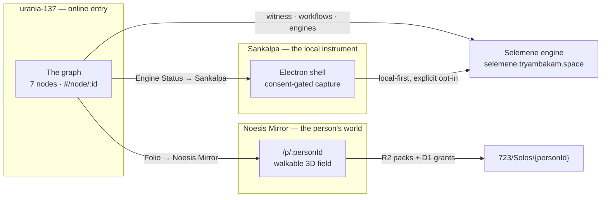
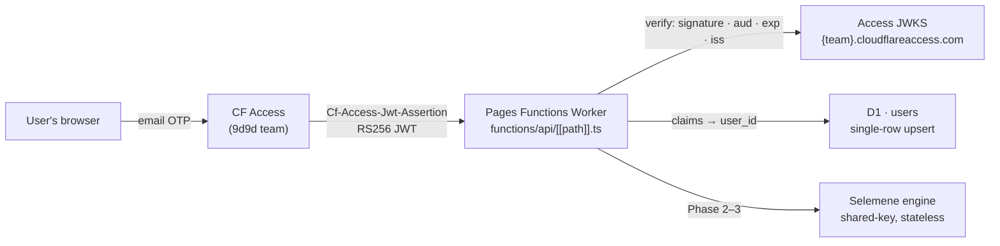

# Tryambakam Noesis — the integrated product

How the surfaces fit, who owns which engine, and where the boundaries actually
are. Written from verification against the live systems and the engine source —
every claim here has a check next to it, because this map exists precisely
because a previous version of "it works" was wrong.

Last verified: **2026-07-17**.

## The three surfaces



| Surface | Role | Where |
|---|---|---|
| **urania-137** | The **online entry**. The graph is the interface at every depth; a browser tab, no install, no capture. **Login-required** via CF Access email OTP (Phase 1). | `urania-137.vercel.app` → Cloudflare Pages (Phase 4) |
| **Noesis Mirror** | The **person's world**. A premium pack rendered as a walkable field; proximity is the interface. | `314.tryambakam.space/p/:personId` |
| **Sankalpa** | The **local instrument**. One Electron shell over Noesis + Biofield; owns anything needing capture + consent. | v0.1.0 — **no published build yet** |

The same content flows through all three. `723/Solos/{personId}` holds a person's
premium pack (reading, audio, video, slide-decks, study guide, flashcards). The
Folio archives readings generated in the console; the Mirror renders that pack as
beacons you walk up to.

## Auth & identity — urania-137 (Phase 1, verified 2026-07-20)

The console is **login-required**: Cloudflare Access renders the email-OTP login
(there is no login UI to build), and every `/api/*` request passes one trust
boundary in the Pages Functions Worker. Identity and per-user storage live at
urania's edge; the Selemene engine stays a shared-key stateless compute backend
and learns nothing about users.



- **Verification:** RS256 signature against the Access app JWKS (cached by `kid`,
  refetch on miss); `aud` contains `CF_ACCESS_AUD`; `exp` not past; `iss` == the
  team domain. `alg=none` / unsigned tokens are rejected before any key lookup.
- **Stable `user_id`:** the Access `sub` when present (survives an email change),
  else the lowercase-hex SHA-256 of the lowercased, trimmed email — deterministic
  across logins. There is **no anonymous or localStorage identity**: without a
  verified JWT every `/api/*` returns 401. (The legacy Folio's localStorage
  *content* cache migrates to per-user D1 in Phase 3 — that is data, not identity.)
- **Surface:** `GET /api/me` → `{id,email}` + single-row `users` upsert
  (`created_at` stable, `last_seen_at` advanced on repeat); `GET|POST /api/logout`
  → 302 to `/cdn-cgi/access/logout` (Access owns the session). `/api/selemene/*`
  and `/api/folio/*` land behind the same gate in Phases 2–3.
- **Local dev:** `wrangler pages dev` may inject a synthetic identity via
  `DEV_IDENTITY_EMAIL` — honored only when the var is set, no production marker
  exists, and the host is loopback (single fail-closed conditional; the var is
  never set in Pages production, so no dev-bypass path yields identity live).
  Dev-mode ids carry the intended `dev:<email>` shape.

Verified locally (T-026, evidence `docs/auth/2026-07-20-t026-local-identity-proof.md`):
unauthenticated `/api/me` → 401; dev identity → 200 with exactly one `users` row
and an advancing `last_seen_at`. Live OTP verification (gates V1–V4) is Phase 5,
gated on the 9d9d CF Access provisioning (T-081).

## Which surface owns which engine

The Selemene engine exposes **18 engines** and **6 workflows**. The division is
not arbitrary — it follows what input an engine needs.

| Engine input | Runs online (urania-137) | Owner |
|---|---|---|
| `birth_data` only | ✅ yes | urania-137 |
| `birth_data` + `options.intention` | ✅ yes (form collects it) | urania-137 |
| camera / image / consent | ❌ no | **Sankalpa** |

- **Online (15):** numerology, human-design, gene-keys, vimshottari, panchanga,
  vedic-clock, biorhythm, transits, tarot, i-ching, enneagram, sacred-geometry,
  nadabrahman, raaga, sigil-forge.
- **Sankalpa (3):** `biofield`, `biofield-capture`, `face-reading` — these need
  capture under explicit consent. Sankalpa's contract is explicit: *"local-first
  + explicit opt-in to backend, explicit consent everywhere"*. A browser tab
  can't honour that, so the console names where they live rather than offering a
  surface that returns nothing.

> `raaga` and `nadabrahman` return `200` from `birth_data` today, but they are
> media engines (`generated_audio`, `melakarta`) whose richer surface belongs to
> Sankalpa. They are online-capable, not online-*complete*.

## The two required inputs that fail silently

Workflows compose **best-effort**: an engine that errors is simply **absent from
`engine_outputs`** — the call still returns 200. Two inputs trigger this, and
both are now supplied by the console:

| Missing input | Symptom | Verified |
|---|---|---|
| `birth_data.name` | numerology 422s → dropped from `birth-blueprint` | 2/3 → **3/3** with name |
| `options.intention` | sigil-forge 422s → dropped from `full-spectrum`, `creative-expression` | 16/17 → **17/17**, 2/3 → **3/3** |

**sigil-forge was never broken.** It 422s with a clear message
(`"requires options.intention (or question/intent/intent_text)"`); the caller just
never sent it. The genuine engine-side issue is narrower: **the workflow swallows
the 422** and omits the engine instead of surfacing it. `DeterministicResult`
reports dropped engines so this can't hide in the UI.

## The witness-mode contract

`POST /api/v1/assets/generate` is **mode-keyed but does not validate `mode`**.
`noesis-api`'s `load_mode_document` (`crates/noesis-api/src/handlers/assets.rs`)
resolves only:

| Mode | Pass plan |
|---|---|
| `integrated-reading`, `composite-dyad` | 2 — Structural Field, Somatic Field |
| `integrated-kundali-l0`, `kundali`, `kundali-l0` | 12 — Opening + Parts I–XI |
| *anything else* | 1 — `default: Reading` |

So an unknown mode returns **200 with a plausible reading**, indistinguishable
from a real one. Ten mode docs exist in `packages/witness-pipeline/modes/`
(birth-blueprint, partner-synastry, business-partners, family-penta,
married-partners, mother-son-lineage, unmarried-partners, integrated-reading-l4,
+ the two served) — they are **authored but not loaded**. This is an integration
gap, not invented UI.

**urania-137 therefore sends only the modes the engine resolves.** A mode earns a
child here when it is *differentiated*, not when it is merely accepted.

### The gate

An in-flight engine change whitelists the 8 remaining modes and returns
`400 UNKNOWN_MODE` for unknown ones. That fixes gate 1 but **not** gate 2 — the 8
share a single `PassDef { id: "core" }`, and `render_pass_output` derives text
from `(pass.id, pass.title, seeds)`, so they will be byte-identical to each
other: the same undifferentiation, relabelled.

Two gates must both pass before a mode is exposed:

1. **Unknown mode is rejected** — `400 UNKNOWN_MODE`, not `200`.
2. **Accepted modes have distinct pass plans** — compared by *pass plan*, not
   assembled text: the text embeds time-varying seeds (biorhythm), so hashing it
   false-PASSes. Declared aliases (`integrated-reading`/`composite-dyad`) are
   legitimately identical.

Weaker assertions that **do not work**, and why:

| Assertion | Defeated by |
|---|---|
| `status === 200` | a typo'd mode |
| `assembled` non-empty | a typo'd mode |
| `passes[0] !== 'default'` | a whitelisted-but-unimplemented mode |

## Boundaries to hold

- **The graph is the interface.** Both doors (Mirror, Sankalpa) are *nodes*, not
  nav items. Every destination stays reachable by clicking the graph.
- **Never send a mode the engine doesn't resolve.** Silence is indistinguishable
  from success on this API.
- **Never offer a surface whose input we can't gather.** Consent-gated capture
  belongs to Sankalpa; say so rather than return empty.
- **Never link to something that doesn't exist.** Sankalpa has no published
  build, so no download is offered. Mirror worlds are granted per person, so the
  panel opens the field rather than promising one exists.

## Verification commands

```bash
# The console's own taxonomy — every child hits a real capability
node scratchpad/verify-taxonomy.mjs http://localhost:5191

# The two gates — run against the engine before exposing any new mode
node scratchpad/differentiation-gate.mjs https://urania-137.vercel.app

# Daily panchanga reading — offline units + contracts, then the live gates
npm run test:daily              # G3/G4/G5/G6/G8 + purity/drift + interpret over the real lexicon
npm run verify:daily-contracts  # Phase-0 exit gate — the frozen contract surface is complete
npm run verify:daily            # G2 live schema-contract (panchanga keys present, prod proxy)
npm run verify:all              # units + contracts + G1 taxonomy + G2, chained
```

**Daily reading:** the `panchanga`/`transits` engines had data but no *reading* — raw JSON,
never interpreted. `src/lib/daily/` adds a `DailyReadingSource` seam: ① an in-app
`DeterministicInterpreter` (engine JSON → authored lexicon → prose) now, ③ a dormant
`WitnessModeSource` (`daily-panchanga` mode) later, tracked in
`docs/selemene-engine-requests.md`. Surfaced as **Sky Weather ▸ Today**. Enum domains are
ground-truth from the live engine (`lexicon/domains.ts`); G2 fails loud on schema drift.

| What | Endpoint | Verified |
|---|---|---|
| Engine liveness | `GET /health` | `ok · v3.1.0 · 18 engines · 6 workflows` |
| Workflow catalog | `GET /api/v1/workflows` | 6 |
| Mirror field | `GET 314.tryambakam.space/p/harshita` | `200` |
| Mirror world API | `GET immersiveapi.tryambakam.space/api/world/harshita` | `401` — gated |
