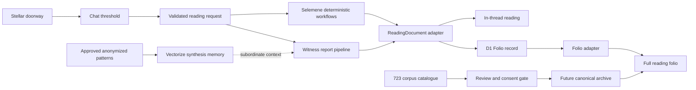
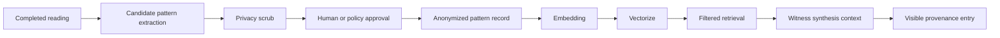
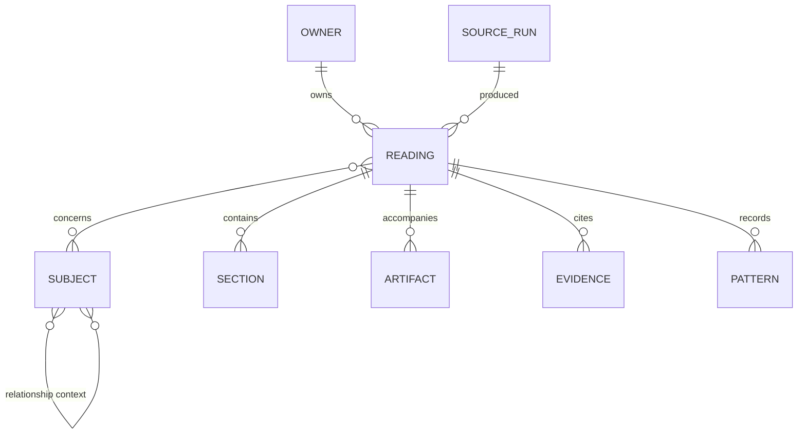

# Urania Living Readings Ecosystem

Status: implementation baseline
Date: 2026-07-26
Scope: Urania 137, Selemene Engine, witness reports, the `/723/` historical
corpus archive (53 ingested readings: 51 Solo + 2 Synastry — `/723/` is a
folder name, not a reading count),
Cloudflare identity/storage, Vectorize retrieval, and Noesis writing voice

## Product thesis

Urania is not a chat product with an archive attached. It is one living body of
readings with two entrances:

1. **Chat is the threshold.** It identifies the subject, relationship context,
   intention, place, and time required by the selected engine or witness mode.
2. **The reading folio is the durable form.** It exposes structure, systems,
   evidence, sequence, convergence, and the bridge question without requiring a
   second conversation.

Both surfaces render one canonical `ReadingDocument`. Chat may reveal the
document section by section; the Folio may show the whole anatomy. Neither
surface invents structure that its source did not supply.



## What is true today

### Urania

- Cloudflare Access is the trust boundary.
- D1 stores one owner-scoped row per saved reading.
- Chat intake already hands off to the same deterministic and witness hooks that
  save the Folio record.
- Live witness and daily results expose real source passes.
- Deterministic workflow output and existing Folio rows are stored as one flat
  Markdown or fenced-JSON body. Strict fenced JSON now rehydrates typed visual
  elements while the archive record remains structurally flat.
- Before this iteration, opening a Folio record exposed that body in a small
  monospaced `<pre>` rather than a reading surface.

### Verified owner identity

The production Urania D1 account read during this review resolves:

- email: `sheshnarayan.iyer@gmail.com`
- one current user row
- one current self subject profile
- one current saved Sky Weather reading

This is read-only verification. No remote reading, subject, or identity row was
created or changed.

Selemene's Postgres schema can associate users, roles, profiles, and readings,
but this environment has no live `DATABASE_URL` or authenticated admin session.
The same email was therefore **not** claimed as a verified Selemene
platform-admin mapping.

### Identity law

Authenticated ownership and reading subject are different relations:

| Relation | Meaning | Example |
| --- | --- | --- |
| Owner | Account allowed to access the document | Shesh's CF Access account |
| Subject | Person or relational field the reading concerns | self, another person, dyad, family |
| Producer | System that computed or composed a section | jyotish, panchanga, witness pipeline |
| Source | Record or artifact from which content came | live chat, Folio, 723 |

All 723 documents may eventually be owned by one admin account. They must not
therefore be relabeled as readings *about* that account.

### 723 corpus inventory

Observed by `scripts/readings/catalog-corpus.mjs` during this review, excluding
symlinks and `.DS_Store`:

- 1,522 files across 550 directories
- 745 files under `Solos`
- 713 files under `_legacy`
- 34 files under `Synastry`
- 19 files under `.runs`
- 691 Markdown, 424 JSON, 136 PDF, 124 HTML
- companion PNG, SVG, DOCX, MP3, and MP4 artifacts
- 51 immediate solo subject candidates
- two active Synastry directory candidates
- 71 manifest files
- historical family, dyad, and triad material under `_legacy`

The corpus contains high-value provenance and companion artifacts, but also
legacy prescriptive language, placeholder claims, and inconsistent subject
metadata. It is source material, not clean current copy.

## Canonical reading anatomy

`src/lib/readings/types.ts` defines the shared substrate:

| Field | Contract |
| --- | --- |
| `owner` | Non-nullable owner reference; never reused as subject |
| `subject` | Non-nullable subject reference; may be explicitly unknown |
| `origin` | `live-chat`, `folio`, or future `corpus-723` |
| `structureSource` | `native` or `flat` |
| `sections` | Only source-supplied reading sections |
| `body` | One unstructured source body |
| `systems` | Exact contributing system identifiers |
| `evidence` | Provenance entries with kind and confidence treatment |
| `patterns` | Reading convergence or retrieval memory, separately labeled |
| `moments` | Source-supplied sequence or timing records |
| `elements` | Typed source-shaped facts, relations, sequences, cycles, and notices |
| `sourcePayload` | Complete locally available structured source, collapsed by default |
| `bridgeQuestion` | Optional integrating question, never a prescription |

The critical honesty rule is `structureSource`:

- `native`: the source provided actual passes or sections; an atlas may draw one
  node per section.
- `flat`: the source provided one body; the atlas displays one flat record and
  states that no section relationships were stored.

This prevents visual richness from manufacturing analytical structure.

## Visual encoding grammar

Sacred geometry is useful only when it can answer “what does this mark mean?”

| Visual mark | Encodes | Must not imply |
| --- | --- | --- |
| Node | Reading, subject, section, system, or pattern | Importance without a legend |
| Edge | Declared membership, sequence, or source relation | Causality |
| Ring | One named layer or source count | Spiritual rank |
| Node density | Independently supported convergence | Certainty |
| Gold | Structural frame and active reading context | Positive prediction |
| Emerald | Computed/system contribution | Moral approval |
| Violet | Witness interpretation | Deterministic fact |
| Terracotta | Warning, absence, or unresolved execution | Diagnosis |
| Timing spine | Source-supplied order or date | Forecast unless explicitly sourced |

Every SVG uses an accessible title and description. Visible legends explain
color and mark meaning. Reduced-motion mode removes reveals without removing
information.

## Component library

The first component family lives in `src/components/readings/`:

Visual references:

- `../.assets/generated/readings-ecosystem/component-atlas.png`
- `../.assets/generated/readings-ecosystem/reading-folio.png`

### `ReadingFolio`

The complete document renderer. `variant="thread"` keeps the conversational
projection quiet; `variant="folio"` adds owner/subject context, atlas, evidence,
patterns, timing, and bridge question.

### `ReadingAtlas`

An SVG relationship view. Native sections orbit the reading; flat records show
one node with an explicit “zero inferred sections” legend.

### `ReadingSection`

The long-form reading unit with section number and evidence treatment.

### `ReadingBody`

A dependency-free renderer for the safe block structures Urania archives:
headings, paragraphs, lists, and fenced engine output. It converts presentation
markup without manufacturing native reading sections or accepting embedded HTML.

### `SystemStack`

Exact contributing engine or system identifiers. It renders nothing when the
source does not record them.

### `EvidenceLedger`

Separates computed, witness, retrieval, historical, and system provenance.
Confidence language is treatment-specific: observed, derived, interpretive, or
unverified.

### `PatternConstellation`

Shows convergence only when typed pattern data exists. Ring intensity reflects
independent source count. Retrieval items always say “synthesis memory — not a
chart fact.”

### `TimingSpine`

Shows only source-supplied dated or ordered moments. It does not infer forecast
windows from prose.

### Typed reading elements

`src/components/readings/elements/` is the source-shaped component layer:
fact grids, number codes, positions, relations, sequences, cycles, spreads,
collections, questions, notices, and raw fallback. Engine-specific allowlist
extractors live in `src/lib/readings/elements.ts`; the exhaustive renderer is
`ReadingElementField`.

The full engine-to-element coverage matrix and archive rehydration contract are
documented in [`reading-element-library.md`](./reading-element-library.md).

## Reading composition

A complete future reading can use this stable order:

1. **Orientation** — title, subject, context, date, and mode
2. **Convergence map** — which native sections and systems are present
3. **Deterministic foundation** — chart or engine facts
4. **Witness articulation** — structural interpretation, clearly treated
5. **System stack** — contributing engines and source versions
6. **Evidence ledger** — provenance, warnings, missing outputs
7. **Pattern constellation** — within-reading and approved retrieval convergence
8. **Timing spine** — source-supplied chronology
9. **Bridge question** — one integrating question

The order is structural, not devotional. Sanskrit belongs only where it names a
technical Vedic construct that would lose precision in translation.

## Voice and vocabulary

The writing register is the **Anatomist Who Sees Fractals**:

- grounded, direct, and observant
- technically specific before metaphorical
- respectful enough to name contradiction
- non-predictive, non-diagnostic, and non-prescriptive
- chart antecedent → lived consequence → integration question
- witness as mirror, never authority

Current reader-facing copy avoids vague wellness and creator-economy language,
including terms such as `journey`, `healing`, `abundance`, `vibration`,
`manifesting`, `higher self`, `optimization`, and `hacks`. Historical records
are not silently rewritten; they receive an origin label and can be migrated
through an editorial review state.

Recommended claim grammar:

> **Treatment:** computed / observed / derived / interpretive / unverified
> **Source:** named engine, pass, artifact, or historical record
> **Statement:** present-tense structural description
> **Boundary:** what the source cannot establish

## Vectorize and continuous learning

The Selemene library currently defines a privacy-aware Vectorize pattern store:

- embedding model: `@cf/baai/bge-small-en-v1.5`
- Vectorize stores retrieval vectors and safe metadata
- full approved records may live in R2 or D1
- birth-data-like private patterns are rejected
- retrieved patterns are explicitly subordinate to deterministic chart facts

Two future-state claims are not yet evidenced:

1. A custom embedding model is not implemented in the inspected store.
2. A deployed continuous extraction → approval → write → retrieval loop was not
   verified from the current worker wiring.

The safe target loop is:



Required correction in the current retriever: its types include language and
relationship type, but the inspected filter builder applies only kind, mode,
report level, version, and systems. Language and relationship filters must be
wired and tested before relational patterns are treated as properly scoped.

## 723 migration architecture

Do not import directly into the current flat `readings` table. First create a
catalogue with stable entities:



Minimum import entities:

- `corpus_sources`: original absolute-relative locator, checksum, media type
- `subjects`: stable corpus subject ID, display label, consent state
- `subject_relationships`: dyad/family/collective membership and mapping goal
- `readings`: owner, origin, mode, title, created time, structure state
- `reading_subjects`: many-to-many relation with role
- `reading_sections`: native pass order and treatment
- `reading_artifacts`: PDF, HTML, image, audio, video, notebook artifact
- `reading_evidence`: source locator, system, confidence, editorial status
- `pattern_candidates`: private candidate before approval
- `approved_patterns`: anonymized retrieval record after approval

### Staged import

The repository includes a read-only structural catalogue command:

```bash
node scripts/readings/catalog-corpus.mjs \
  /Volumes/madara/2026/twc-vault/01-Projects/tryambakam-noesis/723 \
  --owner sheshnarayan.iyer@gmail.com
```

It reads directory structure and file metadata only, prints JSON to stdout, and
records the email as catalogue owner without assigning it as reading subject.

1. **Catalogue only** — hash files, classify format, locate manifests, assign
   provisional subject and relationship IDs; no content enters production.
2. **Identity review** — reconcile aliases such as Shesh/persona directories
   without automatically merging them.
3. **Provenance parse** — extract source run, engine, mode, register, pass, and
   companion artifacts.
4. **Editorial state** — mark current, historical, placeholder, contradictory,
   or prohibited-register content.
5. **Consent gate** — decide which owners may access each subject and artifact.
6. **Canonical import** — write only records that preserve relationships and
   provenance.
7. **Pattern review** — privacy scrub and approve abstractions separately.
8. **Retrieval validation** — prove filtering, deletion, and provenance display
   before synthesis memory influences a new witness report.

## Delivery sequence

### Landed in this iteration

- canonical front-end reading document and loss-aware adapters
- shared reading component family
- chat rendering through the canonical document
- structured Folio reader replacing the raw `<pre>`
- authenticated owner mapping kept separate from intake subject
- daily copy realignment and prohibited-register test
- semantic geometry and reduced-motion contracts
- generated visual references for the component atlas and full reading folio

### Next

1. Add the canonical archive schema without breaking the frozen D1 API.
2. Build the read-only 723 catalogue and alias-review tool.
3. Import one consented Shesh reading plus its artifacts as a pilot.
4. Add versioned evidence and source-run panels.
5. Wire and test Vectorize language and relationship filters.
6. Deploy an approval-gated pattern write worker.
7. Prove deletion propagation before calling the loop continuous.

## Success condition

The product succeeds when a person can enter through conversation, receive a
reading without losing the thread, reopen the same material as a legible folio,
see exactly which systems and sources support it, move between related readings
without identity leakage, and understand where computation ends and witness
interpretation begins.
