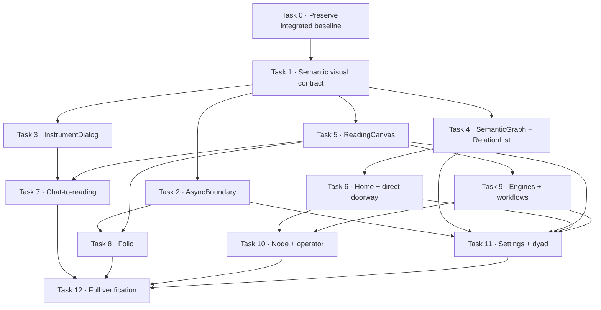

# Urania Graph-First UI Realignment Implementation Plan

> **For Codex:** REQUIRED SUB-SKILL: Use superpowers:executing-plans to implement this plan task-by-task.

**Goal:** Realign the current Urania frontend into one branded living-reading ecosystem where the constellation remains the primary spatial interface, chat remains the onboarding and intake doorway, and every result resolves into an accessible canonical reading surface.

**Architecture:** Preserve the current React SPA, hash routes, Selemene request paths, D1 Folio persistence, relationship consent model, and shared `ReadingDocument` substrate. Build the realignment from semantic tokens and cross-cutting instrument primitives upward; then migrate home, chat, Folio, engine/workflow, node, and settings surfaces onto those foundations. Generated boards guide composition and mood, while runtime data contracts, provenance, and accessible non-visual equivalents remain the source of truth.

**Tech Stack:** React 19, TypeScript 5.7, Vite 6, Tailwind CSS 3.4, Vitest 2, React server rendering for component assertions, Playwright 1.61, Cloudflare Pages Functions/Access/D1, SVG constellation graphics.

---

## Execution skills and rules

- Use `@superpowers:executing-plans` for checkpointed execution.
- Use `@superpowers:test-driven-development` for logic and component behavior.
- Use `@superpowers:verification-before-completion` before every task commit and
  at the final gate.
- Use `@temperance-parallel-dispatch` only for the safe parallel lanes named
  below; do not parallelize files with shared ownership.
- Use `@codex-gpt-image` only if a later implementation decision requires a new
  design reference. The references needed for this plan already exist.
- Never stage or revert unrelated dirty-worktree changes.
- Never implement an administrator role by matching an email address in the
  browser. Administrative authority remains a verified Cloudflare
  Access/Selemene capability.
- Do not change database, KV, Vectorize, embedding, Selemene API, Folio, or
  relationship contracts in this plan.

## Current product map

| Experience | Current route or owner | Current role | Planned realignment |
| --- | --- | --- | --- |
| First-use Threshold | `#/threshold` → `src/pages/ThresholdPage.tsx` | Narrator-led subject establishment | Retain the ritual; add one grounded product sentence and inherit semantic text/motion tokens. |
| Constellation home | `#/` → `src/pages/HomePage.tsx` | Seven-lens graph-first discovery | Remove fictional telemetry, add the product promise and direct reading doorway, retain all seven parent nodes. |
| Parent system | `#/node/:id` → `src/pages/NodePage.tsx` | Child-doorway constellation | Add deep-linked runnable children, honest capability states, accessible list lens, and real status presentation. |
| Conversation | `src/components/chat/ChatSheet.tsx` | Intake, subject/circle selection, engine handoff | Use one semantic dialog, stable live announcements, and an explicit transition into the canonical reading. |
| In-thread result | `src/components/chat/ResultThread.tsx` | Composing/error/result feedback | Show a concise reading preview and “Open reading”; never make the entire long-form record a continuously mutating live region. |
| Folio browse | `#/readings` → `src/pages/ReadingLibraryPage.tsx` | Recovery, search, favorites | Rename the experience consistently to Folio, use mutually exclusive async states, and encode real node-family/time relationships. |
| Canonical reading | `#/readings/:id` → `ReadingFolio` | Durable owner-scoped record | Introduce a Parchment reading canvas with separate Reading, Evidence, and collapsed Source layers. |
| Settings and consent | `#/settings` → `src/pages/SettingsPage.tsx` | Identity, circle, relationships | Apply shared async/state/graph rules; retain two-person consent and owner/subject separation. |
| Dyad/synastry reading | Union Mirror chat → canonical Folio record | Consented shared generation | Render `ReadingSubjectKind = "dyad"` symmetrically inside the same reading grammar; do not create an admin bypass. |
| Operator view | Engine Status node and protected Selemene admin | Runtime/administrative evidence | Use an `OperatorField` density mode; expose no personal interpretation and no browser-side email authorization. |

## Visual-reference translation map

| Reference law | Authoritative reference | Runtime translation | Prohibited drift |
| --- | --- | --- | --- |
| Void Black is the instrument field | `.assets/moodboard.png` | Application shell, graph field, evidence/source chrome | Generic gray SaaS dashboard or full-page frosted glass |
| Sacred Gold is structure | moodboard + `engine-component-families.png` | Rules, frames, named edges, active context, focus ornament | Gold as an unlabelled quantitative score |
| Parchment is sustained reading material | `reading-folio.png` | Long-form `ReadingCanvas`, not every control panel | Low-contrast long prose on Void |
| Emerald is verified computation | both engine atlas boards | Deterministic/returned/complete status with written labels | “Positive” decoration or unverified capture output |
| Violet is witness/interpretation | moodboard + component atlas | Witness prose, interpretive annotation, selected witness material | Presenting interpretation as computed fact |
| Terracotta is unresolved | both engine atlas boards | Failed, capture-gated, unavailable, revoked, unresolved | Concealing absence behind mystical copy |
| Indigo is flow | `.assets/moodboard.png` | Transitional/focus/navigation accent used sparingly | A second dominant brand color competing with state colors |
| Geometry must encode a relationship | all final boards | Named node membership, order, time, coordinates, scale, or source slots | Fictional counts, “frequency ∞”, label-derived resonance, decorative telemetry |
| Every visual has a non-visual equivalent | `engine-component-families.png` | `dl`, table, ordered list, edge list, status text, media metadata | SVG-only navigation or color-only meaning |
| JSON is technical evidence | `engine-reading-surfaces-final.png` | Native collapsed `details`, privacy-filtered and secondary | Expanded raw payload as the reading body |

Every generated image is composition-only. In particular,
`.assets/page-references/multi-page-architecture-moodboard.png`,
`.assets/generated/readings-ecosystem/component-atlas.png`, and
`.assets/generated/readings-ecosystem/reading-folio.png` contain fictional
identifiers, dates, counts, states, and integrity values. The newer engine
boards contain design-time status labels that may also become stale. Generated
images may guide density, rhythm, frame construction, and hierarchy only; the
runtime registry and executable atlas remain authoritative.

## Dependency and safe-parallel map



After Task 1, Tasks 2–5 can run in parallel because they own different files.
After those converge, Tasks 6, 8, and 9 can run in parallel. Task 7 waits for
Tasks 3 and 5. Task 10 waits for Tasks 6 and 9. Task 11 waits for Tasks 2, 4,
5, 6, and 9 because it extends the router and canonical reading/access model.
Task 12 is always last.

## Task 0: Preserve the intentional integrated baseline

**Files:**

- Create: `docs/ui/realignment-baseline.md`
- Create: `docs/ui/realignment-baseline.json`
- Create: `docs/ui/realignment-baseline-allowlist.txt`
- Create: `scripts/verify/ui-realignment-baseline.mjs`
- Modify: `package.json`
- Inspect only: every path currently reported by `git status --short`

**Step 1: Create recoverable evidence before any runtime edit**

Run:

```bash
git status --short
git diff --binary > /tmp/urania-137-before-ui-realignment.patch
git ls-files --others --exclude-standard -z \
  | tar --null -T - -czf /tmp/urania-137-before-ui-realignment-untracked.tgz
test -s /tmp/urania-137-before-ui-realignment.patch
test -s /tmp/urania-137-before-ui-realignment-untracked.tgz
```

Expected: status lists the intentional integrated work; both backup artifacts
exist and are non-empty. Do not run `git stash`, `git reset`, or a broad
checkout.

**Step 2: Establish the execution branch gate**

Run:

```bash
git branch --show-current
git switch -c codex/urania-graph-first-ui-realignment
```

Expected: the second command succeeds only if the named branch does not already
exist. If it exists, switch to it after confirming it contains this exact
integrated baseline.

Before proceeding, copy the one-path-per-line intentional entries from the
captured status into `docs/ui/realignment-baseline-allowlist.txt` using
`apply_patch`. Include the plan, ISA, and allowlist itself. Exclude `/tmp`
backups and any path the operator cannot explain. The operator must explicitly
approve this reviewed allowlist.

Checkpoint only the approved baseline:

```bash
git add --pathspec-from-file=docs/ui/realignment-baseline-allowlist.txt
git diff --cached --name-only | sort > /tmp/urania-ui-staged.txt
sort docs/ui/realignment-baseline-allowlist.txt > /tmp/urania-ui-allowed.txt
diff -u /tmp/urania-ui-allowed.txt /tmp/urania-ui-staged.txt
git diff --cached --check
git commit -m "chore(ui): checkpoint integrated readings baseline"
git status --short
```

Expected: the diff command is silent, the checkpoint contains exactly the
approved paths, and the final status is clean. Stop if any unrelated or
unexplained path remains; do not mix baseline and realignment edits.

Record the resulting baseline commit in `docs/ui/realignment-baseline.md`.
Rollback is recoverable and non-destructive: revert individual realignment
commits in reverse order with `git revert <sha>`. If the branch becomes
unusable, create a new `codex/urania-ui-recovery` branch from the recorded
baseline commit. Apply the `/tmp` patch/tar only inside that clean recovery
worktree after `git apply --check`; never apply it over the original dirty
workspace.

**Step 3: Write a passing characterization gate**

Create `scripts/verify/ui-realignment-baseline.mjs`:

```js
import { readFileSync, readdirSync, statSync, writeFileSync } from 'node:fs'
import assert from 'node:assert/strict'
import { fileURLToPath } from 'node:url'
import { join } from 'node:path'

const read = (path) => readFileSync(new URL(`../../${path}`, import.meta.url), 'utf8')
const runtime = [
  read('src/pages/HomePage.tsx'),
  read('src/pages/NodePage.tsx'),
  read('src/components/chrome/PageTabs.tsx'),
  read('src/components/chrome/TopNav.tsx'),
].join('\n')

const knownViolations = [
  /1,337|12,851|Frequency/,
  /Resonance|Live Paths/,
  /label: 'Archive'|label: 'Library'/,
].map((pattern) => ({ pattern: String(pattern), observed: pattern.test(runtime) }))
assert.ok(knownViolations.every(({ observed }) => observed))

const assets = fileURLToPath(new URL('../../dist/assets/', import.meta.url))
const bundleBytes = readdirSync(assets)
  .filter((name) => /\.(js|css)$/.test(name))
  .reduce((sum, name) => sum + statSync(join(assets, name)).size, 0)
assert.ok(bundleBytes > 0)

writeFileSync(
  new URL('../../docs/ui/realignment-baseline.json', import.meta.url),
  `${JSON.stringify({ bundleBytes, knownViolations }, null, 2)}\n`,
)
```

Add to `package.json`:

```json
"verify:ui-baseline": "npm run build && node scripts/verify/ui-realignment-baseline.mjs"
```

This is a characterization gate, not the final contract. It passes only when
the documented pre-realignment violations and a measurable production bundle
are present.

**Step 4: Run the characterization gate**

Run:

```bash
npm run verify:ui-baseline
```

Expected: exit zero and
`docs/ui/realignment-baseline.json` records the three known violation groups
plus non-zero `bundleBytes`.

**Step 5: Record the baseline**

In `docs/ui/realignment-baseline.md`, record:

- current commit and branch;
- the `git status --short` inventory;
- desktop `1440×1000`, mobile `390×844`, and effective-reflow
  `720×1000` evidence paths from
  `docs/frontend-brand-flow-review-2026-07-27.md`;
- the five authoritative visual-reference paths in this plan;
- the known blocker/major findings from that review;
- the exact `bundleBytes` value in `docs/ui/realignment-baseline.json`;
- an explicit note that current screenshots are evidence, not golden pixels.

**Step 6: Commit only the new baseline harness**

```bash
git add docs/ui/realignment-baseline.md \
  docs/ui/realignment-baseline.json \
  scripts/verify/ui-realignment-baseline.mjs package.json
git diff --cached --check
git commit -m "test(ui): establish realignment baseline contracts"
```

Expected: one commit containing only the four named paths.

## Task 1: Establish the semantic visual and vocabulary contract

**Files:**

- Modify: `src/styles/tokens.ts`
- Modify: `tailwind.config.js`
- Modify: `src/index.css`
- Create: `src/styles/contrast.ts`
- Create: `src/styles/semanticTokens.test.ts`
- Create: `src/content/uiCopy.ts`
- Create: `scripts/verify/ui-asset-boundaries.test.mjs`
- Modify: `src/lib/readings/vocabulary.test.ts`

**Step 1: Write failing semantic-token tests**

Create `src/styles/semanticTokens.test.ts`:

```ts
import { describe, expect, it } from 'vitest'
import { contrastRatio } from './contrast'
import { COLORS, EVIDENCE, INTERACTION, READING, TEXT, TYPE } from './tokens'

describe('Urania semantic visual tokens', () => {
  it('keeps information-bearing text at 4.5:1 on instrument surfaces', () => {
    for (const color of [TEXT.primary, TEXT.secondary, TEXT.metadata]) {
      expect(contrastRatio(color, COLORS.void)).toBeGreaterThanOrEqual(4.5)
      expect(contrastRatio(color, COLORS.surface)).toBeGreaterThanOrEqual(4.5)
    }
  })

  it('reserves evidence colors for named evidence states', () => {
    expect(EVIDENCE.computed).toBe(COLORS.emerald)
    expect(EVIDENCE.witness).toBe('#7B68EE')
    expect(EVIDENCE.unresolved).toBe(COLORS.terracotta)
    expect(INTERACTION.focus).not.toBe(EVIDENCE.computed)
    expect(INTERACTION.selected).not.toBe(EVIDENCE.witness)
  })

  it('keeps ink readable on the Parchment reading material', () => {
    for (const color of [READING.ink, READING.muted]) {
      expect(contrastRatio(color, READING.surface)).toBeGreaterThanOrEqual(4.5)
    }
  })

  it('declares every typography role and safe minimums', () => {
    expect(Object.keys(TYPE.roles)).toEqual([
      'display', 'engraving', 'prose', 'ui', 'metadata', 'data',
    ])
    expect(TYPE.roles.metadata.minPx).toBeGreaterThanOrEqual(12)
    expect(TYPE.readingMeasureCh).toBeGreaterThanOrEqual(65)
    expect(TYPE.readingMeasureCh).toBeLessThanOrEqual(75)
  })
})
```

Extend `src/lib/readings/vocabulary.test.ts` to import `UI_COPY` and assert it
does not contain `journey`, `paths`, `ascend`, `frequency`, `resonance`,
`archive` as a Folio synonym, or generic transformation promises.

Create `scripts/verify/ui-asset-boundaries.test.mjs` to recursively inspect
`src/**/*.{ts,tsx}` and fail on any import/reference to `.assets/generated`,
`.assets/page-references`, or generated PNG fixture text. Images are never
runtime data/configuration.

**Step 2: Run the focused tests**

```bash
npx vitest run src/styles/semanticTokens.test.ts \
  src/lib/readings/vocabulary.test.ts
node --test scripts/verify/ui-asset-boundaries.test.mjs
```

Expected: semantic tests fail because `contrast.ts`, the semantic groups, and
`UI_COPY` do not exist. The asset-boundary characterization may already pass.

**Step 3: Implement the minimal semantic layer**

Add to `src/styles/tokens.ts`:

```ts
export const TEXT = {
  primary: COLORS.parchment,
  secondary: '#C2CBD1',
  metadata: '#AEBBC4',
  disabled: '#75838E',
} as const

export const EVIDENCE = {
  computed: COLORS.emerald,
  witness: '#7B68EE',
  unresolved: COLORS.terracotta,
} as const

export const INTERACTION = {
  active: COLORS.gold,
  selected: '#89A5FF',
  flow: COLORS.indigo,
  focus: '#A9B9FF',
} as const

export const READING = {
  surface: COLORS.parchment,
  ink: '#171B24',
  muted: '#4C5661',
  rule: '#76652A',
} as const

export const TYPE = {
  readingMeasureCh: 70,
  roles: {
    display: { family: 'Panchang', minPx: 18, lineHeight: 1.2, weight: 500 },
    engraving: { family: 'Cinzel', minPx: 16, lineHeight: 1.3, weight: 500 },
    prose: { family: 'Satoshi', minPx: 16, lineHeight: 1.7, weight: 400 },
    ui: { family: 'Satoshi', minPx: 14, lineHeight: 1.45, weight: 500 },
    metadata: { family: 'Satoshi', minPx: 12, lineHeight: 1.5, weight: 500 },
    data: { family: 'SF Mono', minPx: 12, lineHeight: 1.5, weight: 400 },
  },
} as const
```

Implement WCAG relative luminance in `src/styles/contrast.ts`. Mirror the
semantic colors into Tailwind names such as `text-primary`,
`text-secondary`, `text-metadata`, `evidence-*`, `interaction-*`, and
`reading-*`. Keep colored evidence marks redundant with neutral readable text;
do not use violet, terracotta, or indigo alone for small status copy. Deprecate
`STATE.active` and `STATE.selected`; all graph selection/hover consumers must
migrate to `INTERACTION` in Task 4. Narrow `COLORS.growth` to non-semantic
ambient use or remove it if no verified consumer remains. In `src/index.css`:

- declare Cinzel for engraved headings only and Satoshi for sustained prose;
- add `.instrument-frame`, `.instrument-panel`, `.instrument-chip`,
  `.reading-canvas`, and semantic metadata utilities;
- implement square/notched frames, nested one-pixel rules, and diamond
  junctions as structure—not decorative telemetry;
- restrict rounded pills to compact actions/tags;
- remove `backdrop-blur` from the default `.console-card`;
- retain blur only for transient overlays where background context remains
  readable;
- replace generic emerald `.btn-secondary` interaction styling with
  `INTERACTION` gold/indigo styling;
- make all information-bearing metadata at least 12px;
- preserve the existing reduced-motion collapse;
- restrict `pulse-slow`, `drift`, and any infinite animation to
  `aria-hidden` ambient decoration; data marks and statuses are static;
- use 300ms snap or 1000ms out-expo reveal only for meaningful state changes.

Centralize home/nav/Folio/settings vocabulary in `src/content/uiCopy.ts`:

```ts
export const UI_COPY = {
  promise: 'See what is active. Choose a lens; the narrator assembles the reading with you.',
  beginReading: 'Begin a reading',
  folio: 'Folio',
  browseFolio: 'Browse Folio',
  returnToMap: 'Return to map',
  thresholdGrounding: 'A private instrument for examining what is active while keeping authorship with you.',
} as const
```

**Step 4: Run focused tests and the production build**

```bash
npx vitest run src/styles/semanticTokens.test.ts \
  src/lib/readings/vocabulary.test.ts
node --test scripts/verify/ui-asset-boundaries.test.mjs
npm run build
```

Expected: both focused suites pass; TypeScript and Vite build with no new
warnings.

**Step 5: Perform the visual-token gate**

Inspect the home, a node page, chat, Folio, and settings at `1440×1000` and
`390×844`. Expected:

- Parchment is not used as a global panel background yet;
- metadata is readable without zoom;
- semantic state colors always have adjacent text;
- no default panel resembles a generic blurred SaaS card.

**Step 6: Commit**

```bash
git add src/styles/tokens.ts src/styles/contrast.ts \
  src/styles/semanticTokens.test.ts src/content/uiCopy.ts \
  src/lib/readings/vocabulary.test.ts \
  scripts/verify/ui-asset-boundaries.test.mjs \
  src/index.css tailwind.config.js
git diff --cached --check
git commit -m "feat(ui): establish semantic Urania visual contract"
```

## Task 2: Add one mutually exclusive async-state primitive

**Files:**

- Create: `src/components/ui/AsyncBoundary.tsx`
- Create: `src/components/ui/AsyncBoundary.test.ts`
- Modify later consumers only in Tasks 8 and 11

**Step 1: Write the failing server-render tests**

```tsx
import { createElement } from 'react'
import { renderToStaticMarkup } from 'react-dom/server'
import { describe, expect, it } from 'vitest'
import { AsyncBoundary } from './AsyncBoundary'

describe('AsyncBoundary', () => {
  it('renders ready children without a status shell', () => {
    const html = renderToStaticMarkup(createElement(AsyncBoundary, {
      state: { status: 'ready' },
      children: createElement('p', null, 'ready body'),
    }))
    expect(html).toContain('ready body')
    expect(html).not.toContain('data-async-state=')
  })

  it.each(['loading', 'empty', 'partial', 'stale', 'denied', 'error'] as const)(
    'renders one exclusive %s state',
    (status) => {
      const html = renderToStaticMarkup(createElement(AsyncBoundary, {
        state: { status, message: `${status} message` },
        children: createElement('p', null, 'ready body'),
      }))
      expect(html).toContain(`data-async-state="${status}"`)
      expect(html).not.toContain('ready body')
    },
  )
})
```

**Step 2: Run and confirm failure**

```bash
npx vitest run src/components/ui/AsyncBoundary.test.ts
```

Expected: module-not-found failure.

**Step 3: Implement the state contract**

```tsx
export type AsyncViewState =
  | { status: 'ready' }
  | { status: 'loading'; message: string }
  | { status: 'empty'; message: string }
  | { status: 'partial'; message: string }
  | { status: 'stale'; message: string }
  | { status: 'denied'; message: string }
  | { status: 'error'; message: string; onRetry?: () => void }

export function AsyncBoundary({
  state,
  children,
}: {
  state: AsyncViewState
  children: React.ReactNode
}) {
  if (state.status === 'ready') return <>{children}</>
  return (
    <section
      data-async-state={state.status}
      role={state.status === 'error' ? 'alert' : 'status'}
      aria-live={state.status === 'error' ? 'assertive' : 'polite'}
    >
      {/* status-specific icon, written label, finite recovery */}
    </section>
  )
}
```

`partial` and `stale` may accept a separate `children` slot only when the
message and data are intentionally shown together. Error and empty must never
render simultaneously.

**Step 4: Verify**

```bash
npx vitest run src/components/ui/AsyncBoundary.test.ts
npm run build
```

Expected: focused tests and build pass.

**Step 5: Commit**

```bash
git add src/components/ui/AsyncBoundary.tsx \
  src/components/ui/AsyncBoundary.test.ts
git diff --cached --check
git commit -m "feat(ui): add exclusive async state boundary"
```

## Task 3: Replace overlay shells with `InstrumentDialog`

**Files:**

- Create: `src/components/ui/InstrumentDialog.tsx`
- Create: `src/components/ui/InstrumentDialog.test.ts`
- Create: `scripts/verify/ui-dialog.mjs`
- Modify: `src/components/Modal.tsx`
- Modify: `src/components/chat/ChatSheet.tsx`
- Modify: `package.json`

**Step 1: Write failing semantic and browser checks**

The static test must assert `role="dialog"`, `aria-modal="true"`, a rendered
labelled title, and a close control. The Playwright script must:

1. open a runnable child;
2. assert focus enters the dialog;
3. press `Tab` through the end and prove focus remains inside;
4. press `Escape` and prove the dialog closes;
5. prove focus returns to the child doorway;
6. repeat at `390×844`.

Add:

```json
"verify:ui-dialog": "node scripts/verify/ui-dialog.mjs"
```

**Step 2: Run to observe the current failure**

```bash
npx vitest run src/components/ui/InstrumentDialog.test.ts
npm run build
node scripts/verify/ui-dialog.mjs http://localhost:8788
```

Expected: the module is missing; the live check reports missing dialog
semantics/focus containment. The last command requires
`npx wrangler pages dev dist --port 8788` in a second terminal.

**Step 3: Implement the shared shell**

Use the native dialog lifecycle where supported:

```tsx
export function InstrumentDialog({
  open,
  title,
  description,
  onClose,
  children,
  returnFocusRef,
}: InstrumentDialogProps) {
  const ref = useRef<HTMLDialogElement>(null)
  const titleId = useId()
  const descriptionId = useId()

  useEffect(() => {
    const dialog = ref.current
    if (!dialog) return
    if (open && !dialog.open) dialog.showModal()
    if (!open && dialog.open) dialog.close()
  }, [open])

  return (
    <dialog
      ref={ref}
      aria-labelledby={titleId}
      aria-describedby={description ? descriptionId : undefined}
      onCancel={(event) => { event.preventDefault(); onClose() }}
      onClose={() => returnFocusRef?.current?.focus()}
      className="instrument-dialog"
    >
      {/* one desktop modal / mobile sheet frame */}
    </dialog>
  )
}
```

Scroll-lock the document while open. Treat outside-click close as an explicit
policy prop; never attach click handling to a non-semantic anonymous backdrop.
Respect reduced motion.

Refactor `Modal` into a thin compatibility wrapper. Refactor `ChatSheet` to
use the same shell while retaining its existing session, streaming, circle,
handoff, and retry logic unchanged.

**Step 4: Run focused and live checks**

```bash
npx vitest run src/components/ui/InstrumentDialog.test.ts \
  src/lib/chat/stateMachine.test.ts
npm run build
npm run verify:ui-dialog -- http://localhost:8788
```

Expected: static and browser checks pass at desktop and mobile; chat state
tests remain green.

**Step 5: Commit**

```bash
git add src/components/ui/InstrumentDialog.tsx \
  src/components/ui/InstrumentDialog.test.ts src/components/Modal.tsx \
  src/components/chat/ChatSheet.tsx scripts/verify/ui-dialog.mjs package.json
git diff --cached --check
git commit -m "feat(ui): unify accessible instrument dialogs"
```

## Task 4: Make graph meaning accessible and responsive

**Files:**

- Create: `src/components/graph/RelationList.tsx`
- Create: `src/components/graph/GraphLens.tsx`
- Create: `src/components/graph/graphEntries.ts`
- Create: `src/components/graph/graphEntries.test.ts`
- Modify: `src/components/ConstellationGraph.tsx`
- Modify: `src/components/primitives/StellarNode.tsx`
- Modify: `src/types/index.ts`
- Modify: `src/styles/tokens.ts`

**Step 1: Write the failing relationship-model test**

```ts
expect(buildGraphEntries(orbitals)).toEqual([
  {
    id: 'birth',
    label: 'Birth Witness',
    description: 'The Arrival',
    relation: 'lens of NOESIS',
  },
])
```

Add a static source assertion to `graphEntries.test.ts` that decorative SVG
lines and rings carry `pointer-events="none"` or a noninteractive class.

**Step 2: Run focused tests**

```bash
npx vitest run src/components/graph/graphEntries.test.ts
```

Expected: missing modules and decorative-pointer assertions fail.

**Step 3: Implement the dual representation**

- `RelationList` is the canonical ordered DOM equivalent with label, epithet,
  purpose, relation, and action.
- `GraphLens` shows the constellation at wide layouts and the list lens at
  narrow/reflow layouts. A user may switch views without losing selection.
- The SVG outer role must no longer be `img` when it contains interactive
  descendants.
- Every decorative line, ring, particle, and star must ignore pointer events.
- Every node must have a minimum 44×44 CSS-pixel hit target and visible
  `:focus-visible` treatment.
- Migrate generic hover/selection from deprecated `STATE.active` /
  `STATE.selected` to `INTERACTION.active` / `INTERACTION.selected`; emerald
  and violet remain evidence colors only.
- At `prefers-reduced-motion`, skip reveal animation and default to the simpler
  list lens when `prefers-reduced-transparency`/reflow makes the graph
  impractical.
- Preserve the current home/node data and seven parent nodes.

**Step 4: Verify logic, build, and responsive behavior**

```bash
npx vitest run src/components/graph/graphEntries.test.ts
npm run build
```

Then use Playwright at `1440×1000`, `390×844`, and `720×1000`:

- center-click every visible node;
- tab to each of the seven home destinations;
- switch to list lens;
- confirm no destination disappears at effective 200% reflow.

Expected: all destinations remain available with pointer and keyboard.

**Step 5: Commit**

```bash
git add src/components/graph/RelationList.tsx \
  src/components/graph/GraphLens.tsx \
  src/components/graph/graphEntries.ts \
  src/components/graph/graphEntries.test.ts \
  src/components/ConstellationGraph.tsx \
  src/components/primitives/StellarNode.tsx src/types/index.ts \
  src/styles/tokens.ts
git diff --cached --check
git commit -m "feat(graph): pair constellation with accessible relation lens"
```

## Task 5: Introduce the Parchment reading canvas and three-layer document

**Files:**

- Create: `src/components/readings/ReadingCanvas.tsx`
- Create: `src/components/readings/ReadingLayerNav.tsx`
- Create: `src/components/readings/ReadingPreview.tsx`
- Create: `src/components/readings/ReadingCanvas.test.ts`
- Modify: `src/components/readings/ReadingFolio.tsx`
- Modify: `src/components/readings/ReadingBody.tsx`
- Modify: `src/components/readings/ReadingSection.tsx`
- Modify: `src/components/readings/ReadingAtlas.tsx`
- Modify: `src/components/readings/ReadingTrustPanel.tsx`
- Modify: `src/components/readings/elements/ReadingElementField.tsx`
- Modify: `src/components/readings/elements/ReadingSourcePayload.tsx`
- Modify: `src/components/readings/elements/ReadingRaw.tsx`
- Modify: `docs/reading-element-library.md`
- Test: `src/components/readings/ReadingFolio.test.ts`

**Step 1: Write failing document-layer tests**

Add assertions that the folio variant renders:

```tsx
expect(html).toContain('data-reading-layer="reading"')
expect(html).toContain('data-reading-layer="evidence"')
expect(html).toContain('data-reading-layer="source"')
expect(html).toContain('class="reading-canvas')
expect(html).toContain('<details')
expect(html).not.toContain('<details open')
```

Add Markdown fixtures with `##` and `###` headings and assert they render as
distinct levels, never nested under an invalid same-level heading.

**Step 2: Run focused tests**

```bash
npx vitest run src/components/readings/ReadingCanvas.test.ts \
  src/components/readings/ReadingFolio.test.ts \
  src/lib/readings/markdown.test.ts
```

Expected: layer/canvas/heading assertions fail.

**Step 3: Implement the density modes**

`ReadingCanvas`:

```tsx
export function ReadingCanvas({
  density,
  children,
}: {
  density: 'thread' | 'reading' | 'folio' | 'compare' | 'operator'
  children: React.ReactNode
}) {
  return (
    <div
      className="reading-canvas"
      data-reading-density={density}
      style={{ '--reading-measure': '70ch' } as React.CSSProperties}
    >
      {children}
    </div>
  )
}
```

Composition rules:

1. **Reading:** orientation, source-shaped elements, narrative sections, and
   bridge question on Parchment.
2. **Evidence:** systems, provenance, confidence, patterns, timing, owner,
   subject, access reason, and checksum in the dark instrument shell.
3. **Source:** one privacy-filtered native `details`, collapsed by default.

`ReadingPreview` for thread density shows orientation, one meaningful primary
element, a concise narrative excerpt, status, and an “Open reading” action. It
must not duplicate the whole folio document.

Update `docs/reading-element-library.md`: durable storage may remain
loss-preserving, but browser Source is a privacy-filtered projection, not a
promise that every raw value is exposed. Replace “complete/exact payload”
language accordingly and keep binary media, credentials, capture input, and
unknown private keys default-denied.

Preserve exact source hierarchy in `ReadingBody`; constrain prose to 65–75
characters; allow long tables/media to scroll inside their own labelled
region; no content depends on hover, motion, or color.

**Step 4: Verify**

```bash
npx vitest run src/components/readings/ReadingCanvas.test.ts \
  src/components/readings/ReadingFolio.test.ts \
  src/components/readings/elements/ReadingElementField.test.ts \
  src/components/readings/elements/ReadingSourcePayload.test.ts \
  src/lib/readings/markdown.test.ts
npm run build
```

Expected: all focused suites pass and source disclosure remains collapsed.
At `390×844`, prose stays within the viewport and has a readable measure.

**Step 5: Commit**

```bash
git add src/components/readings/ReadingCanvas.tsx \
  src/components/readings/ReadingLayerNav.tsx \
  src/components/readings/ReadingPreview.tsx \
  src/components/readings/ReadingCanvas.test.ts \
  src/components/readings/ReadingFolio.tsx \
  src/components/readings/ReadingBody.tsx \
  src/components/readings/ReadingSection.tsx \
  src/components/readings/ReadingAtlas.tsx \
  src/components/readings/ReadingTrustPanel.tsx \
  src/components/readings/elements/ReadingElementField.tsx \
  src/components/readings/elements/ReadingSourcePayload.tsx \
  src/components/readings/elements/ReadingRaw.tsx \
  src/components/readings/ReadingFolio.test.ts \
  src/lib/readings/markdown.test.ts docs/reading-element-library.md
git diff --cached --check
git commit -m "feat(readings): add layered Parchment reading canvas"
```

Review the staged list before committing; this task must not collect unrelated
reading-adapter work already present in the baseline.

## Task 6: Realign home, navigation, and the direct reading doorway

**Files:**

- Create: `src/components/readings/BeginReadingDialog.tsx`
- Create: `src/components/readings/BeginReadingDialog.test.ts`
- Create: `src/content/uiCopy.test.ts`
- Create: `scripts/verify/ui-home-contracts.test.mjs`
- Modify: `src/pages/HomePage.tsx`
- Modify: `src/pages/ThresholdPage.tsx`
- Modify: `src/components/chrome/TopNav.tsx`
- Modify: `src/components/chrome/PageTabs.tsx`
- Modify: `src/components/chrome/StatFooter.tsx`
- Modify: `src/hooks/useHashRoute.ts`
- Modify: `src/hooks/useHashRoute.test.ts`
- Modify: `src/App.tsx`
- Modify: `src/pages/NodePage.tsx`
- Modify: `package.json`

**Step 1: Write failing route and home-contract tests**

Add:

```ts
expect(parseHash('#/node/witness/integrated-reading')).toEqual({
  view: 'node',
  nodeId: 'witness',
  childId: 'integrated-reading',
})
```

Add a `BeginReadingDialog` server-render test that proves it lists only
runnable, real child capabilities from `SELEMENE_NODES` and creates one
deep-link per child.

Add `src/content/uiCopy.test.ts` to require the grounded Threshold sentence and
the single Folio vocabulary. Create
`scripts/verify/ui-home-contracts.test.mjs` to inspect HomePage, NodePage,
TopNav, PageTabs, StatFooter, ThresholdPage, and `UI_COPY`; it must reject
fictional telemetry, reference-only tabs/verbs, duplicate Archive/Library
nouns, and direct generated-image imports. Add:

```json
"verify:ui-home": "node --test scripts/verify/ui-home-contracts.test.mjs"
```

**Step 2: Run focused tests and the invariant gate**

```bash
npx vitest run src/hooks/useHashRoute.test.ts \
  src/components/readings/BeginReadingDialog.test.ts \
  src/content/uiCopy.test.ts
npm run verify:ui-home
```

Expected: child deep-link and component tests fail; fictional telemetry and
duplicate Folio nouns still fail.

**Step 3: Implement the first-viewport contract**

- Keep the seven current parent orbitals and their positions.
- Add the exact promise from `UI_COPY.promise` without covering the graph.
- Add `UI_COPY.thresholdGrounding` once inside the Threshold before personal
  facts are requested; retain its existing narrator/subject behavior.
- Add one primary “Begin a reading” action.
- `BeginReadingDialog` groups real run-capable child doorways by parent lens
  and navigates to `#/node/:nodeId/:childId`.
- Extend the hash router and `App` to pass a validated `initialChildId` into
  `NodePage`. On mount, `NodePage` opens that same child through its existing
  `openChild` path; do not duplicate engine or chat handoff logic.
- Replace top navigation with `Map · Folio · Begin · Settings`.
- Route both Folio navigation entry points to the same `#/readings` experience;
  use “Folio map” only for the graph doorway.
- Hide inactive PageTabs until their underlying relation/insight views exist.
- Remove `HOME_STATS`, `Frequency`, `Resonance`, `Live Paths`, and reference-only
  verbs. If any count remains, derive it from actual runtime taxonomy and label
  the meaning.

**Step 4: Verify**

```bash
npx vitest run src/hooks/useHashRoute.test.ts \
  src/components/readings/BeginReadingDialog.test.ts \
  src/content/uiCopy.test.ts
npm run verify:ui-home
npm run build
if rg -n "FolioPanel" src -g '!*.test.*'; then exit 1; fi
```

Playwright acceptance:

- home still shows seven parent nodes;
- the product promise and direct action are visible at desktop and mobile;
- selecting a direct child opens the same chat sheet as graph navigation;
- refresh and back/forward preserve the deep link;
- mobile top chrome stays inside the viewport.

**Step 5: Commit**

```bash
git add src/pages/HomePage.tsx src/components/readings/BeginReadingDialog.tsx \
  src/components/readings/BeginReadingDialog.test.ts \
  src/pages/ThresholdPage.tsx src/content/uiCopy.test.ts \
  src/components/chrome/TopNav.tsx src/components/chrome/PageTabs.tsx \
  src/components/chrome/StatFooter.tsx src/hooks/useHashRoute.ts \
  src/hooks/useHashRoute.test.ts src/App.tsx src/pages/NodePage.tsx \
  scripts/verify/ui-home-contracts.test.mjs package.json
git diff --cached --check
git commit -m "feat(ui): connect home graph to direct reading doorway"
```

## Task 7: Make chat onboarding resolve cleanly into the reading UI

**Files:**

- Create: `src/components/chat/ReadingTransition.tsx`
- Create: `src/components/chat/ReadingTransition.test.ts`
- Create: `src/hooks/useThreadScroll.ts`
- Create: `src/hooks/useThreadScroll.test.ts`
- Modify: `src/components/chat/ChatSheet.tsx`
- Modify: `src/components/chat/ResultThread.tsx`
- Modify: `src/components/readings/CanonicalReadingReference.tsx`
- Modify: `src/lib/chat/resultMessages.ts`
- Test: `src/lib/chat/resultMessages.test.ts`

**Step 1: Write failing state and markup tests**

Test these transitions:

```text
intake → composing → preview → canonical-bound → open-reading
intake → composing → preview → save-failed → embedded-reading-fallback
intake → engine-failed → retry-same-request
```

Static markup must contain one concise `role="status"` for composing/save
changes, while the message list and long-form reading are not live regions.
`useThreadScroll` must stop auto-following after manual upward movement and
resume only through “Return to latest”.

**Step 2: Run focused tests**

```bash
npx vitest run src/components/chat/ReadingTransition.test.ts \
  src/hooks/useThreadScroll.test.ts \
  src/lib/chat/resultMessages.test.ts
```

Expected: missing transition/scroll modules and current announcement behavior
fail.

**Step 3: Implement the transition**

- Keep existing narrator intake, quick replies, circle persistence, engine
  hooks, and retry behavior.
- Announce only short status changes in a dedicated polite live region.
- Stop applying `aria-live` to the whole thread.
- Render `ReadingPreview` when computation succeeds.
- When the canonical Folio record binds, expose “Open reading” to
  `#/readings/:id`.
- If Folio save fails, keep a labelled embedded `ReadingCanvas` fallback and a
  retry action; never leave “Binding…” indefinitely.
- Provide a finite timeout and explicit recovery state.
- Do not persist presentation-only status turns.
- Respect reduced motion for composing beats and reading transition.

**Step 4: Verify**

```bash
npx vitest run src/components/chat/ReadingTransition.test.ts \
  src/hooks/useThreadScroll.test.ts \
  src/lib/chat/resultMessages.test.ts \
  src/components/readings/CanonicalReadingReference.test.ts
npm run build
```

Playwright acceptance:

- keyboard completes a short intake and opens the result;
- one concise status is announced;
- scrolling upward prevents forced auto-scroll;
- “Open reading” reaches the exact canonical ID;
- save failure exposes the visual reading fallback and recovery.

**Step 5: Commit**

```bash
git add src/components/chat/ReadingTransition.tsx \
  src/components/chat/ReadingTransition.test.ts \
  src/components/chat/ChatSheet.tsx src/components/chat/ResultThread.tsx \
  src/hooks/useThreadScroll.ts \
  src/hooks/useThreadScroll.test.ts \
  src/components/readings/CanonicalReadingReference.tsx \
  src/lib/chat/resultMessages.ts src/lib/chat/resultMessages.test.ts
git diff --cached --check
git commit -m "feat(chat): transition narration into canonical reading"
```

## Task 8: Turn Reading Library into one coherent Folio

**Files:**

- Create: `src/lib/readings/folioLayout.ts`
- Create: `src/lib/readings/folioLayout.test.ts`
- Create: `src/lib/readings/folioView.ts`
- Create: `src/lib/readings/folioView.test.ts`
- Create: `scripts/verify/ui-folio-contracts.test.mjs`
- Modify: `src/pages/ReadingLibraryPage.tsx`
- Modify: `src/components/readings/ReadingLibraryMap.tsx`
- Modify: `src/components/readings/ReadingTrustPanel.tsx`
- Modify: `package.json`
- Test: `src/components/readings/ReadingFolio.test.ts`

**Step 1: Write failing layout and state tests**

`folioLayout.test.ts` must prove:

- angular sector derives from the reading’s real `nodeId`;
- radial distance derives from `createdAt`;
- identical data produces identical positions;
- unknown nodes fall into a labelled “unmapped” sector;
- every plotted reading remains present in the adjacent list.

In `folioView.test.ts`, assert that `deriveFolioView` produces exactly one of
loading, empty, error, denied, unavailable-record, and ready for each fixture.
`ReadingLibraryPage` passes that value into the already tested
`AsyncBoundary`, rather than evaluating independent booleans in JSX.

Create `scripts/verify/ui-folio-contracts.test.mjs` to inspect the rendered
Folio, map, result transition, canonical reference, trust panel, and `UI_COPY`.
It rejects Archive/Library as competing product nouns, generic
emerald/violet selection state, an expanded Source disclosure, and any
generated-board fixture identifier/count.

**Step 2: Run focused tests**

```bash
npx vitest run src/lib/readings/folioLayout.test.ts \
  src/lib/readings/folioView.test.ts \
  src/components/readings/ReadingFolio.test.ts
node --test scripts/verify/ui-folio-contracts.test.mjs
```

Expected: layout/state modules and Folio vocabulary/selection assertions fail.

**Step 3: Implement Folio composition**

- Use `AsyncBoundary`; error and empty may never render simultaneously.
- Use **Folio** as the one product noun:
  - `Browse Folio` for list/search,
  - `Folio map` for the constellation doorway,
  - `Reading` for canonical detail.
- Replace evenly spaced decorative records with real node-family/time layout.
- Print the encoding in the figure caption.
- Pair the figure with a complete list lens; default to the list on mobile and
  effective 200% reflow.
- Render selected reading in `ReadingCanvas` with Reading/Evidence/Source
  layers.
- Keep owner, subject, producer, access reason, and checksum distinct.
- Distinguish “not found” from “not authorized” only when the existing API
  exposes that distinction; otherwise use the current non-leaking unavailable
  language.
- Preserve search, favorites, refresh, and direct canonical URLs.
- Migrate generic selected-record treatment from emerald to
  `INTERACTION.selected`; retain emerald only for verified computed/complete
  evidence.

**Step 4: Verify**

```bash
npx vitest run src/lib/readings/folioLayout.test.ts \
  src/lib/readings/folioView.test.ts \
  src/components/readings/ReadingFolio.test.ts \
  src/components/readings/CanonicalReadingReference.test.ts
node --test scripts/verify/ui-folio-contracts.test.mjs
npm run build
```

Playwright acceptance covers empty, populated, filtered-empty, selected,
unavailable ID, and forced-error fixtures at all three viewports.

**Step 5: Commit**

```bash
git add src/lib/readings/folioLayout.ts src/lib/readings/folioLayout.test.ts \
  src/lib/readings/folioView.ts src/lib/readings/folioView.test.ts \
  src/pages/ReadingLibraryPage.tsx \
  src/components/readings/ReadingLibraryMap.tsx \
  src/components/readings/ReadingTrustPanel.tsx \
  src/components/readings/ReadingFolio.test.ts \
  scripts/verify/ui-folio-contracts.test.mjs package.json
git diff --cached --check
git commit -m "feat(folio): align browse map and canonical reader"
```

## Task 9: Map all engines and workflows into reusable reading instruments

**Files:**

- Create: `src/lib/readings/engineVisualRegistry.ts`
- Create: `src/lib/readings/engineVisualRegistry.test.ts`
- Create: `src/components/readings/ReadingInstrument.tsx`
- Create: `src/components/readings/ResultOrientation.tsx`
- Create: `src/components/readings/RunStateBadge.tsx`
- Create: `src/components/readings/ProvenanceBadge.tsx`
- Create: `src/components/readings/SystemRunLedger.tsx`
- Create: `src/components/readings/EngineReading.tsx`
- Create: `src/components/readings/WorkflowReading.tsx`
- Create: `src/components/readings/OperatorField.tsx`
- Create: `src/components/readings/EvidenceBoundary.tsx`
- Create: `src/components/readings/EvidenceDrawer.tsx`
- Create: `src/components/readings/artifacts/FiveLimbMandala.tsx`
- Create: `src/components/readings/artifacts/ActivationCross.tsx`
- Create: `src/components/readings/artifacts/NestedPeriodSpiral.tsx`
- Create: `src/components/readings/artifacts/DoshaClock.tsx`
- Create: `src/components/readings/artifacts/HexagramTransition.tsx`
- Create: `src/components/readings/artifacts/RaagaPlayer.tsx`
- Create: `src/components/readings/artifacts/MediaArtifact.tsx`
- Create: `src/components/readings/artifacts/CapturePanel.tsx`
- Create: `src/components/readings/artifacts/SafeGeometryPreview.tsx`
- Create: `src/components/readings/artifacts/MetricField.tsx`
- Create: `src/components/readings/artifacts/ChakraSpectrum.tsx`
- Create: `src/components/readings/artifacts/QualityPanel.tsx`
- Create: `src/components/readings/artifacts/EngineArtifacts.test.ts`
- Modify: `src/components/readings/elements/ReadingElementField.tsx`
- Modify: `src/lib/readings/elements.ts`
- Modify: `src/lib/readings/types.ts`
- Test: `src/lib/readings/elements.test.ts`
- Test: `scripts/readings/engine-output-atlas.test.mjs`

**Step 1: Write the failing registry reconciliation test**

```ts
expect(Object.keys(ENGINE_VISUAL_REGISTRY)).toHaveLength(18)
expect(Object.keys(WORKFLOW_VISUAL_REGISTRY)).toHaveLength(6)
expect(ENGINE_VISUAL_REGISTRY.biofield.status).toBe('capture-gated')
expect(ENGINE_VISUAL_REGISTRY.numerology.primary).toBe('number-codes')
expect(WORKFLOW_VISUAL_REGISTRY['full-spectrum'].surface).toBe('System Atlas')
```

Also load `docs/engine-output-atlas.json` in a Node reconciliation test and
prove runtime identifiers, states, provenance, component assignments, and
non-visual alternatives match the executable atlas.

**Step 2: Run focused tests**

```bash
npx vitest run src/lib/readings/engineVisualRegistry.test.ts \
  src/lib/readings/elements.test.ts
node --test scripts/readings/engine-output-atlas.test.mjs
```

Expected: registry module is missing.

**Step 3: Implement shared instruments**

The registry must describe composition, not values:

```ts
export interface EngineVisualContract {
  status: 'implemented' | 'partial' | 'capture-gated'
  family: 'foundation' | 'time' | 'motion' | 'symbol' | 'creation' | 'capture'
  primary: ReadingElement['kind']
  secondary: ReadingElement['kind'][]
  nonVisual: {
    kind:
      | 'definition-list'
      | 'value-table'
      | 'sortable-table'
      | 'ordered-list'
      | 'edge-list'
      | 'grouped-list'
      | 'media-metadata'
      | 'consent-quality-status'
      | 'collapsed-disclosure'
    label: string
    preservesOrder: boolean
  }
  provenance: 'observed-data' | 'source-contract'
}
```

Build these shared shells:

- `ResultOrientation`
- `RunStateBadge`
- `ProvenanceBadge`
- `SystemRunLedger`
- `ReadingInstrument`
- `EngineReading`
- `WorkflowReading`
- `OperatorField`
- `EvidenceBoundary`
- `EvidenceDrawer`

Do not build eighteen unrelated dashboards. Compose existing fact, number,
position, relation, sequence, cycle, spread, collection, question, media,
artifact, capture, notice, and source primitives.

Workflow rules:

- show declared, returned, missing, failed, and capture-gated engines first;
- render only returned data;
- use the six names from the atlas;
- keep named workflow composite status `proposed` until its exact runtime
  composition and fixture test exists; the generic `WorkflowReading` shell
  does not make all six named surfaces implemented;
- never display seventeen cards simultaneously in full-spectrum;
- accept the whole engine envelope so top-level audio/image survives.

**Step 4: Add the no-JSON/default and status gates**

Tests must prove:

- every one of 18 engines has a named primary projection or visible
  capture/unavailable boundary;
- unknown fields remain in collapsed Technical source;
- media/capture credentials and private inputs remain redacted;
- `partial` is not styled as complete;
- capture-gated output cannot receive emerald computed treatment without a
  verified persisted capture;
- every component has a non-visual alternative.

**Step 5: Verify**

```bash
npx vitest run src/lib/readings/engineVisualRegistry.test.ts \
  src/lib/readings/elements.test.ts
node --test scripts/readings/engine-output-atlas.test.mjs
npm run build
```

Expected: 18 engines, 6 workflows, and all source/privacy gates pass.

**Step 6: Commit**

```bash
git add src/lib/readings/engineVisualRegistry.ts \
  src/lib/readings/engineVisualRegistry.test.ts \
  src/components/readings/ReadingInstrument.tsx \
  src/components/readings/ResultOrientation.tsx \
  src/components/readings/RunStateBadge.tsx \
  src/components/readings/ProvenanceBadge.tsx \
  src/components/readings/SystemRunLedger.tsx \
  src/components/readings/EngineReading.tsx \
  src/components/readings/WorkflowReading.tsx \
  src/components/readings/OperatorField.tsx \
  src/components/readings/EvidenceBoundary.tsx \
  src/components/readings/EvidenceDrawer.tsx \
  scripts/readings/engine-output-atlas.test.mjs
git diff --cached --check
git commit -m "feat(readings): register engine and workflow instruments"
```

Expected: this first commit is independently buildable and contains the 18/6
registry, shared shells, workflow ledger, evidence boundaries, and
reconciliation test only.

**Step 7: Write failing artifact-family tests and implement adapters**

`EngineArtifacts.test.ts` starts with one source-shaped fixture per named
artifact family and asserts both visual encoding and non-visual equivalent.
Run it before implementation:

```bash
npx vitest run src/components/readings/artifacts/EngineArtifacts.test.ts
```

Expected: module-not-found or missing-renderer failures.

Implement the named artifact adapters promised by the atlas:

- `FiveLimbMandala` encodes five supplied limb memberships, never a fabricated
  cyclic transition;
- `ActivationCross` uses only the four supplied Gene Keys positions;
- `NestedPeriodSpiral` follows explicit Vimshottari nesting and prints the
  canonical timeline;
- `DoshaClock` uses only the current window and explicit transitions;
- `HexagramTransition` uses primary, relating, and source-ordered changing
  lines;
- `RaagaPlayer` and `MediaArtifact` require an allowlisted playable/viewable
  envelope and always print metadata/provenance;
- `CapturePanel`, `MetricField`, `ChakraSpectrum`, and `QualityPanel` render
  only verified persisted capture fields, with consent/quality text;
- `SafeGeometryPreview` never executes arbitrary SVG/HTML.

Each adapter must render its non-visual contract beside or immediately after
the optional visual. If required source relationships are absent, show a
partial/capture-gated notice instead of decorative geometry. Extend the
element union/extractor/renderer only for relationships proved by the fixtures.

**Step 8: Verify artifact families**

```bash
npx vitest run src/components/readings/artifacts/EngineArtifacts.test.ts \
  src/lib/readings/elements.test.ts \
  src/components/readings/elements/ReadingRichElements.test.ts \
  src/components/readings/elements/ReadingSourcePayload.test.ts
node --test scripts/readings/engine-output-atlas.test.mjs
npm run build
```

Expected: artifact, privacy, atlas, and build gates all pass.

**Step 9: Commit the artifact adapters**

```bash
git add src/lib/readings/elements.ts src/lib/readings/types.ts \
  src/components/readings/artifacts/FiveLimbMandala.tsx \
  src/components/readings/artifacts/ActivationCross.tsx \
  src/components/readings/artifacts/NestedPeriodSpiral.tsx \
  src/components/readings/artifacts/DoshaClock.tsx \
  src/components/readings/artifacts/HexagramTransition.tsx \
  src/components/readings/artifacts/RaagaPlayer.tsx \
  src/components/readings/artifacts/MediaArtifact.tsx \
  src/components/readings/artifacts/CapturePanel.tsx \
  src/components/readings/artifacts/SafeGeometryPreview.tsx \
  src/components/readings/artifacts/MetricField.tsx \
  src/components/readings/artifacts/ChakraSpectrum.tsx \
  src/components/readings/artifacts/QualityPanel.tsx \
  src/components/readings/artifacts/EngineArtifacts.test.ts \
  src/components/readings/elements/ReadingElementField.tsx \
  src/lib/readings/elements.test.ts
git diff --cached --check
git commit -m "feat(readings): add source-shaped engine artifacts"
```

Expected: a second independently buildable commit containing only the named
artifact adapters and their exact element-contract changes.

## Task 10: Realign node pages and separate operator evidence

**Files:**

- Modify: `src/pages/NodePage.tsx`
- Modify: `src/components/panels/EngineStatusPanel.tsx`
- Modify: `src/components/layout/PageHeader.tsx`
- Modify: `src/components/chrome/PageTabs.tsx`
- Modify: `src/data/selemeneNodes.ts`
- Delete: `src/components/panels/FolioPanel.tsx`
- Create: `src/lib/nodePresentation.ts`
- Create: `src/lib/nodePresentation.test.ts`
- Test: `scripts/verify/ui-home-contracts.test.mjs`

**Step 1: Write failing presentation tests**

Test that every parent has:

- one real child count;
- child states derived from run/info/capability, never label length;
- a written purpose and relation;
- no `resonance`, `live paths`, `frequency`, or disabled reference-only view;
- the Engine Status node uses operator density and never personal
  interpretation.

**Step 2: Run focused tests**

```bash
npx vitest run src/lib/nodePresentation.test.ts
npm run verify:ui-home
```

Expected: current NodePage/status copy violates the contract.

**Step 3: Implement the node hierarchy**

- Preserve the constellation-first child doorway.
- Pair it with `RelationList` and meaningful child descriptions.
- Use `nodePresentation` for real counts/statuses.
- Keep info children in `InstrumentDialog`.
- Keep runnable children in the same chat handoff.
- Replace PageTabs with only implemented views.
- Keep `noesis-mirror` as the one Folio info instrument. Route supported saved,
  search, and favorites doorways to the canonical `#/readings` Folio and hide
  export/history doorways until their behavior exists.
- Delete `FolioPanel`; no node-page modal may duplicate Folio browse/detail.
- Use `OperatorField` for Engine Status, with real engine availability,
  versions, latency/error evidence only when the existing endpoint provides it.
- Do not infer operator/admin authority from `me.email`.
- Keep all parent and child deep links valid.

**Step 4: Verify**

```bash
npx vitest run src/lib/nodePresentation.test.ts \
  src/hooks/useHashRoute.test.ts
npm run verify:ui-home
npm run build
```

Playwright acceptance opens every parent, keyboard-selects every child, checks
info/chat variants, and confirms the bottom chrome neither overlaps the graph
nor leaves the viewport.

**Step 5: Commit**

```bash
git add src/pages/NodePage.tsx src/components/panels/EngineStatusPanel.tsx \
  src/components/layout/PageHeader.tsx \
  src/components/chrome/PageTabs.tsx src/data/selemeneNodes.ts \
  src/components/panels/FolioPanel.tsx \
  src/lib/nodePresentation.ts src/lib/nodePresentation.test.ts \
  scripts/verify/ui-home-contracts.test.mjs
git diff --cached --check
git commit -m "feat(nodes): align capability pages and operator evidence"
```

## Task 11: Realign settings, consent, and dyad readings

**Files:**

- Create: `src/components/readings/CompareField.tsx`
- Create: `src/components/readings/CompareField.test.ts`
- Create: `src/components/settings/ConsentConstellation.tsx`
- Create: `src/components/settings/ConsentConstellation.test.ts`
- Create: `src/pages/RelationshipReadingPage.tsx`
- Create: `src/pages/RelationshipReadingPage.test.ts`
- Create: `src/lib/readings/relationshipReadings.ts`
- Create: `src/lib/readings/relationshipReadings.test.ts`
- Create: `src/components/ui/DefinitionRow.tsx`
- Modify: `src/pages/SettingsPage.tsx`
- Modify: `src/lib/settingsView.ts`
- Modify: `src/lib/settingsView.test.ts`
- Modify: `src/lib/relationshipsApi.ts`
- Modify: `src/lib/relationshipsApi.test.ts`
- Modify: `src/lib/readings/types.ts`
- Modify: `src/lib/readings/adapters.ts`
- Modify: `src/lib/readings/adapters.test.ts`
- Modify: `src/components/readings/ReadingFolio.tsx`
- Modify: `src/components/readings/ReadingTrustPanel.tsx`
- Modify: `src/hooks/useHashRoute.ts`
- Modify: `src/hooks/useHashRoute.test.ts`
- Modify: `src/App.tsx`
- Modify: `src/components/chrome/BottomChrome.tsx`
- Modify: `src/components/chrome/VersionBadge.tsx`
- Modify: `src/components/chrome/PatternSection.tsx`
- Delete: `src/components/chrome/SettingsPanel.tsx`
- Reference only: `docs/superpowers/plans/2026-07-26-living-readings-admin-synastry.md`

**Step 1: Write failing settings and dyad tests**

Test:

- loading/error/empty relationship states are exclusive;
- every consent state has written status, participant ownership, expiry, and
  finite action;
- `listRelationshipReadings(id)` calls the existing
  `GET /api/relationships/:id/readings` and returns typed grant/checksum data;
- only a participant grant produces a relationship-reading page;
- `ReadingSubjectKind = "dyad"` renders compare density;
- two participant sides use identical component order and visual weight;
- revocation blocks future generation but preserves previously granted
  historical readings;
- a foreign/non-granted account receives no reading;
- no administrative role can substitute for participant consent.

**Step 2: Run focused tests**

```bash
npx vitest run src/components/settings/ConsentConstellation.test.ts \
  src/components/readings/CompareField.test.ts \
  src/pages/RelationshipReadingPage.test.ts \
  src/lib/readings/relationshipReadings.test.ts \
  src/lib/readings/adapters.test.ts \
  src/lib/settingsView.test.ts \
  src/lib/relationshipsApi.test.ts
```

Expected: new components are missing and current mixed async states fail.

**Step 3: Implement settings on shared foundations**

- Replace ad hoc subject/relationship loading branches with `AsyncBoundary`.
- `ConsentConstellation` uses real relationship membership and status, with a
  complete `RelationList` equivalent.
- Keep owner, subject, relationship participant, and access reason distinct.
- Add the existing granted-reading client contract:

  ```ts
  export interface GrantedSynastryReading {
    generationId: string
    relationshipId: string
    mode: 'synastry'
    responseSha256: string
    result: unknown
    visibility: 'participant'
    createdAt: string
    grantedAt: string
  }

  export function listRelationshipReadings(
    relationshipId: string,
    fetchImpl?: FetchLike,
  ): Promise<GrantedSynastryReading[]>
  ```

- `grantedSynastryToReadingDocument` creates a dyad document and adds an
  explicit access reason of `participant-grant`, checksum, grant time, and
  relationship ID. It must use allowlisted reading extractors and the same
  collapsed privacy-filtered Source boundary.
- Add the validated hash route
  `#/relationships/:relationshipId/readings/:generationId`; Settings links
  only to IDs returned by `listRelationshipReadings`.
- Keep one-time invitation tokens protocol-shaped and clearly labelled; do not
  invent a share-link contract or expose tokens in decorative telemetry.
- Use `CompareField` only for a canonical `ReadingDocument` whose subject kind
  is `dyad` and whose access reason is a current or historical participant
  grant.
- Compare sides are symmetrical; relation components live between/after them
  with named edges.
- Revocation changes the current relationship status and blocks new
  generation. It does not erase a previously persisted participant grant; the
  page labels that reading “historical · granted before revocation”.
- An administrator may inspect provenance in the protected Selemene admin
  product, but cannot generate/read a dyad record by bypassing consent.
- Do not add the current owner email or any other email-based frontend
  authorization rule.
- Move build identity, signed-in identity, logout, and pattern content into the
  canonical Settings page. `VersionBadge` navigates to `#/settings`; delete the
  duplicate `SettingsPanel`. Move reusable `Row` markup to `DefinitionRow` so
  `PatternSection` does not import a deleted panel.

**Step 4: Verify**

```bash
npx vitest run src/components/settings/ConsentConstellation.test.ts \
  src/components/readings/CompareField.test.ts \
  src/pages/RelationshipReadingPage.test.ts \
  src/lib/readings/relationshipReadings.test.ts \
  src/lib/readings/adapters.test.ts \
  src/hooks/useHashRoute.test.ts \
  src/lib/settingsView.test.ts src/lib/relationshipsApi.test.ts \
  functions/__tests__/relationship-http.test.ts
npm run build
if rg -n "SettingsPanel" src -g '!*.test.*'; then exit 1; fi
```

Expected: UI/client/adapter tests pass; foreign/admin bypass denial remains
green; historical grants survive revocation while new generation remains
denied.

Playwright acceptance covers subject error, relationship error, empty circle,
pending/active/revoked consent, and a dyad reading at desktop/mobile.

**Step 5: Commit**

```bash
git add src/components/settings/ConsentConstellation.tsx \
  src/components/settings/ConsentConstellation.test.ts \
  src/components/readings/CompareField.tsx \
  src/components/readings/CompareField.test.ts \
  src/components/readings/ReadingFolio.tsx \
  src/components/readings/ReadingTrustPanel.tsx \
  src/pages/SettingsPage.tsx src/pages/RelationshipReadingPage.tsx \
  src/pages/RelationshipReadingPage.test.ts \
  src/lib/readings/relationshipReadings.ts \
  src/lib/readings/relationshipReadings.test.ts \
  src/lib/readings/types.ts src/lib/readings/adapters.ts \
  src/lib/readings/adapters.test.ts \
  src/lib/relationshipsApi.ts src/lib/relationshipsApi.test.ts \
  src/lib/settingsView.ts src/lib/settingsView.test.ts \
  src/hooks/useHashRoute.ts src/hooks/useHashRoute.test.ts src/App.tsx \
  src/components/ui/DefinitionRow.tsx \
  src/components/chrome/BottomChrome.tsx \
  src/components/chrome/VersionBadge.tsx \
  src/components/chrome/PatternSection.tsx \
  src/components/chrome/SettingsPanel.tsx
git diff --cached --check
git commit -m "feat(settings): align consent and dyad reading surfaces"
```

Do not stage Functions files; their tests are verification of the frozen
contract, not implementation targets.

## Task 12: Add the full visual, accessibility, and anti-drift exit gate

**Files:**

- Create: `scripts/verify/ui-realignment-contracts.test.mjs`
- Create: `scripts/verify/ui-realignment.mjs`
- Create: `scripts/verify/ui-visual-matrix.mjs`
- Create: `scripts/verify/ui-fixtures.mjs`
- Create: `scripts/verify/ui-evidence-redaction.test.mjs`
- Create: `docs/ui/realignment-traceability.md`
- Create: `docs/ui/evidence/realignment/README.md`
- Create: `docs/ui/evidence/realignment/allowlist.txt`
- Modify: `package.json`
- Modify: `package-lock.json`
- Modify: `README.md`
- Update: `ISA.md`

**Step 1: Write the failing orchestrator**

Install the accessibility scanner:

```bash
npm install --save-dev @axe-core/playwright
```

Add:

```json
"verify:ui-contracts": "node --test scripts/verify/ui-realignment-contracts.test.mjs",
"verify:ui-evidence": "node --test scripts/verify/ui-evidence-redaction.test.mjs",
"verify:ui-visual": "node scripts/verify/ui-visual-matrix.mjs",
"verify:ui-realignment": "node scripts/verify/ui-realignment.mjs"
```

The strict contract test aggregates the already-passing home, Folio, asset,
graph, engine, privacy, duplicate-surface, and Source-disclosure invariants. It
must reject generated-image imports/fixture strings, deprecated interaction
state aliases, duplicate `FolioPanel`/`SettingsPanel`, default-open JSON, and
missing engine/workflow registry coverage.

The orchestrator must fail until all required screenshot/state records and
sub-gate summaries exist.

**Step 2: Define the matrix**

`ui-visual-matrix.mjs` must run against local Wrangler with dev identity and
cover:

| Viewport | Surfaces |
| --- | --- |
| `1440×1000` | Threshold, home, every parent node, chat intake, reading preview, full Folio, selected reading, settings, operator |
| `390×844` | same critical flow, mobile sheet, list lens, reading measure, contained top chrome |
| `720×1000` effective reflow | home/list equivalence, node/list equivalence, Folio, long reading, settings |
| reduced motion | graph, dialog, composing beat, reading transition |

`ui-fixtures.mjs` exports deterministic, synthetic `.test` identities and
allowlisted network responses for empty, populated, partial, denied, revoked,
failed, capture-gated, engine, workflow, and historical-grant states.
Playwright uses `page.route()` to fulfill those requests; it does not mutate a
real/local D1 and never calls live Selemene. The visual script masks signed-in
identity text before screenshots. All fixture IDs, checksums, timestamps,
locale/timezone, random seeds, and response order are fixed constants; the
matrix must not call `Date.now()`, `Math.random()`, or an external network.

Use Axe in each route/state fixture:

```js
import AxeBuilder from '@axe-core/playwright'

const axe = await new AxeBuilder({ page }).analyze()
const blocking = axe.violations.filter(({ impact }) =>
  impact === 'serious' || impact === 'critical')
assert.deepEqual(blocking, [])
```

For every surface assert:

- no horizontal page overflow;
- no clipped global control;
- keyboard-reachable primary actions;
- visible focus;
- correct dialog semantics;
- no continuously mutating long-form live region;
- no informational text below the semantic size/contrast floor;
- no raw JSON expanded by default;
- every graph has a list/table equivalent;
- every status has written text;
- `AxeBuilder` reports no serious/critical name-role-value, landmark, dialog,
  focus, contrast, or duplicate-ID violations;
- no console errors, page errors, failed same-origin requests, or unexpected
  HTTP failures.

`ui-evidence-redaction.test.mjs` scans every JSON/text artifact and fixture
before staging. It fails on production emails, invitation/bearer/access
tokens, birth facts, absolute corpus paths, raw capture/media payloads, and
unmasked subject names. Screenshot fixtures must contain only the synthetic
labels declared in `ui-fixtures.mjs`. Immediately before every screenshot,
assert that every visible email ends in `.test` and replace identity text with
the fixture label `Reader A`. The redaction test reads the emitted DOM-text
snapshot, request/response log, console log, accessibility result, and evidence
manifest for every matrix row; it does not pass merely because a redaction
helper exists.

**Step 3: Implement the orchestrated gate**

`ui-realignment.mjs` runs, in order:

```text
npm run verify:ui-contracts
npx vitest run src/styles/semanticTokens.test.ts src/components/ui/AsyncBoundary.test.ts src/components/ui/InstrumentDialog.test.ts src/components/graph/graphEntries.test.ts src/components/readings/ReadingCanvas.test.ts src/hooks/useHashRoute.test.ts src/components/readings/BeginReadingDialog.test.ts src/components/chat/ReadingTransition.test.ts src/hooks/useThreadScroll.test.ts src/lib/readings/folioLayout.test.ts src/lib/readings/folioView.test.ts src/lib/readings/engineVisualRegistry.test.ts src/components/readings/artifacts/EngineArtifacts.test.ts src/lib/nodePresentation.test.ts src/components/settings/ConsentConstellation.test.ts src/components/readings/CompareField.test.ts src/pages/RelationshipReadingPage.test.ts src/lib/readings/relationshipReadings.test.ts
node --test scripts/readings/engine-output-atlas.test.mjs
npm test
npm run typecheck:functions
npm run build
npm run verify:ui-visual -- http://localhost:8788
npm run verify:ui-evidence
git diff --check
```

It must:

- start or require a named local Wrangler port without killing unrelated
  processes;
- write bounded JSON summaries and screenshots under
  `docs/ui/evidence/realignment/`;
- write every generated evidence path to
  `docs/ui/evidence/realignment/allowlist.txt`; the list includes itself,
  `README.md`, and every exact JSON/PNG path;
- record viewport, route, state fixture, console/page/request failures, and
  screenshot path;
- compare the production bundle size to the Task-0 baseline and fail on an
  unexplained >10% growth;
- exit non-zero on any missing surface or failed sub-gate.

**Step 4: Build traceability**

`docs/ui/realignment-traceability.md` maps:

- every visual-reference law to component and test;
- all 18 engines and 6 workflows to runtime composition and status;
- all current routes to desktop/mobile/reflow evidence;
- every finding in
  `docs/frontend-brand-flow-review-2026-07-27.md` to resolved/deferred status;
- every ISC-282 through ISC-313 to an exact test/evidence path;
- deferred items with reasons, never silent omissions.

Update `README.md` with the new UI verification command and the explicit
reference/contract/implemented asset labels.

**Step 5: Run the complete gate**

In terminal one:

```bash
npm run build
npx wrangler pages dev dist --port 8788
```

In terminal two:

```bash
npm run verify:ui-realignment -- http://localhost:8788
npm run verify:ui-evidence
git status --short
git diff --check
```

Expected:

- all Vitest/Node/Functions/build gates pass;
- the visual matrix covers all declared surfaces and viewports;
- no raw-JSON, fictional-telemetry, focus, overflow, or deep-link violation;
- `git diff --check` is silent;
- `git status --short` contains no unexpected file.

**Step 6: Update the living ISA**

Mark ISC-282 through ISC-313 only from the evidence produced above. Record
deferred items honestly; do not mark a criterion complete because a file
exists.

**Step 7: Final commit**

```bash
git add scripts/verify/ui-realignment.mjs \
  scripts/verify/ui-realignment-contracts.test.mjs \
  scripts/verify/ui-visual-matrix.mjs scripts/verify/ui-fixtures.mjs \
  scripts/verify/ui-evidence-redaction.test.mjs \
  package.json package-lock.json README.md \
  docs/ui/realignment-traceability.md ISA.md
git add --pathspec-from-file=docs/ui/evidence/realignment/allowlist.txt
git diff --cached --check
git commit -m "test(ui): gate the graph-first realignment"
```

Expected: final verification commit contains only the named verification,
documentation, and ISA paths.

## Final acceptance checklist

> Resolved 2026-08-16 (stale-orphan close): all 15 items verified green by ISA ISC-344/345 (`[x]`) and the `verify:ui-realignment` orchestrator (33 stable-state browser rows, blocking Axe, evidence redaction, build, bundle budget) — see ISA.md Iteration 2 / Verification. This plan is **shipped**; present acceptance + forward ladder live in `goal.md` + `.planning/ROADMAP.md`.

- [x] Seven parent nodes remain visible and usable.
- [x] Chat is a direct as well as graph-derived reading doorway.
- [x] A failed canonical save still leaves a complete visual reading fallback.
- [x] Folio is the one archive noun and canonical recovery surface.
- [x] Long-form readings use Parchment material and a 65–75 character measure.
- [x] Reading, Evidence, and Source are distinct; Source is collapsed.
- [x] All 18 engines and 6 workflows reconcile with the executable atlas.
- [x] Implemented, partial, capture-gated, missing, and failed are visually and
      textually distinct.
- [x] No fictional telemetry, decorative quantitative geometry, or default raw
      JSON remains.
- [x] Every graph has a complete non-visual equivalent.
- [x] Dialog focus, keyboard behavior, reduced motion, mobile hit targets, and
      effective reflow pass.
- [x] Owner, subject, participant, access reason, and admin authority remain
      distinct.
- [x] No frontend email allowlist or participant-consent bypass exists.
- [x] No backend, database, KV, Vectorize, embedding, or Selemene API contract
      changed.
- [x] The complete test/build/visual gate exits zero.
