# AgentScope Context Orchestration Integration Plan

> **For Codex:** REQUIRED SUB-SKILL: Use `superpowers:executing-plans` to implement this plan task-by-task.

**Goal:** Unify selected personal, relational, temporal, and research context after an engine result exists, then let the existing Aletheios/Pichet/Synthesis Dyad interpret it with replayable provenance. AgentScope is introduced only as a replaceable execution adapter after the native Noesis path works.

**Architecture:** Selemene remains the calculation authority; Urania remains the reading/Folio/chat authority; `@witness/orchestration` remains the FactLock, DAG, grounding, repair, and provider-policy authority. A pinned AgentScope 2.0.5 worker may execute one already-locked atomic task and stream lifecycle events, but the Noesis host validates and accepts or rejects its candidate result.

**Tech Stack:** Rust/Axum/PostgreSQL (Selemene), TypeScript/Node (`witness-agents` and `@witness/orchestration`), React/Vite/Cloudflare Pages/D1 (Urania), Python 3.11/FastAPI/`agentscope==2.0.5` (isolated worker), JSON Schema, SSE, OpenTelemetry-compatible trace IDs.

---

## Decision in one sentence

Adopt AgentScope's message/event, middleware, permission, structured-output, and replay ideas first; then pilot AgentScope behind the existing `TaskExecutor` port. Do not replace Noesis orchestration with AgentScope Agent Service.

## Why this is the right seam

The repository already contains the hard domain work AgentScope would otherwise be asked to invent:

- `witness-agents/packages/orchestration` owns `AtomicTask`, `FactLock`, dependency waves, grounding, contradiction detection, sparse repair, observers, metrics, and a swappable `TaskExecutor`.
- `witness-agents/src/wiring` owns the Aletheios, Pichet, Selemene-anchor, and Synthesis graphs plus provider-aware inference adapters.
- Selemene owns calculations, calculation versions, stochastic methods/seeds, the Rust Witness endpoint, provider fallback, and operational persistence.
- Urania owns canonical reading identity, D1 Folio, owner-scoped evidence, reading-aware routing, and the conversational interpretation kernel.

AgentScope 2.0.5 adds a useful runtime around a single agent execution: typed messages, a recoverable event stream, structured Pydantic output, middleware, permissions, interruption, custom model adapters, and trace hooks. Those are executor capabilities, not a reason to discard the existing fact-locked coordinator.

## Stable AgentScope baseline

- Pin Python `agentscope==2.0.5`; do not install from `main`.
- Commit `services/agentscope-executor/uv.lock` and install with `uv sync --frozen`; a floating `>=2.0.5` constraint is not acceptable.
- Require Python 3.11 or newer.
- Treat documentation that redirects to `2.0.6dev` as preview material unless the behavior exists in the `v2.0.5` tag.
- Do not make the experimental `@agentscope-ai/agentscope@0.0.x` frontend package a production dependency during this migration. Project AgentScope events into a Noesis-owned versioned event contract.
- Do not rely on AgentScope evaluation as the release authority. The stable 2.0.5 tree does not provide the current documented evaluation surface; Noesis conformance and golden-corpus tests remain authoritative.

## Three approaches considered

| Approach | What it replaces | Benefit | Cost/risk | Decision |
| --- | --- | --- | --- | --- |
| Full AgentScope Agent Service | API, sessions, persistence, teams, message bus, orchestration | Maximum use of framework features | Duplicates auth, Folio, chat, FactLock DAG, provider policy, and operational state | Reject |
| AgentScope `TaskExecutor` adapter | One atomic model-execution implementation | Gains structured output, streaming lifecycle, middleware, permissions, and Python ecosystem without changing callers | One internal network boundary and event projection | Recommended pilot |
| Concept/event-only adoption | Nothing | Improves Noesis lifecycle, replay, provenance, and UI before Python is deployed | Does not test AgentScope runtime itself | Implement first |

## Authority constitution

| Concern | Sole authority | AgentScope role |
| --- | --- | --- |
| Deterministic calculations | Selemene engine crates | None |
| Stochastic draw/cast result, method, and seed | Selemene engine contract | Read-only input |
| Canonical engine envelope and version | Selemene | Read-only input |
| Reading identity and owner scope | Urania Folio | Opaque references only |
| Context selection | Urania server-side assembler | Receives bounded packet |
| Interpretation depth L0-L5 | Noesis context policy | Receives resolved policy |
| Consciousness/register/Kosha | Existing Witness level resolver | Receives resolved register |
| FactLock and task DAG | `@witness/orchestration` | Echoes lock hash |
| Aletheios/Pichet/Synthesis prompts | `witness-agents/src/wiring/graphs` | Executes one supplied task |
| Grounding and sourced passages | `GroundingProvider` | May receive already-approved passages |
| Model/provider/tier selection | Existing Witness provider factory | Calls one internal model gateway |
| Contradiction detection and repair | `@witness/orchestration` | Returns candidate only |
| Folio interpretation persistence | Urania D1 | None |
| Conversation UI and graph status | Urania | Supplies projected lifecycle events |
| Long-term user memory | Existing Noesis/Folio stores | Never canonical |
| NotebookLM premium asset pack | Existing offline workflow | None |
| Autoresearch | Separate asynchronous evidence producer | Possible later Agent Team experiment |

## Interpretation depth is not consciousness level

The current code often collapses a 1–5 consciousness level into two register bands. That setting controls language depth; it must not also decide which evidence is present.

Introduce two independent fields:

- `interpretationDepth: 0 | 1 | 2 | 3 | 4 | 5` controls additive context and synthesis.
- `consciousnessLevel: 1 | 2 | 3 | 4 | 5` continues to resolve register/Kosha through the existing level resolver.

Proposed initial context policy:

| Depth | Included context | Agent behavior |
| --- | --- | --- |
| L0 | Immutable current engine result only | No LLM; source rendering only |
| L1 | L0 plus the user's question/intention | One grounded perspective |
| L2 | L1 plus explicitly selected owned prior readings | Aletheios + Pichet |
| L3 | L2 plus authorized relationship and temporal context | Dyad plus synthesis |
| L4 | L3 plus provenance-labelled research passages | Grounded synthesis and uncertainty |
| L5 | L4 plus cross-engine/cross-reading pattern synthesis | Full Dyad, counter-reading, explicit unknowns |

The policy is additive, bounded, and auditable. Higher depth never silently expands authorization. Autoresearch output can enter L4/L5 only after it becomes a versioned `GroundedPassage`; live research agents do not run inside an ordinary reading request.

## Target flow

```mermaid
flowchart LR
    A["Urania graph action"] --> B["Selemene engine calculation"]
    B --> C["Immutable EngineResultEnvelope"]
    C --> D["Urania Folio source reading"]
    D --> E["Server-side ContextPacketV1 assembler"]
    E --> F["witness-agents builds FactLock + AtomicTask DAG"]
    F --> G{"Executor routing"}
    G -->|"default"| H["Native Witness TaskExecutor"]
    G -->|"shadow/canary"| I["AgentScope 2.0.5 worker"]
    I --> J["Noesis model gateway"]
    H --> K["Host FactLock + provenance validator"]
    I --> K
    K --> L["Existing grounding, contradiction, sparse repair"]
    L --> M["InterpretationBundleV1 + ProvenanceEnvelopeV1"]
    M --> N["Urania linked Folio interpretation"]
    N --> O["Reading-aware conversation"]
    M --> P["Graph lifecycle projection"]
```



Graph nodes visible to the reader are domain relations—Calculation, Context, Aletheios, Pichet, Synthesis, Evidence, Conversation—not the AgentScope brand or its Studio UI.

## Contract 1: `ContextPacketV1`

Canonical JSON shape:

```ts
export interface ContextPacketV1 {
  schemaVersion: 'noesis.context.v1'
  packetId: string
  readingId: string
  ownerRef: string
  subjectRefs: string[]
  relationshipRef?: string
  interpretationDepth: 0 | 1 | 2 | 3 | 4 | 5
  consciousnessLevel: 1 | 2 | 3 | 4 | 5
  question: string
  current: {
    sourceId: string
    engineId: string
    engineVersion: string
    inputHash: string
    resultHash: string
    calculatedAt: string
    method?: string
    seed?: string
    payload: unknown
  }
  selectedHistory: Array<{
    readingId: string
    sourceId: string
    excerpt: string
    excerptHash: string
  }>
  temporalContext: Array<{
    sourceId: string
    kind: string
    value: unknown
    valueHash: string
  }>
  groundedPassages: Array<{
    id: string
    source: string
    excerpt: string
    score: number
    provenance: 'sourced-fact'
  }>
  policy: {
    allowedSourceIds: string[]
    maxHistory: number
    maxBytes: number
    allowRelationship: boolean
    allowResearch: boolean
  }
  createdAt: string
}
```

Rules:

1. Urania assembles it after owner-scoped source loading.
2. The browser cannot supply `ownerRef`, source payloads, source hashes, or authorization policy.
3. The packet is canonicalized and hashed before leaving Urania.
4. L0 never reaches an LLM.
5. History is opt-in and capped; no entire Folio dump.
6. Relationship context requires the existing grant/consent path.
7. Research passages contain source IDs and excerpt hashes.
8. Exact birth details and direct identifiers are omitted unless the selected engine result already requires and authorizes them.

## Contract 2: `ExecutionEnvelopeV1`

```ts
export interface ExecutionEnvelopeV1 {
  schemaVersion: 'noesis.execution.v1'
  runId: string
  attemptId: string
  idempotencyKey: string
  contextPacketHash: string
  factLock: FactLock
  factLockHash: string
  task: AtomicTaskDescriptorV1
  priorOutputRefs: Array<{ taskId: string; outputHash: string }>
  allowedTools: string[]
  deadlineAt: string
}
```

Only descriptors cross the process boundary; executable `buildPrompts` functions do not. The Noesis host renders the locked system/user prompts before dispatch and includes prompt-template version and hashes.

## Contract 3: `ProvenanceEnvelopeV1`

```ts
export interface ProvenanceEnvelopeV1 {
  schemaVersion: 'noesis.provenance.v1'
  runId: string
  attemptId: string
  executor: 'native' | 'agentscope-2.0.5'
  adapterVersion: string
  contextPacketHash: string
  factLockHash: string
  promptTemplateId: string
  promptHash: string
  modelCalls: Array<{
    role: string
    provider: string
    model: string
    providerRequestId?: string
    inputHash: string
    outputHash: string
    inputTokens?: number
    outputTokens?: number
    latencyMs: number
  }>
  toolCalls: Array<{
    id: string
    name: string
    inputHash: string
    outputHash?: string
    decision: 'allowed' | 'denied' | 'asked'
    state: 'success' | 'error' | 'interrupted' | 'denied'
  }>
  claimRefs: Array<{ claimId: string; sourceIds: string[] }>
  events: NoesisAgentEventV1[]
  terminal: {
    reason: 'completed' | 'interrupted' | 'timeout' | 'error' | 'invalid'
    outputHash?: string
  }
  extensions?: { agentscope?: Record<string, unknown> }
}
```

Required projection fidelity:

- Every run, task, attempt, role, reply, block, model call, and tool call has a stable ID.
- Every event has exactly one parent or an explicit root.
- Every event sequence has one terminal event.
- Every final claim resolves to allowed source IDs.
- Input/output hashes match the candidate validated by the host.
- Unknown AgentScope fields remain namespaced; they are never silently dropped.
- Raw prompts, chain-of-thought, secrets, and full source payloads are not stored in traces. Store hashes and approved redacted excerpts.

## Worked provenance trace

Example: a Panchanga `tithi` fact reaches a contextual Today interpretation.

1. Selemene calculates the Panchanga envelope and emits:
   `sourceId=engine:panchanga:run-42`, `engineVersion=...`,
   `resultHash=sha256(...)`, and payload fact `tithi=Shukla Panchami`.
2. Urania stores that envelope as the immutable source reading. Its server-side
   context assembler includes the same source ID and result hash in
   `ContextPacketV1.current`; it does not copy the fact from browser input.
3. `contextPacketToFactLock` creates locked fact
   `facts["panchanga.tithi"]={value:"Shukla Panchami", source:"engine:panchanga:run-42"}`.
4. The native coordinator hashes the FactLock, renders the atomic prompt, and
   sends `ExecutionEnvelopeV1` to the AgentScope worker. AgentScope receives the
   fact and hash as immutable inputs and must echo `factLockHash`.
5. Aletheios returns claim `claim:tithi-pattern` with
   `sourceIds=["engine:panchanga:run-42"]`. AgentScope lifecycle events describe
   the execution, but the Noesis claim/source contract carries epistemic lineage.
6. The host recomputes the FactLock hash, validates the source ID and output
   hash, then runs the existing contradiction/repair path.
7. Urania writes a linked interpretation row whose provenance contains
   `readingId`, context hash, FactLock hash, claim/source edge, model-call hash,
   and terminal event. The original Panchanga source row is unchanged.

If AgentScope changes the fact, drops the source ID, duplicates the reply, or
omits a terminal event, the host rejects the candidate and runs the native
executor.

## Failure and fallback semantics

| Failure | Required behavior |
| --- | --- |
| AgentScope unavailable | Route to native executor before user-visible failure |
| Remote timeout | Cancel remote attempt, reject late result, run native fallback |
| Duplicate delivery | Deduplicate by `idempotencyKey`; first terminal valid result wins |
| FactLock hash mismatch | Discard remote output, record security event, open circuit |
| Missing terminal/provenance event | Treat candidate as invalid; do not persist |
| Unauthorized tool call | Deny, terminate attempt, fall back natively |
| Model provider failure | Existing model gateway owns fallback; AgentScope does not retry independently |
| Partial SSE disconnect | Replay by event cursor in shadow lab; production canary falls back natively |
| Folio write failure | Source reading remains intact; interpretation write is retriable and separate |
| Context source changes mid-run | Reject stale candidate by revision/hash |

## Reversibility by state class

- **Code/runtime:** `WITNESS_EXECUTOR_MODE=native` removes AgentScope from the
  live path immediately; the native executor remains continuously tested.
- **D1 schema:** migration `0008` is additive. Rollback disables interpretation
  writes and leaves executor-neutral rows readable; it does not drop data.
  Physical cleanup, if ever wanted, requires a separate backup-verified
  migration and is not part of an incident rollback.
- **Canonical reading data:** source `readings` rows are never rewritten, so no
  data restoration is required.
- **AgentScope state:** the worker uses ephemeral `AgentState`, no Agent Service
  storage, and no long-term memory. Draining or deleting the worker loses no
  canonical state.
- **Trace data:** Noesis stores executor-neutral provenance. AgentScope-specific
  extensions can be ignored after rollback without changing claim/source edges.
- **Selemene convergence:** Task 13 is feature-flagged and additive; disabling
  the client restores the original Rust Witness path without schema migration.

## Implementation tasks

### Task 1: Freeze executor-neutral context, execution, and provenance schemas

**Repository:** `witness-agents`

**Files:**

- Create: `packages/orchestration/src/context-packet.ts`
- Create: `packages/orchestration/src/execution-envelope.ts`
- Create: `packages/orchestration/src/provenance.ts`
- Modify: `packages/orchestration/src/types.ts`
- Modify: `packages/orchestration/src/index.ts`
- Create: `packages/orchestration/tests/contracts.test.ts`

**Step 1: Write failing contract tests**

Test canonical serialization, stable hashes, L0-L5 bounds, source caps, unknown-field rejection, and provenance terminal-event requirements.

```bash
cd /Volumes/madara/2026/twc-vault/01-Projects/tryambakam-noesis/witness-agents/packages/orchestration
npm test -- --test-name-pattern='context|execution|provenance'
```

Expected: fail because the contracts and canonical hash helpers do not exist.

**Step 2: Implement the minimal schemas and canonical hashing**

Keep `FactLock` unchanged. Add adapter functions:

```ts
contextPacketToFactLock(packet: ContextPacketV1): FactLock
hashContextPacket(packet: ContextPacketV1): Promise<string>
hashFactLock(lock: FactLock): Promise<string>
```

**Step 3: Re-run**

```bash
npm run typecheck && npm test
```

Expected: all orchestration tests pass, including the old zero-context path.

**Step 4: Commit**

```bash
git add packages/orchestration/src packages/orchestration/tests
git commit -m "feat(orchestration): freeze context and provenance contracts"
```

### Task 2: Add host-side remote-result validation and backward compatibility

**Repository:** `witness-agents`

**Files:**

- Create: `packages/orchestration/src/executor-v2.ts`
- Create: `packages/orchestration/src/executor-validation.ts`
- Modify: `packages/orchestration/src/in-process-service.ts`
- Modify: `packages/orchestration/src/observability.ts`
- Create: `packages/orchestration/tests/executor-conformance.test.ts`

**Step 1: Write failing tests**

Cover:

- exact FactLock hash echo;
- stale context revision;
- changed task/prompt hash;
- missing source citations;
- missing terminal event;
- duplicate/late attempt;
- legacy `TaskExecutor` wrapped without behavior change.

**Step 2: Run**

```bash
cd /Volumes/madara/2026/twc-vault/01-Projects/tryambakam-noesis/witness-agents/packages/orchestration
npm test -- --test-name-pattern='executor conformance'
```

Expected: fail until `validateExecutorResult` and `adaptLegacyTaskExecutor` exist.

**Step 3: Implement**

The host validates after every executor return and before `assemble`. Invalid remote candidates never enter contradiction repair or persistence.

**Step 4: Verify**

```bash
npm run typecheck && npm test
```

**Step 5: Commit**

```bash
git add packages/orchestration
git commit -m "feat(orchestration): validate replaceable executor results"
```

### Task 3: Introduce a replayable Noesis agent-event stream

**Repository:** `witness-agents`

**Files:**

- Create: `packages/orchestration/src/events.ts`
- Create: `packages/orchestration/src/event-projector.ts`
- Modify: `packages/orchestration/src/observability.ts`
- Modify: `packages/orchestration/src/metrics.ts`
- Create: `packages/orchestration/tests/event-replay.test.ts`

**Step 1: Write failing replay tests**

Prove that start/delta/end events rebuild one final `TaskResult`, tool-call/result IDs pair, retries remain separate attempts, and interrupted/error runs cannot appear completed.

**Step 2: Run**

```bash
npm test -- --test-name-pattern='event replay'
```

Expected: fail because `NoesisAgentEventV1` and projector are absent.

**Step 3: Implement**

Borrow AgentScope's recoverability principle, but keep Noesis field names and evidence requirements. Do not persist thinking blocks.

**Step 4: Verify**

```bash
npm run typecheck && npm test
```

**Step 5: Commit**

```bash
git add packages/orchestration
git commit -m "feat(orchestration): add replayable agent lifecycle events"
```

### Task 4: Implement additive L0-L5 context selection in Urania

**Repository:** `urania-137`

**Files:**

- Create: `functions/lib/context/types.ts`
- Create: `functions/lib/context/layer-policy.ts`
- Create: `functions/lib/context/assemble.ts`
- Create: `functions/__tests__/context-packet.test.ts`
- Modify: `functions/lib/agents/types.ts`
- Modify: `functions/lib/agents/evidence.ts`

**Step 1: Write failing tests**

Test L0 no-LLM behavior, additive L1-L5 inclusion, maximum history count,
relationship grant enforcement, owner scoping, research passage provenance,
byte cap, and separation from consciousness/register. Include an explicit pair:
the same `consciousnessLevel` with two different `interpretationDepth` values,
and the same depth with two different consciousness levels; neither field may
default from or derive the other.

**Step 2: Run**

```bash
cd /Volumes/madara/2026/twc-vault/01-Projects/tryambakam-noesis/urania-137
npx vitest run functions/__tests__/context-packet.test.ts
```

Expected: fail because the context assembler does not exist.

**Step 3: Implement**

The route accepts only `readingId`, question, depth, and selected history IDs. The server loads and validates every source. Never accept source text or owner identity from the browser.

**Step 4: Verify**

```bash
npx vitest run functions/__tests__/context-packet.test.ts functions/__tests__/agent-kernel.test.ts
npm run build
```

**Step 5: Commit**

```bash
git add functions/lib/context functions/lib/agents functions/__tests__/context-packet.test.ts
git commit -m "feat(context): assemble provenance-bound L0-L5 packets"
```

### Task 5: Persist interpretations as linked Folio artifacts, never overwrites

**Repository:** `urania-137`

**Files:**

- Create: `migrations/0008_reading_interpretations.sql`
- Modify: `functions/lib/db.ts`
- Create: `functions/lib/interpretations/db.ts`
- Create: `functions/__tests__/interpretation-storage.test.ts`
- Modify: `src/lib/readings/types.ts`
- Modify: `src/lib/readings/adapters.ts`

**Step 1: Write failing storage tests**

Prove one source reading can have multiple versioned interpretations, deletion/updates never alter `readings.raw`, provenance is retained, cross-user reads return indistinguishable not-found responses, and a failed interpretation insert leaves the source untouched.

**Step 2: Run locally**

```bash
npm run migrate:local
npx vitest run functions/__tests__/interpretation-storage.test.ts
```

Expected: fail before migration and repository functions exist.

**Step 3: Implement**

Store `context_hash`, `fact_lock_hash`, answer, claims, provenance JSON, executor, and created time in a separate table keyed to the source reading.

**Step 4: Verify**

```bash
npx vitest run functions/__tests__/interpretation-storage.test.ts
npm run build
```

**Step 5: Commit**

```bash
git add migrations/0008_reading_interpretations.sql functions src/lib/readings
git commit -m "feat(folio): store linked interpretation provenance"
```

### Task 6: Put the native fact-locked Dyad online before adding AgentScope

**Repository:** `witness-agents`

**Files:**

- Create: `src/api/contextual-interpretation.ts`
- Modify: `src/api/server.ts`
- Create: `src/wiring/context-packet-adapter.ts`
- Modify: `src/wiring/index.ts`
- Create: `tests/contextual-interpretation-api.test.ts`

**Step 1: Write failing API tests**

Test authenticated request, packet hash, L0 rejection from the LLM route, fixed Aletheios/Pichet/Synthesis graph, no unauthorized source, native executor default, provenance response, timeout, and idempotency.

**Step 2: Run**

```bash
cd /Volumes/madara/2026/twc-vault/01-Projects/tryambakam-noesis/witness-agents
npm test -- --test-name-pattern='contextual interpretation'
```

Expected: fail because no contextual endpoint exists.

**Step 3: Implement**

Use `InProcessWitnessOrchestrationService`, `createWitnessInferenceExecutor`, and the existing domain graph. Do not build a second orchestrator.

**Step 4: Verify**

```bash
npm run typecheck
npm test
```

**Step 5: Commit**

```bash
git add src/api src/wiring tests/contextual-interpretation-api.test.ts
git commit -m "feat(api): expose native fact-locked contextual interpretation"
```

### Task 7: Connect Urania's missing conversation flow to the native service

**Repository:** `urania-137`

**Files:**

- Create: `functions/lib/agents/orchestration-client.ts`
- Modify: `functions/api/[[path]].ts`
- Modify: `functions/lib/agents/interpret.ts`
- Modify: `functions/__tests__/chat-interpret-route.test.ts`
- Modify: `src/pages/ConversationPage.tsx`
- Modify: `src/pages/ConversationPage.test.ts`
- Create: `src/components/chat/WitnessRun.tsx`
- Create: `src/components/chat/WitnessRun.test.tsx`
- Modify: `src/components/readings/ReadingFolio.tsx`

**Step 1: Write failing route and UI tests**

Prove that:

- a Folio reading opens conversation with its canonical ID;
- the route builds a server-side packet;
- native Aletheios/Pichet/Synthesis events render progressively;
- claims link back to Evidence;
- retry reuses the idempotency key;
- close returns to the source reading;
- a degraded native fallback is visible but does not damage Folio.

**Step 2: Run**

```bash
npx vitest run functions/__tests__/chat-interpret-route.test.ts src/pages/ConversationPage.test.ts src/components/chat/WitnessRun.test.tsx
```

Expected: fail because `ConversationPage` currently carries reading identity only.

**Step 3: Implement**

Keep `/api/chat/interpret` as Urania's public owner-scoped route. It calls the internal Witness service; the browser never calls Python or the Witness service directly.

**Step 4: Verify**

```bash
npx vitest run
npm run build
```

Then perform browser stories for Folio → Conversation → Evidence → back to Folio.

**Step 5: Commit**

```bash
git add functions src
git commit -m "feat(chat): continue canonical readings through Witness Dyad"
```

### Task 8: Build the isolated AgentScope 2.0.5 execution lab

**Repository:** `witness-agents`

**Files:**

- Create: `services/agentscope-executor/pyproject.toml`
- Create: `services/agentscope-executor/uv.lock`
- Create: `services/agentscope-executor/app/contracts.py`
- Create: `services/agentscope-executor/app/runner.py`
- Create: `services/agentscope-executor/app/provenance_middleware.py`
- Create: `services/agentscope-executor/app/main.py`
- Create: `services/agentscope-executor/tests/test_contracts.py`
- Create: `services/agentscope-executor/tests/test_runner.py`
- Create: `services/agentscope-executor/README.md`

**Step 1: Write failing Python tests**

Cover exact version pin, FactLock hash echo, no tools by default, `EXPLORE`/allowlist permissions, structured candidate output, terminal event emission, cancellation, redaction, and zero storage writes.

**Step 2: Run**

```bash
cd /Volumes/madara/2026/twc-vault/01-Projects/tryambakam-noesis/witness-agents/services/agentscope-executor
uv run pytest
```

Expected: fail before the service exists.

**Step 3: Implement the lab**

Use:

- `Agent.reply_stream`;
- a Pydantic `TaskCandidateV1`;
- `MiddlewareBase` for redacted lifecycle projection;
- `PermissionContext` with no write tools;
- ephemeral `AgentState`;
- `max_retries=0` at the AgentScope model layer.

Generate and commit the exact dependency graph:

```bash
uv lock
uv sync --frozen
```

Do not use Agent Service storage, Agent Team, workspaces, long-term memory, Studio, or production credentials.

**Step 4: Verify**

```bash
uv run pytest
uv run python -c "import agentscope; print(agentscope.__version__)"
```

Expected version: `2.0.5`.

**Step 5: Commit**

```bash
git add services/agentscope-executor
git commit -m "feat(agentscope): add isolated atomic execution lab"
```

### Task 9: Reuse existing provider routing through one internal model gateway

**Repository:** `witness-agents`

**Files:**

- Create: `src/api/internal-model-gateway.ts`
- Modify: `src/api/server.ts`
- Refactor: `src/wiring/inference-adapter.ts`
- Create: `tests/internal-model-gateway.test.ts`
- Create: `services/agentscope-executor/app/noesis_model.py`
- Create: `services/agentscope-executor/tests/test_noesis_model.py`

**Step 1: Write failing tests**

Test internal authentication, role/tier allowlists, prompt caps, provider request IDs, streaming translation, no raw key disclosure, existing provider fallback, and no duplicate retry.

**Step 2: Run**

```bash
npm test -- --test-name-pattern='internal model gateway'
cd services/agentscope-executor && uv run pytest -k noesis_model
```

Expected: both suites fail before the gateway and custom `ChatModelBase` subclass exist.

**Step 3: Implement**

AgentScope's custom model calls this internal route. The gateway resolves provider/model using the current Witness factory; AgentScope never selects a provider or receives provider credentials.

**Step 4: Verify**

```bash
npm run typecheck && npm test
cd services/agentscope-executor && uv run pytest
```

**Step 5: Commit**

```bash
git add src services/agentscope-executor tests
git commit -m "feat(agentscope): reuse witness model routing gateway"
```

### Task 10: Implement the remote AgentScope `TaskExecutor` and event projector

**Repository:** `witness-agents`

**Files:**

- Create: `src/wiring/agentscope/remote-task-executor.ts`
- Create: `src/wiring/agentscope/event-projector.ts`
- Create: `src/wiring/agentscope/routing.ts`
- Create: `src/wiring/agentscope/shadow-executor.ts`
- Modify: `src/wiring/index.ts`
- Create: `tests/agentscope-remote-executor.test.ts`

**Step 1: Write failing conformance tests**

Use the same test vector for native and remote executors. Cover valid completion, timeout, cancel, invalid FactLock hash, missing terminal, orphan span, unrecognized event preservation, duplicate response, late response, circuit open, and native fallback.

**Step 2: Run**

```bash
npm test -- --test-name-pattern='AgentScope remote executor'
```

Expected: fail before the adapter exists.

**Step 3: Implement**

Routing modes:

```ts
type ExecutorMode = 'native' | 'agentscope-shadow' | 'agentscope-canary'
```

Shadow mode never returns the AgentScope candidate to the user. Canary mode returns it only after host validation; otherwise it falls back natively.

**Step 4: Verify**

```bash
npm run typecheck && npm test
```

**Step 5: Commit**

```bash
git add src/wiring/agentscope src/wiring/index.ts tests/agentscope-remote-executor.test.ts
git commit -m "feat(orchestration): add AgentScope executor adapter"
```

### Task 11: Run a provenance-first L0-L5 shadow evaluation

**Repository:** `witness-agents`

**Files:**

- Create: `tests/fixtures/agentscope-shadow-corpus.json`
- Create: `scripts/evaluate-agentscope-shadow.ts`
- Create: `tests/agentscope-shadow-eval.test.ts`
- Create: `docs/verification/agentscope-shadow-gate.md`

**Step 1: Build the corpus**

Include:

- source-only L0;
- L1-L5 solo readings;
- relationship-authorized readings;
- Today/Panchanga context;
- Tarot with captured seed;
- I Ching with captured method/lines;
- prior-reading selection;
- research passage present/absent;
- adversarial prompt and unauthorized-source cases.

**Step 2: Write failing gates**

Required promotion thresholds:

- 0 FactLock mutations;
- 0 unauthorized writes/tool calls;
- 100% terminal event coverage;
- 0 orphan spans;
- 100% final-claim source coverage;
- 0 critical provenance-field loss;
- contradiction rate no worse than native baseline;
- no regression in cancellation, timeout, duplicate, or provider-failure behavior;
- p95 latency and cost remain inside an explicitly recorded budget.

**Step 3: Run**

```bash
npm test -- --test-name-pattern='AgentScope shadow eval'
node --import tsx scripts/evaluate-agentscope-shadow.ts
```

Expected: the script produces a comparison report but cannot promote automatically.

**Step 4: Human witness review**

Review 3–5 representative outputs for factual fidelity, somatic/structural balance, non-prescriptive language, and whether provenance remains understandable.

**Step 5: Commit**

```bash
git add tests/fixtures scripts tests/agentscope-shadow-eval.test.ts docs/verification/agentscope-shadow-gate.md
git commit -m "test(agentscope): add shadow conformance and quality gate"
```

### Task 12: Canary, graph recovery, and rollback

**Repositories:** `witness-agents`, then `urania-137`

**Files:**

- Modify: `witness-agents/src/wiring/agentscope/routing.ts`
- Modify: `witness-agents/src/api/server.ts`
- Modify: `witness-agents/src/serve.ts`
- Modify: `witness-agents/.env.example`
- Modify: `urania-137/src/components/chat/WitnessRun.tsx`
- Modify: `urania-137/src/components/readings/ReadingFolio.tsx`
- Create: `urania-137/src/components/chat/WitnessRun.browser.test.ts`
- Create: `witness-agents/docs/runbooks/agentscope-canary.md`

**Step 1: Write failing routing and UI tests**

Test percentage/tenant/task-class routing, circuit breaker, explicit routing-decision provenance, native fallback, late-response discard, retry/recovery UI, and no user-visible executor branding.

**Step 2: Run the focused suites**

```bash
cd /Volumes/madara/2026/twc-vault/01-Projects/tryambakam-noesis/witness-agents
npm test -- --test-name-pattern='AgentScope routing'

cd /Volumes/madara/2026/twc-vault/01-Projects/tryambakam-noesis/urania-137
npx vitest run src/components/chat/WitnessRun.browser.test.ts
```

Expected: fail because canary routing and recovery UI do not exist.

**Step 3: Implement configuration**

```text
WITNESS_EXECUTOR_MODE=native|agentscope-shadow|agentscope-canary
AGENTSCOPE_EXECUTOR_URL=http://agentscope-executor:8000
AGENTSCOPE_INTERNAL_TOKEN=...
AGENTSCOPE_CANARY_PERCENT=0
AGENTSCOPE_TIMEOUT_MS=...
```

Default remains `native`.

**Step 4: Verify**

```bash
cd /Volumes/madara/2026/twc-vault/01-Projects/tryambakam-noesis/witness-agents
npm run typecheck && npm test

cd /Volumes/madara/2026/twc-vault/01-Projects/tryambakam-noesis/urania-137
npx vitest run && npm run build
```

Run browser stories at desktop and mobile widths.

**Step 5: Rollback drill**

Set `WITNESS_EXECUTOR_MODE=native`, drain remote jobs, and prove the same reading/context request succeeds through the native executor without schema or data migration.

**Step 6: Commit**

```bash
git add src .env.example docs
git commit -m "feat(agentscope): add reversible executor canary"
```

### Task 13: Converge Selemene's Rust Witness endpoint only after canary success

**Repository:** `Selemene-engine`

**Precondition:** Tasks 1–12 pass, the canary gate is approved, and production operations accept the Python service.

**Files:**

- Create: `crates/noesis-api/src/witness_orchestration_client.rs`
- Modify: `crates/noesis-api/src/handlers/witness.rs`
- Modify: `crates/noesis-api/src/lib.rs`
- Modify: `crates/noesis-api/Cargo.toml`
- Modify: `.env.example`
- Create: `crates/noesis-api/tests/witness_orchestration_contract_test.rs`

**Step 1: Write failing compatibility tests**

Prove the existing `/api/v1/witness/interpret` response remains backward compatible, calculations finish first, the new client receives immutable engine envelopes, Rust persistence remains authoritative, and local Rust fallback works.

**Step 2: Run the compatibility test**

```bash
cd /Volumes/madara/2026/twc-vault/01-Projects/tryambakam-noesis/Selemene-engine
cargo test -p noesis-api --test witness_orchestration_contract_test
```

Expected: fail because the orchestration client and forwarding seam do not exist.

**Step 3: Implement one route-at-a-time forwarding**

Start shadow-only. Do not change `/assets/generate`, premium NotebookLM assets, autoresearch, or calculation routes.

**Step 4: Verify**

```bash
cd /Volumes/madara/2026/twc-vault/01-Projects/tryambakam-noesis/Selemene-engine
cargo fmt --check
cargo clippy -p noesis-api --all-targets -- -D warnings
cargo test -p noesis-api witness_orchestration
```

**Step 5: Rollback**

Disable the forwarding flag. The original Rust Witness path must remain deployable and data-compatible.

**Step 6: Commit**

```bash
git add crates/noesis-api .env.example
git commit -m "feat(witness): shadow fact-locked orchestration adapter"
```

## What AgentScope must not own

- Any engine calculation input or result.
- Tarot draw, I Ching cast, method, or seed.
- Current reading or Folio primary key.
- Context inclusion policy or authorization decision.
- Relationship consent/grant.
- FactLock creation or mutation.
- The Aletheios/Pichet/Synthesis dependency graph.
- Grounding admission and relevance threshold.
- Provider/model/tier policy.
- Contradiction acceptance or repair.
- Canonical interpretation persistence.
- Long-term reader memory.
- Public auth, billing, or tenancy.
- Premium NotebookLM artifact generation.

## Where AgentScope may help later

AgentScope Agent Team is a better fit for open-ended autoresearch than for the fixed Dyad. A later, separate plan may use dynamic workers to produce candidate research artifacts. Those artifacts must still be quarantined, reviewed, versioned, and converted into `GroundedPassage` records before ordinary readings can use them.

Broader replacement is justified only if all are true:

1. Native orchestration cannot meet measured scale or latency needs.
2. AgentScope passes the same executor conformance suite without exemptions.
3. It provides sustained quality or operational advantage, not merely more features.
4. FactLock and provenance invariants survive adversarial testing.
5. Security approves Python isolation, secrets, retention, and permissions.
6. Operations can upgrade and roll back the Python runtime safely.
7. No canonical data migration is needed to return to the native executor.

## Official sources

- [AgentScope repository](https://github.com/agentscope-ai/agentscope)
- [AgentScope v2.0.5 release](https://github.com/agentscope-ai/agentscope/releases/tag/v2.0.5)
- [AgentScope v2.0.5 Agent and `reply_stream`](https://github.com/agentscope-ai/agentscope/blob/v2.0.5/src/agentscope/agent/_agent.py)
- [AgentScope v2.0.5 message model](https://github.com/agentscope-ai/agentscope/blob/v2.0.5/src/agentscope/message/_base.py)
- [AgentScope v2.0.5 event model](https://github.com/agentscope-ai/agentscope/blob/v2.0.5/src/agentscope/event/_event.py)
- [AgentScope v2.0.5 middleware](https://github.com/agentscope-ai/agentscope/blob/v2.0.5/src/agentscope/middleware/_base.py)
- [AgentScope v2.0.5 custom model boundary](https://github.com/agentscope-ai/agentscope/blob/v2.0.5/src/agentscope/model/_base.py)
- [AgentScope v2.0.5 permission engine](https://github.com/agentscope-ai/agentscope/blob/v2.0.5/src/agentscope/permission/_engine.py)
- [AgentScope current Message and Event documentation](https://docs.agentscope.io/latest/en/building-blocks/message-and-event)
- [AgentScope current Agent Service architecture](https://docs.agentscope.io/latest/en/deploy/agent-service)
