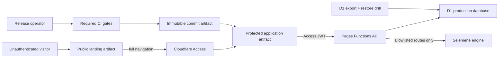

# Urania Production Readiness Design

**Status:** Approved direction, implementation pending
**Date:** 2026-08-01
**Decision owner:** Urania maintainer
**Scope:** Public landing, protected application, calculation correctness, consented relationships, release engineering, security, privacy, recovery, and production evidence

## Problem

Urania v0.6.0 is an authenticated pilot, not a production launch. The deployed application has substantial tested functionality, but four conditions make a broad release unsafe: unresolved locations are silently converted into `(0, 0, Asia/Kolkata)`, longitude is used as an approximate timezone, the consented relationship-generation route has no reachable product flow, and release automation publishes mutable state before proving deployment. The current landing candidate also returns before the remaining React hooks run, so route changes can violate hook ordering. Repository governance and planning evidence overstate completion.

Production readiness therefore means more than making the current UI build. It means that every generated reading is based on valid, attributable inputs; every relationship reading remains bounded by active bilateral consent; the public acquisition surface does not weaken the protected application boundary; releases are reproducible and recoverable; and the evidence accurately describes what is live.

## Decision

Use a split-host, split-artifact architecture:

- A small public landing artifact is deployed to a public hostname. It contains no authenticated app bootstrap, no application API calls, and no secrets.
- The full application remains on a Cloudflare Access-protected hostname. The landing CTA performs a full-document navigation to a build-time allowlisted `VITE_PROTECTED_APP_ORIGIN`.
- `/api/*` remains authenticated in the Worker even when called through any public Pages preview hostname. Host policy is defense in depth, not the API trust boundary.
- Location normalization becomes a server-owned contract. A subject cannot become calculation-ready until it has finite coordinates, a valid IANA timezone, provenance, and an explicit resolution state.
- Existing ambiguous profiles are quarantined for correction rather than silently recalculated. Remediation is inventory-first, backup-first, and reversible.
- Relationship generation becomes a first-class state transition in the consent UI. The secure journey is invitation → acceptance → generation → browsing → revocation → denied regeneration/access.
- Releases are produced from a clean `main` commit only. The same immutable commit is verified, tagged, deployed, smoke-tested, and then published as a GitHub release. Failed smoke checks trigger a documented rollback and never result in a success declaration.

## Trust Boundaries

The public landing may be served by a separate Pages project or another static host. It must not depend on path-scoped Cloudflare Access exceptions because Access policy is primarily hostname-oriented and an exception can accidentally expose the SPA shell. The protected application never treats the presence of the landing as evidence of authentication.

## Data Correctness

`NormalizedLocation` gains an explicit resolution contract. Valid calculation inputs require:

- Latitude within `[-90, 90]` and longitude within `[-180, 180]`.
- A timezone accepted by `Intl.DateTimeFormat` and represented by an IANA zone identifier, including fractional-offset and daylight-saving regions.
- Provider/provenance metadata and a resolution state (`resolved`, `needs_review`, or `unresolved`).
- No fallback that fabricates coordinates or assigns `Asia/Kolkata` to an arbitrary place.

The Worker owns candidate generation and validation. An authenticated location-search endpoint queries the geocoder, maps coordinates through a maintained Worker-compatible IANA timezone dataset, and returns short-lived HMAC-signed candidates. The client can select a candidate but cannot forge persisted coordinates, timezone, or provenance. Subject and chat writes verify the signed candidate before persistence. A failed lookup returns a repairable validation error.

Migration `0009` adds searchable location-quality metadata without rewriting existing JSON in place. A read-only inventory classifies stored profiles. Suspect profiles are marked `needs_review`; generated readings that depend on them are blocked and labelled, not silently replaced. Before any remote mutation, the operator captures a D1 export, records row counts and hashes, and proves restore into preview/local D1.

## Relationship Consent Product

The backend consent/grant model remains authoritative. The UI renders actions from the server relationship state and never infers permission from navigation state. Generation requires an active grant at request time. Browsing requires ownership or the same active grant. Revocation invalidates future generation immediately and makes previously shared access follow the documented retention policy.

The active consent card owns the “Generate Union Mirror” action. A successful response navigates with the returned relationship and reading identifiers, eliminating the current id-dropping `#/node/compat` link. Conflict, expired invitation, revoked grant, engine failure, and retry states remain visible and deterministic. Contract tests cover both participants and cross-user denial; browser evidence proves the complete journey with isolated identities.

## Release, Recovery, and Operations

CI has one canonical local command and one required GitHub check. It covers dependency installation, all Vitest suites, Worker typechecking, application build, static policy checks, migration verification, UI contract/evidence tests, and a bundle budget. Browser smoke tests use deterministic fixtures; remote production probes are a separate post-deploy gate.

The local release preflight refuses detached HEAD, any branch except `main`, tracked or untracked changes, a commit not synchronized with `origin/main`, missing required CI success, an existing local/remote tag, or an unavailable backup. The Actions preflight separately permits an exact detached checkout only when it cryptographically resolves to the explicitly requested `main` SHA. Version metadata and all source-controlled readiness evidence are reviewed before that release commit reaches `main`. The release workflow builds and deploys the exact immutable SHA; only after smoke gates pass does it attach the tag and GitHub release to that SHA. Live evidence is emitted as a signed/checksummed workflow attestation and release asset whose subject is the same SHA—never as a later source commit.

Operational readiness includes request IDs, stable JSON error envelopes, security headers, bounded request bodies, explicit engine proxy routes/methods, anti-CSRF origin/token validation on mutations, conservative rate limiting, structured logs without sensitive payloads, alerts, D1 backup/restore drills, and owner-scoped export/delete workflows. Preview deployments use a distinct D1 database and non-production secrets.

## Planning and Governance Truth

The ISA, project status, issues, and release notes must distinguish:

- `implemented`: code exists locally;
- `verified`: automated evidence passes for the exact commit;
- `deployed`: the commit is live;
- `operationally_ready`: backup, monitoring, rollback, privacy, and governance gates pass.

No unchecked or deferred criterion is counted as complete. Stale issues are reconciled against code and evidence. `main` protection requires the canonical CI check, conversation resolution, no force pushes, and no deletion. One approving review is enabled only after a real independent reviewer is named; until then, the governance gap remains explicit rather than installing an unusable rule.

## Delivery Strategy

Work proceeds in dependency-ordered waves:

1. Establish truthful baselines, a recovery protocol, and safe release/CI foundations.
2. Correct location/timezone semantics and quarantine affected profiles.
3. Complete the relationship-consent product journey.
4. extract and harden the public landing while preserving the Access boundary.
5. Add API limits, privacy workflows, observability, preview isolation, and recovery drills.
6. Close dependency, visual, governance, and launch evidence gates.

Parallel work is allowed only across non-overlapping ownership boundaries. Every rail must produce a reviewed diff and targeted tests. External-state operations—DNS/Access changes, production D1 migration, secrets, branch rules, and deployment—remain explicit operator gates with captured before/after evidence.

## Success Criteria

Urania is ready for production only when all P0/P1 criteria in the implementation plan are verified on one commit; the public and protected hostnames have their intended policies; the production D1 migration is preceded by a restorable snapshot; the full consent journey and location repair journey pass browser tests; required CI and governance are active; the deployed SHA matches the release; post-deploy smoke and security probes pass; and no launch-blocking ISA criterion is pending or deferred.
