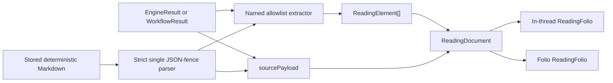

# Urania Reading Element Library

Status: implemented baseline
Date: 2026-07-26
Scope: semantic elements derived from Selemene and `723` source structures

## Why this layer exists

`ReadingSection` answers “what did the witness or interpreter say?” A reading
element answers “what explicit structure did the source return?” Keeping those
questions separate lets Urania render a five-limb panchanga, a transit
relationship, or a period sequence without pretending that a chart row is
narrative prose.

The element layer follows four invariants:

1. Engine adapters read named allowlisted fields.
2. Every element names its system, source path, evidence treatment, and
   confidence.
3. The complete locally available source payload remains inspectable.
4. Unknown, null, mock, and incomplete results are shown without inferred
   meaning.

## Observed source inventory

The schema pass inspected keys and types rather than importing private reading
bodies. Fifty-one `723/Solos/*/new-l0-flow/engines.json` bundles expose the
following recurrent engines:

| Engine | Observed shape |
| --- | --- |
| panchanga | five named limbs, indices, solar/lunar longitude |
| vimshottari | nested current periods, timeline, explicit transitions |
| human-design | type, authority, profile, centers, channels, activations |
| gene-keys | four activation positions, active keys, frequency records |
| numerology | six named code records with value, reduction, meaning |
| biorhythm | named cycles, phase, percentage, forecast, target date |
| vedic-clock | current dosha/organ window and explicit transitions |
| transits | natal positions, transit positions, aspects, period quality |
| enneagram | source questions |
| tarot | named spread and ordered positions |
| i-ching | primary/relating hexagrams and changing lines |
| nadabrahman | time field and source-listed ragas |
| sacred-geometry | selected form and source description |
| biofield | metrics and chakra records; historical output may be mock |
| face-reading | capture notice/disclaimer; historical output may be mock |
| sigil-forge | sparsely observed; retained through generic source fallback |

Some full-spectrum bundles contain a null engine envelope. Null remains an
explicit unavailable state rather than disappearing from the reading.

## Canonical element grammar

`src/lib/readings/types.ts` defines one discriminated `ReadingElement` union:

| Kind | Relationship encoded | Renderer |
| --- | --- | --- |
| `fact-grid` | named field → source value | `ReadingFactGrid` |
| `number-codes` | named code → value → reduction | `ReadingNumberCodes` |
| `positions` | point → sign/degree/motion | `ReadingPositions` |
| `relations` | endpoint → named relation → endpoint | `ReadingRelations` |
| `sequence` | source-supplied order or time | `ReadingSequence` |
| `cycles` | named measure → value on source scale | `ReadingCycles` |
| `spread` | source position → card or hexagram | `ReadingSpread` |
| `collections` | named set → source members | `ReadingCollections` |
| `questions` | ordered source prompts | `ReadingQuestions` |
| `notice` | source status → visible boundary | `ReadingNotice` |
| `raw` | unknown source → exact payload | `ReadingRaw` |

The exhaustive registry is `ReadingElementField`. Adding a union member without
adding a renderer fails TypeScript compilation.

## Engine-to-element matrix

| Engine | Elements now rendered | Deliberate boundary |
| --- | --- | --- |
| panchanga | five-limb `fact-grid` | no inferred transition timestamp |
| numerology | `number-codes` | source meaning is labeled, not rewritten |
| transits | context facts, two position tables, aspect relations | no causality or prediction |
| vimshottari | current nested periods and explicit transition sequences | no forecast beyond source dates |
| human-design | profile facts, center collection, channel relations | activations remain in source payload |
| gene-keys | four-position activation sequence | frequency interpretation remains in source |
| biorhythm | current named cycles | forecast array remains in source payload |
| vedic-clock | current window facts and explicit transitions | source recommendations are not promoted |
| tarot | ordered spread | no authored divinatory conclusion |
| i-ching | primary/relating positions | no authored judgment |
| enneagram | questions | questions do not become a type conclusion |
| nadabrahman | time facts and raga collection | therapeutic claims are not promoted |
| sacred-geometry | source-selected form facts | geometry does not imply certainty |
| biofield | unresolved notice plus raw source | mock/capture context never receives computed styling |
| face-reading | unresolved notice plus raw source | mock/capture context never receives computed styling |
| unknown/null | raw or unavailable source | no field-name guessing |

## Data flow

### Live deterministic results

`ThreadResult.sourcePayload` carries the existing engine or workflow object to
`threadResultToReadingDocument`. The adapter produces elements; the raw payload
is collapsed under “Exact source payload.”

### Daily readings

`DeterministicInterpreter` attaches the panchanga and optional transit result to
the live `DailyReading`. The daily chat result therefore shows the computed
elements beside the existing witness-oriented passes. Existing daily Folio rows
remain prose-only because the frozen D1 row did not archive the engine bundle.

### Stored deterministic Folio rows

The existing archive already contains one exact fenced JSON payload emitted by
`deterministicMarkdown`. `folioEntryToReadingDocument` parses only that strict
shape and reuses the same extractor. The record remains
`structureSource: flat`, with zero inferred sections. Invalid JSON, prose, or
non-JSON fences remain ordinary flat reading bodies.

## Accessibility and visual law

- Fact and position data uses `dl` or table semantics.
- Relationships print both endpoints, relation, measure, and state.
- Sequences use ordered lists and print every available date.
- Cycle values and phases are written in text; color is redundant.
- Raw source uses a native collapsed `details` element.
- Source text and JSON render through React text nodes; embedded markup cannot
  execute.
- Layout falls from a two-column field to one column without removing data.
- No element requires motion, hover, or color perception to be understood.

## Known next layers

- Preserve daily source payloads durably only through a versioned archive
  contract, not an unreviewed D1 column change.
- Add activation-position tables when their semantic copy and density have been
  reviewed against more Human Design fixtures.
- Add historical subject/artifact elements only after the `723` consent and
  migration model is implemented.
- Generate the next image reference from these implemented components rather
  than using image generation to invent new data semantics.
