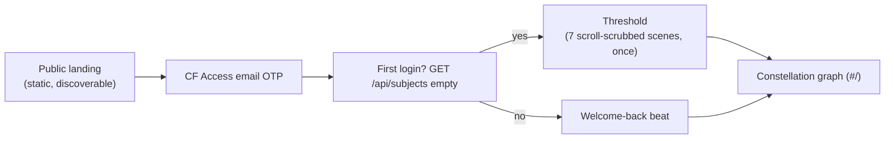
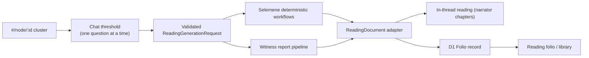
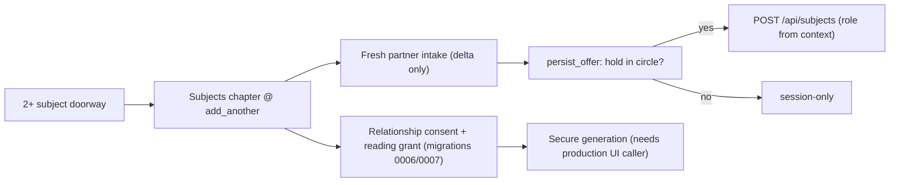

# Urania 137 — End Goal & Backward Implementation Map

> **Status:** north star · **Read first:** this file, then `.planning/ROADMAP.md`, then `.planning/tasks.md` + `.planning/NEXT-WAVE.json`.
> **Authority note:** this file is the product north star. It states *what we are building toward* and *why*. It does **not** invent capabilities — every surface below exists in code, docs, or a verified upstream contract. The executable wave breakdown lives in `.planning/` (GSD spine) and is observed by `temperance-next-wave`.
> **Last reconciled:** 2026-08-16 · against ISA.md (23 iterations), `_PROJECT-STATUS.md`, `.planning/`, `docs/`.

---

## 1. End state

Urania 137 is the **online entry** to the Tryambakam Noesis integrated product: a graph-first stellar console where the constellation is the interface at every depth, chat is the threshold, and every reading resolves into a durable, source-honest folio.

A person arrives through a public (unauthenticated) landing, crosses Cloudflare Access email-OTP, passes the one-time Threshold, and steps onto the seven-node constellation. Every doorway opens a narrative chat that collects only the facts that capability needs (prefilled from the subject profile, deltas only), hands off to the Selemene engine, and archives a canonical `ReadingDocument` to the Folio — where it renders as a legible reading with system stack, evidence ledger, pattern constellation, and bridge question. Relationships are consent-complete; the historical 723 archive becomes a canonical, consented, provenance-preserving corpus; approved anonymized patterns feed synthesis memory with visible provenance and never override deterministic facts. All of it ships through one governed, immutable, fail-closed release path and is recoverable, observable, and privacy-proven.

**Success condition (three sentences):** a person enters through conversation, receives a reading without losing the thread, and reopens the same material as a legible folio that names exactly which systems and sources support it — with no identity leakage and a clear line between computation and witness interpretation. The graph remains the interface at every depth. The system is `operationally_ready`: backup, restore, rollback, monitoring, privacy, security, and post-deploy attestation all pass for the exact deployed commit.

---

## 2. The integrated product (triad-aware, urania-owned)

Urania is one of three surfaces over one Selemene engine. This repo **owns urania-137 only**; siblings are boundary contracts, not work items here.

| Surface | Role | Owned by |
|---|---|---|
| **urania-137** | online entry — graph, chat threshold, Folio/library, corpus admin | **this repo** |
| **Noesis Mirror** | the person's walkable 3D field (`314.tryambakam.space/p/:personId`) | sibling |
| **Sankalpa** | local Electron instrument; consent-gated capture | sibling |
| **Selemene engine** | calculation authority (18 engines, 6 workflows, witness modes) | upstream repo (`../Selemene-engine`, Railway) |

Engine-input ownership (from `docs/integrated-product-map.md`): `birth_data`-only engines run online here; camera/image/consent engines (`biofield`, `biofield-capture`, `face-reading`) belong to Sankalpa and are *named*, never faked.

---

## 3. Infra mapping

```
                            ┌────────────────────────────────────────────────┐
                            │  Cloudflare (Thoughtseed Labs · team red-queen-4dfa) │
                            │                                                │
   Public (no auth) ──────► │  Pages: urania-137-landing (static landing)    │
   email OTP ◄────────────► │  Access (AUD df8a00b1…b6b4) — the trust boundary │
   authed browser ────────► │  Pages: urania-137 (SPA dist/ + Functions)      │
                            │    ├─ /api/me, /api/logout     (identity)       │
                            │    ├─ /api/selemene/*          (engine proxy)   │
                            │    ├─ /api/folio/*             (D1 readings)    │
                            │    ├─ /api/subjects            (D1 profiles)    │
                            │    ├─ /api/relationships       (consent)        │
                            │    ├─ /api/corpus, /api/patterns/search (admin)│
                            │    └─ /api/chat/session, turn  (SSE narrator)   │
                            │  Data: D1 (11 migrations) · R2 urania-137-corpus│
                            │        · Vectorize 384-dim · Workers AI         │
                            └───────────────┬────────────────────────────────┘
                                            │ x-api-key (server-side only)
                                            ▼
                            ┌────────────────────────────────────────────────┐
                            │ Selemene noesis-api · Railway                  │
                            │   selemene.tryambakam.space (public base)      │
                            │   /health · /api/v1/workflows · /api/v1/engines│
                            │   /api/v1/assets/generate (mode-keyed)         │
                            └────────────────────────────────────────────────┘
```

**Boundary rules (non-negotiable, from integrated-product-map):**

- The engine is a shared-key **stateless** backend; identity + storage live only at urania's edge. The engine learns nothing about users.
- Never send a mode the engine doesn't resolve (`load_mode_document` resolves exactly 2 witness families + `kundali`; unknown → must become `400 UNKNOWN_MODE`, never `200 default`).
- Never offer a surface whose input we can't gather (consent-gated capture → Sankalpa).
- Never link to something that doesn't exist (Sankalpa has no build; Mirror worlds are granted per person).
- Release path is the only deploy path: `readiness.yml` → `release.yml` (production Environment approval), 5 artifacts, attestation `subject SHA == deployed SHA`.

---

## 4. UX flows

### 4.1 Entry funnel



### 4.2 Reading loop (the core product)



### 4.3 Relationship & consent (M3)



### 4.4 Corpus → canonical archive (M4–M5)

```mermaid
flowchart LR
  X["723 historical archive<br/>(source material)"] --> Y["Catalogue only<br/>(hash, classify, provisional IDs)"]
  Y --> Z["Identity review (no auto-merge)"]
  Z --> AA["Provenance parse"]
  AA --> AB["Editorial state (current/historical/prohibited)"]
  AB --> AC["Consent gate (per subject/artifact)"]
  AC --> AD["Canonical import (relationships preserved)"]
  AD --> AE["Approval-gated pattern extraction → Vectorize"]
  AE --> AF["Filtered retrieval → witness synthesis (subordinate)"]
```



---

## 5. Milestone ladder (backwards from the end state)

Milestones are ordered **backwards** — the farthest-out is what the end state requires; M1 is the next step toward it. M1 = the live manifest's current wave, and the only milestone with active tasks.

| M | Milestone | Goal (one line) | State today |
|---|---|---|---|
| **M7** | Boundary fast-follows | Engine `daily-panchanga` mode (REQ-1/REQ-3, Selemene-side), `birth_profiles` (ISC-31), calculation correctness (`(0,0,Asia/Kolkata)` + longitude-tz approximation), Mirror/Sankalpa door deepening | ledgered / tracked, not started |
| **M6** | AgentScope context orchestration | Post-result Dyad interpretation (Aletheios/Pichet/Synthesis) with replayable provenance, AgentScope behind the executor port only | decided (`2026-07-28-agentscope-*`), unimplemented |
| **M5** | Vectorize continuous-learning loop | Extract → privacy-scrub → approval → anonymized pattern → retrieval with visible provenance + **deletion-propagation proof** before it influences a reading | future-state, explicitly unevidenced |
| **M4** | 723 → canonical archive | Catalogue → consent gate → provenance-preserving import; pilot importer already exists (`scripts/readings/lib/pilot-import.mjs`) | catalogue + 53-readings admin browser done; canonical import + admin query surface pending (ISC-143/144) |
| **M3** | Relationship journey UI | Consent-complete synastry/dyad/family with a production UI caller | API + migrations done; **no production UI caller** (ISC-189 deferred) |
| **M2** | Public landing (split-host) | Correct two-artifact build (unauthenticated landing + protected app), replacing the rejected prototype | prototype checkpointed, **architecture rejected** (Iteration 21/22) |
| **M1** | Production readiness → release | Ship corpus admin browser through the governed immutable release path; reach `operationally_ready` | **active** — waves 0–1 done, wave 2 blocked, waves 3–5 pending |

---

## 6. Traceability (milestone ↔ ISA ↔ source ↔ manifest)

| Milestone | ISA ISCs | Source doc | Manifest wave |
|---|---|---|---|
| M1 | ISC-143/144/145/146 (open) · ISC-188 (FV-188, deferred-verify) · ISC-132/133/137/139 (done) | `.planning/DEEP-PASS.md`, `docs/corpus-browser-2026-08-12-plan.md`, `docs/plans/2026-08-01-urania-production-readiness.md` | wave-2 → wave-5 (R-8→R-16) |
| M2 | Iteration 21/22/23 (landing) | `docs/plans/2026-08-01-urania-production-readiness.md` Tasks 11–12, `_PROJECT-STATUS.md` | backlog (after M1) |
| M3 | ISC-189 (deferred) + relationship family | `_PROJECT-STATUS.md` ("Relationship product journey blocked"), migrations 0006/0007 | backlog |
| M4 | ISC-143/144 + corpus family | `docs/living-readings-ecosystem.md` §"723 migration architecture" | backlog |
| M5 | (new, to be authored at M5 gate) | `docs/living-readings-ecosystem.md` §"Vectorize and continuous learning" | backlog |
| M6 | (new) | `docs/plans/2026-07-28-agentscope-context-orchestration-integration.md` | backlog |
| M7 | ISC-31 · REQ-1/REQ-3 | `docs/selemene-engine-requests.md`, `ISA.md` ISC-31, `_PROJECT-STATUS.md` | backlog |

---

## 7. Non-negotiables (carry into every milestone)

1. **The graph is the interface at every depth.** No dropdown/sidebar replaces node navigation (ISC-10).
2. **Witness, not seer.** No prediction, diagnosis, or prescription; prohibited wellness vocabulary is gated in source strings.
3. **Owner ≠ subject.** Authentication never collapses the people being read.
4. **Engine facts stay primary.** Synthesis memory and interpretation are subordinate to deterministic results.
5. **Silence is indistinguishable from success** on the mode-keyed engine API — verify discrimination, never `200 + non-empty`.
6. **Geometry carries evidence.** No decorative mark implies unsupported analytical certainty.
7. **Consent is explicit and revocable.** Profile writes, relationship grants, and pattern approval are all opt-in.
8. **Historical language stays attributable.** Legacy copy is evidence, never silently rewritten.
9. **A reading stays legible without animation, color, or hidden interaction.** Reduced-motion and accessible equivalents are mandatory.
10. **One governed release path.** No side-deploys; production mutations require human approval + attestation.
